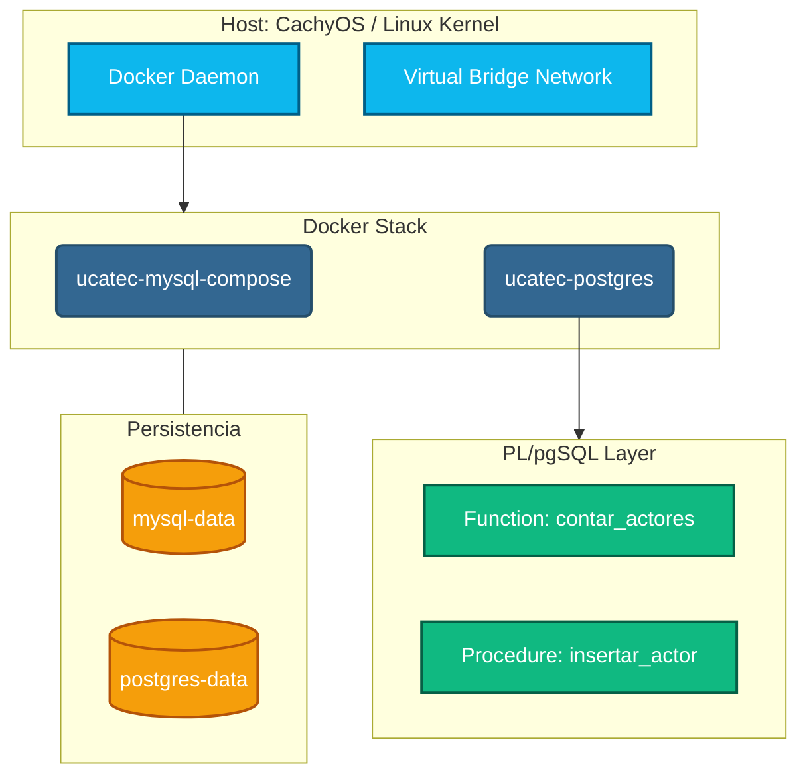
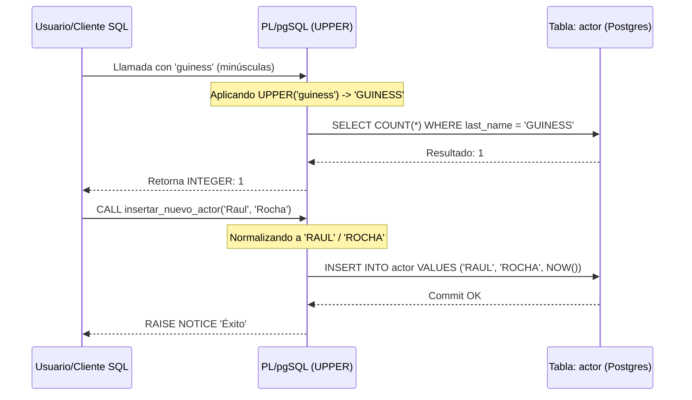
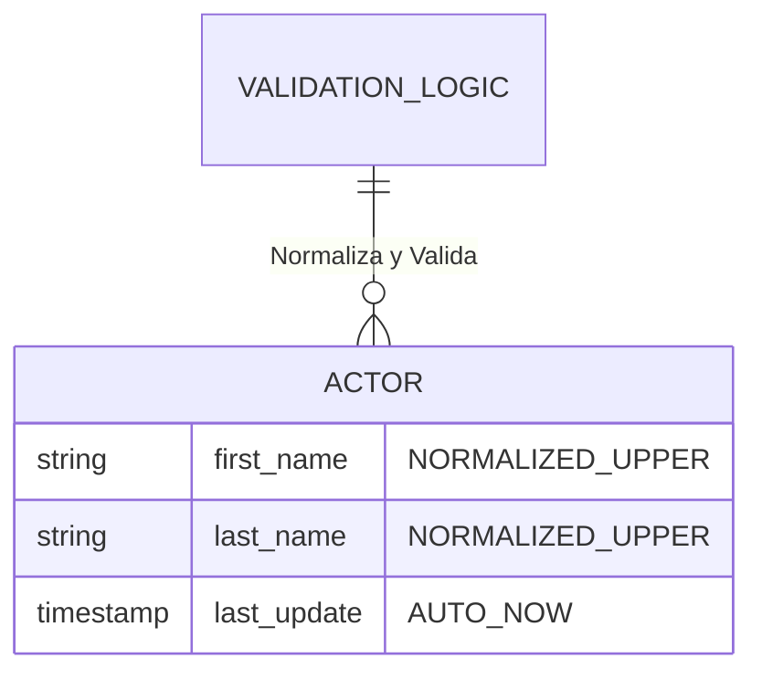

# 📊 Deep Dive: Arquitectura Visual y Flujos Corregidos

## 1. Topología de Infraestructura

---

## 2. Flujo de Normalización de Datos

Representa cómo la lógica PL/pgSQL procesa las entradas para evitar errores de sintaxis y discrepancias.

---

## 3. Matriz de Validación de Datos

