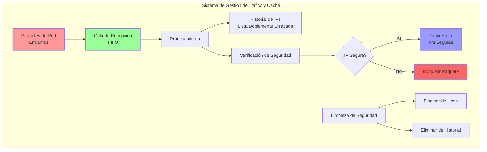
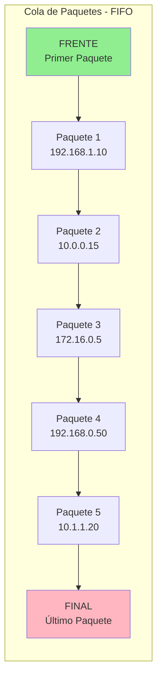
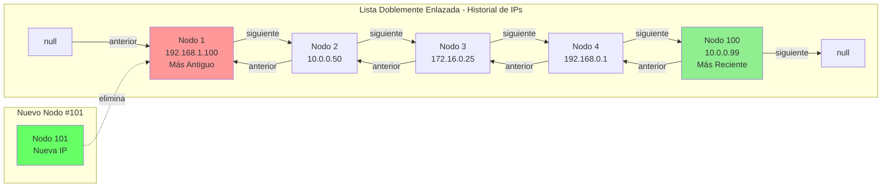
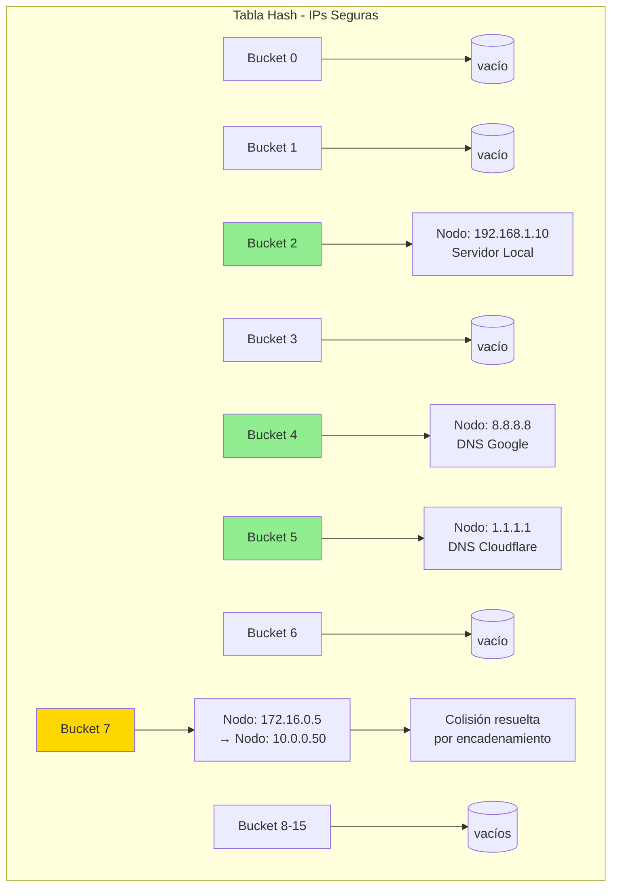
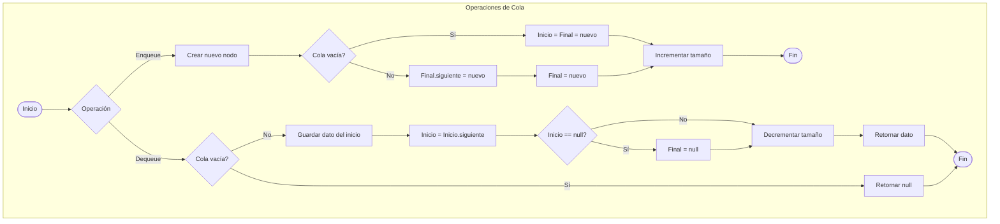
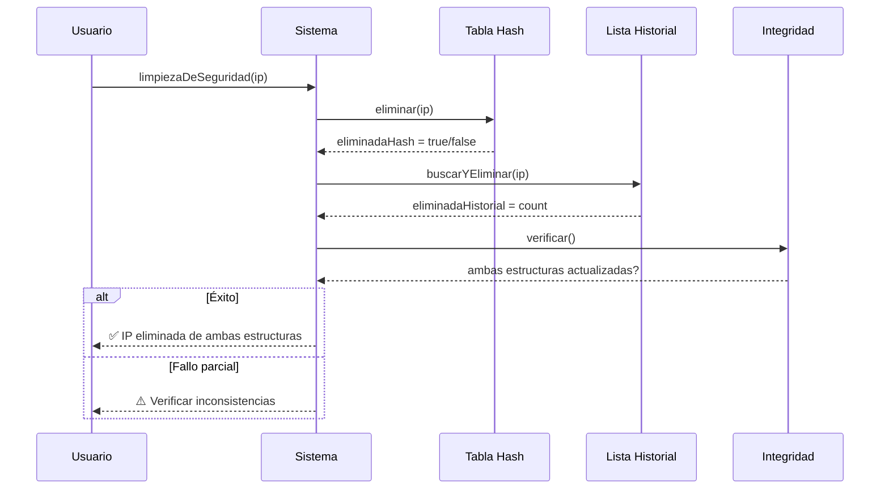
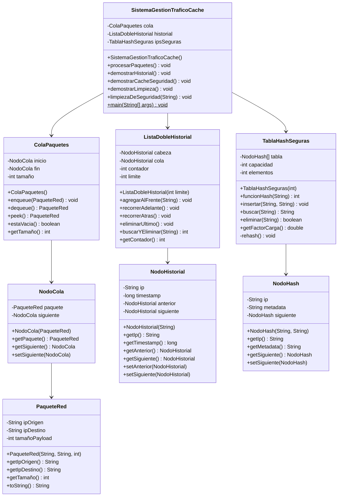

# Diagramas Mermaid - Examen Final ED1

## Diagrama 1: Arquitectura del Sistema



## Diagrama 2: Estructura de Datos - Cola



## Diagrama 3: Lista Doblemente Enlazada - Historial



## Diagrama 4: Tabla Hash con Manejo de Colisiones



## Diagrama 5: Flujo de Operaciones - Cola



## Diagrama 6: Flujo de Limpieza de Seguridad



## Diagrama 7: Diagrama de Clases UML



## Diagrama 8: Comparación de Complejidades

```mermaid
xychart-beta
    title "Complejidad Temporal - Operaciones Principales"
    x-axis [Cola, Cola, Lista, Lista, Hash, Hash]
    y-axis "Complejidad"
    bar [1, 1, 1, 100, 1, 1]
    
    annotation "O(1)" at 0, 1
    annotation "O(1)" at 1, 1
    annotation "O(1)" at 2, 1
    annotation "O(n)" at 3, 100
    annotation "O(1)" at 4, 1
    annotation "O(1)" at 5, 1
```

---

**Nota:** Los diagramas anteriores ilustran la arquitectura completa del sistema de gestión de tráfico y caché implementado para el Examen Final de Estructura de Datos I.
