# Diagramas Mermaid - Funciones Recursivas

## 1. Suma de los Primeros N Números Naturales

### Diagrama de Flujo

### Diagrama de Recursión (Ejemplo: sumaNaturales(5))

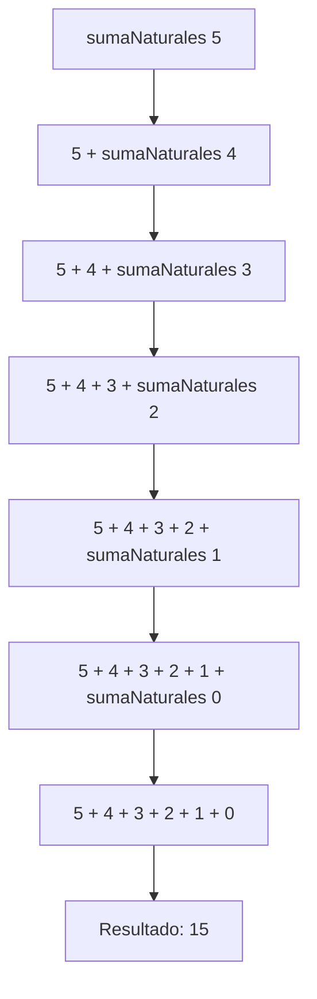

---

## 2. Contar Dígitos de un Número

### Diagrama de Flujo

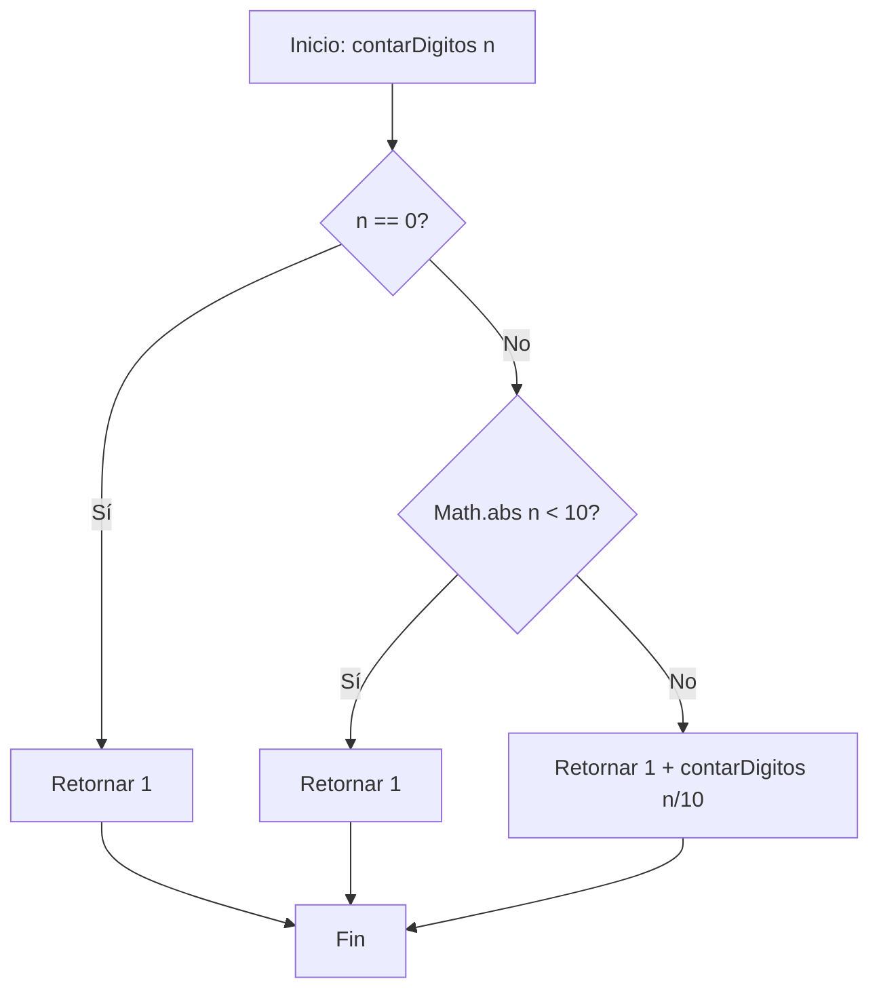

### Diagrama de Recursión (Ejemplo: contarDigitos(1234))

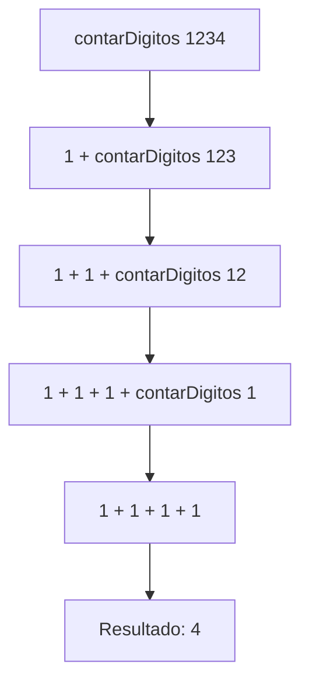

---

## 3. Máximo Común Divisor (MCD) - Algoritmo de Euclides

### Diagrama de Flujo

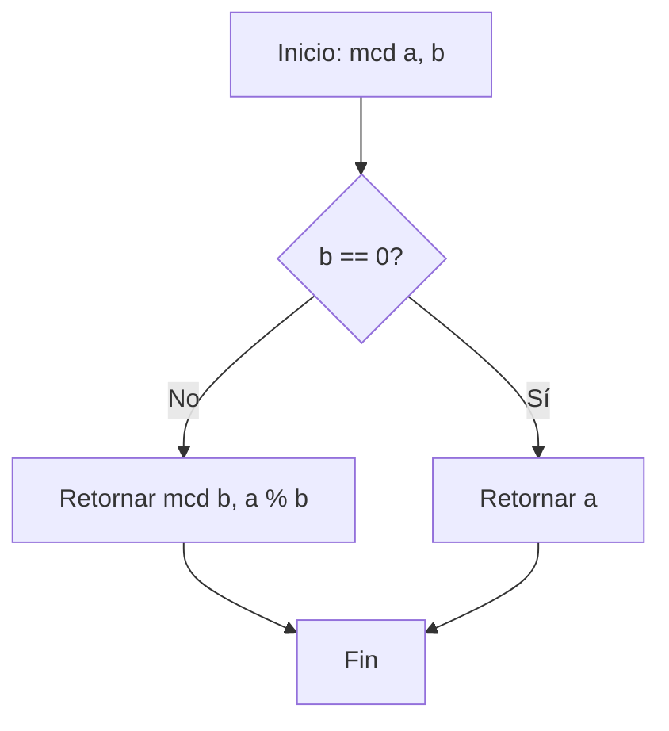

### Diagrama de Recursión (Ejemplo: mcd(48, 18))

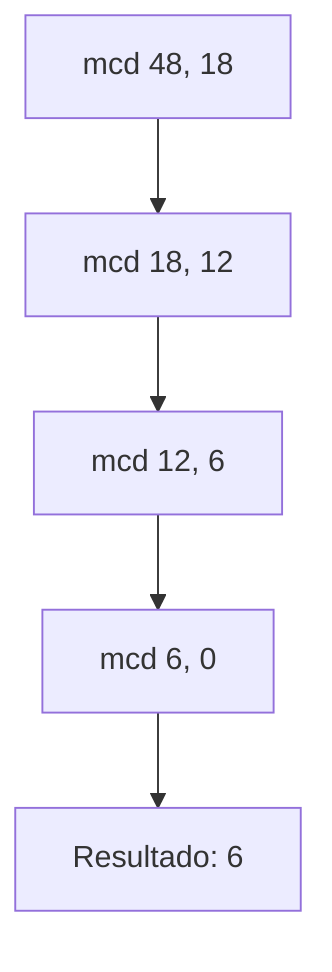

---

## 4. Invertir un Número Entero

### Diagrama de Flujo

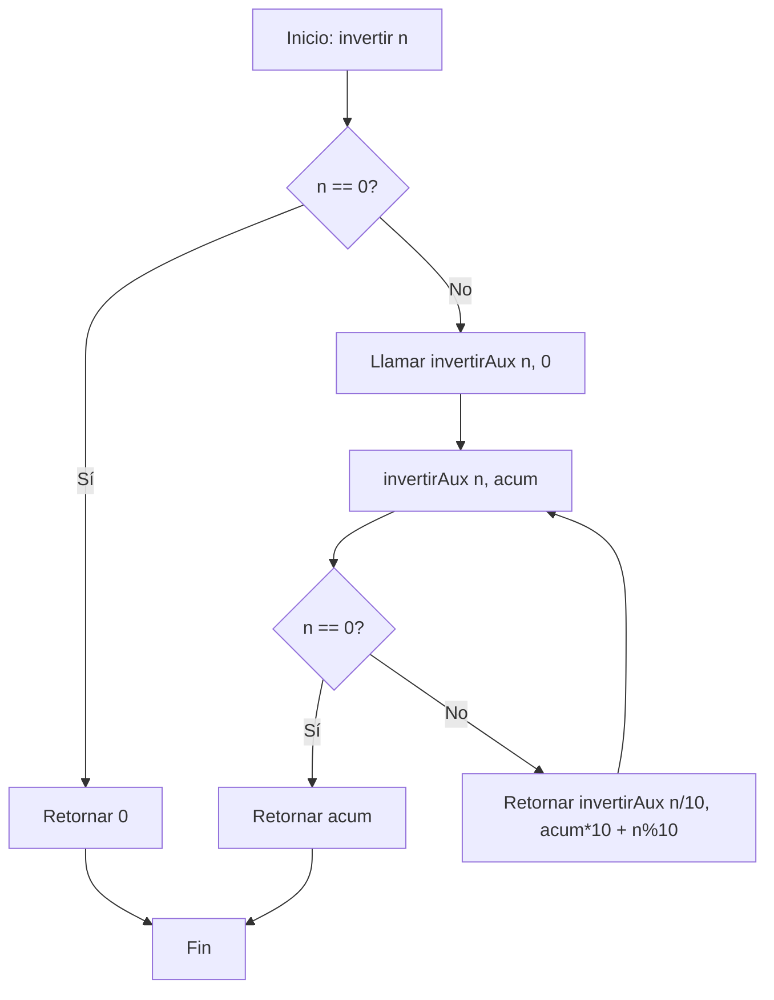

### Diagrama de Recursión (Ejemplo: invertir(1234))

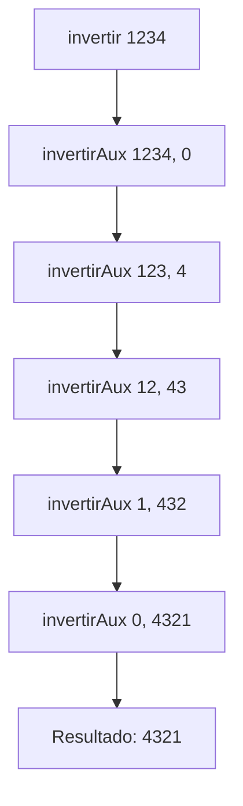

---

## 5. Potencia usando Multiplicaciones Sucesivas

### Diagrama de Flujo

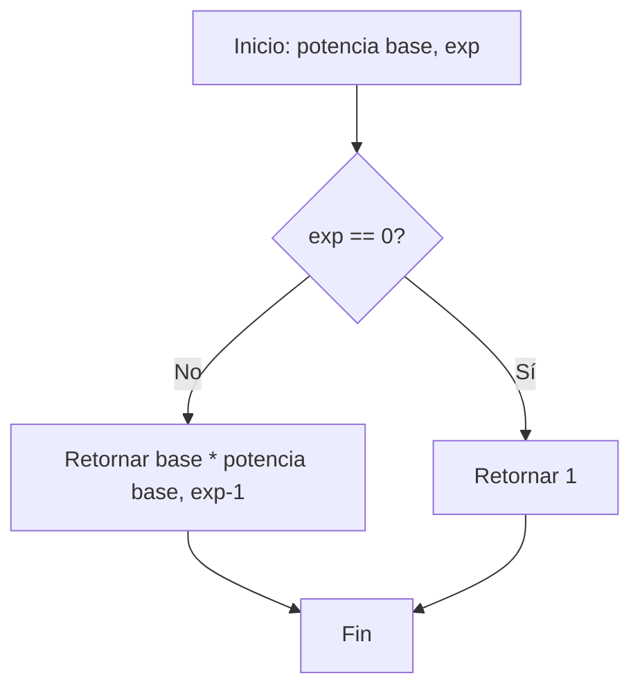

### Diagrama de Recursión (Ejemplo: potencia(2, 3))

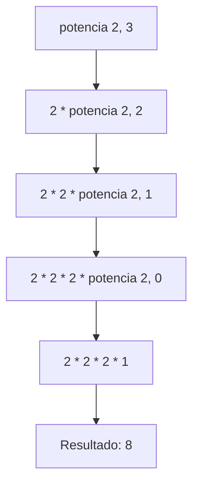

---

## 6. Verificar si un Número es Primo

### Diagrama de Flujo

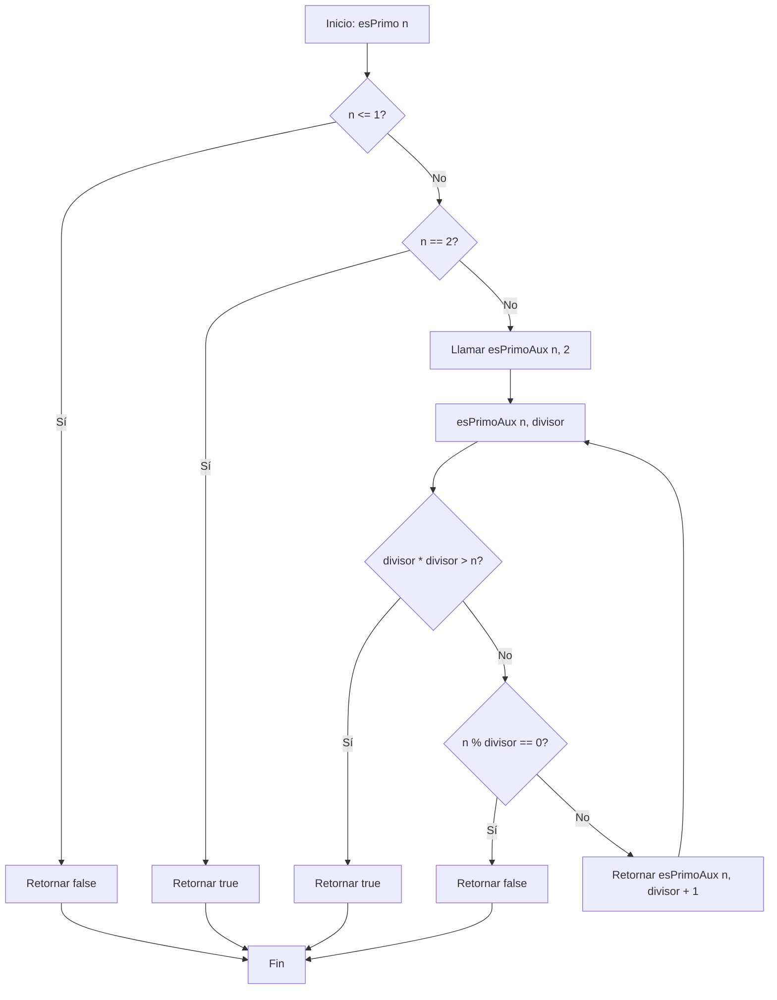

### Diagrama de Recursión (Ejemplo: esPrimo(17))

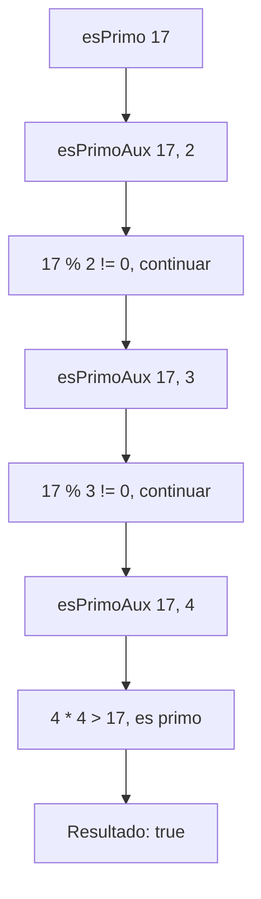

---

## Pila de Ejecución (Call Stack)

