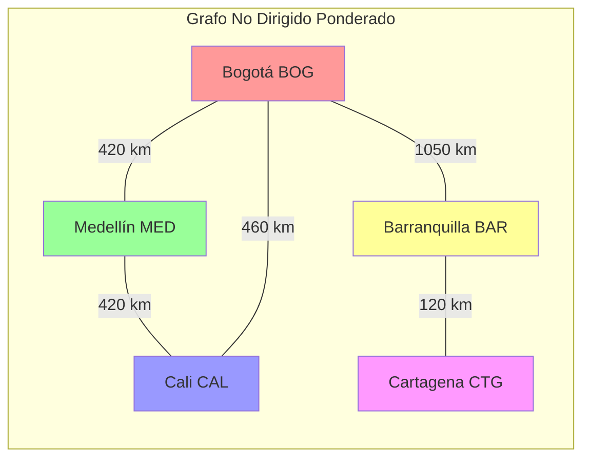
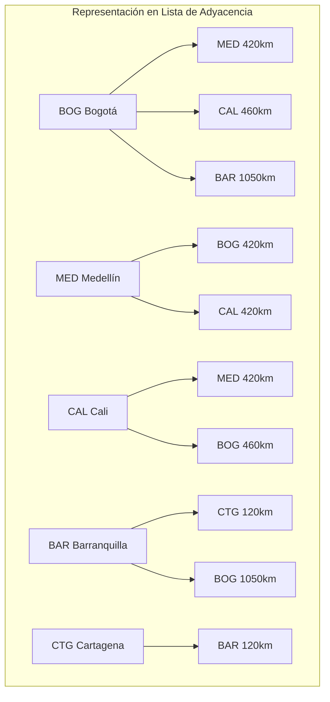
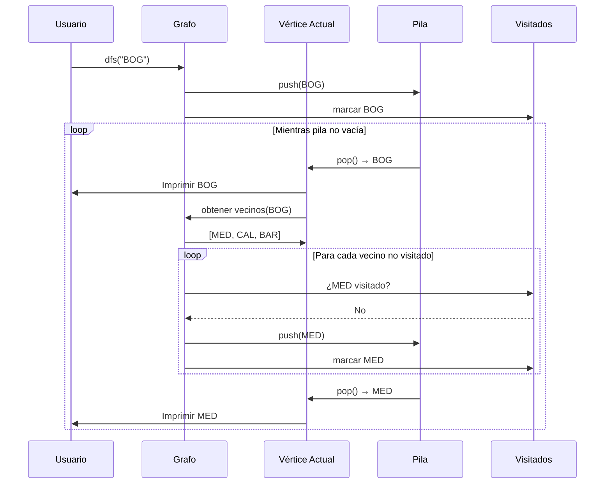
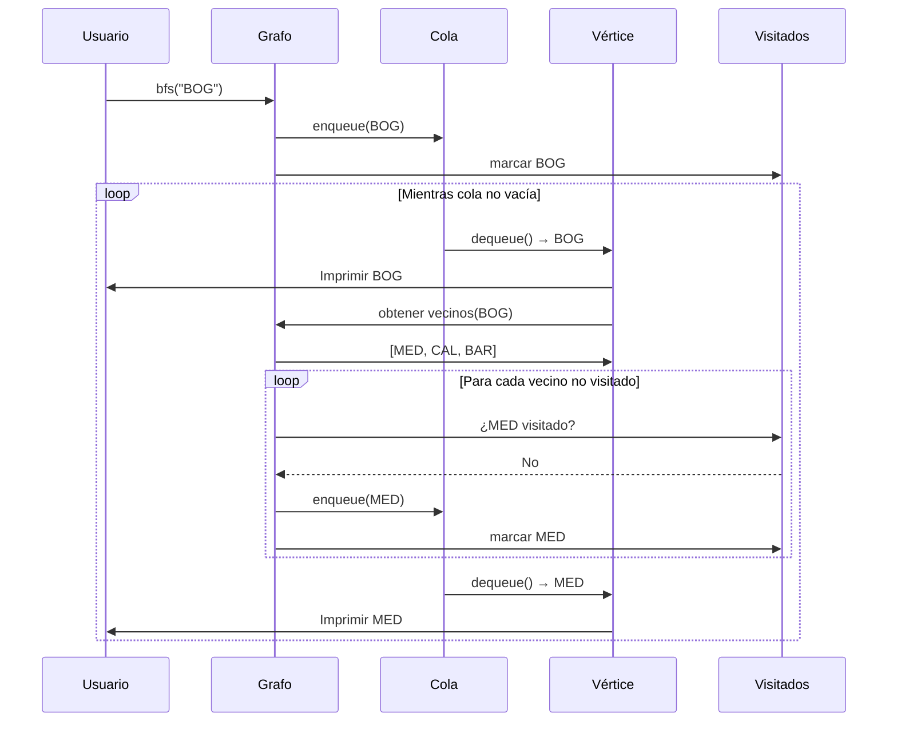
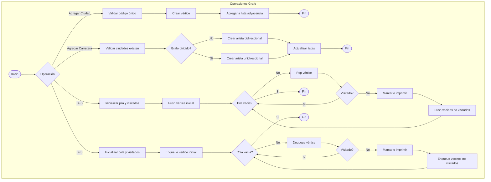
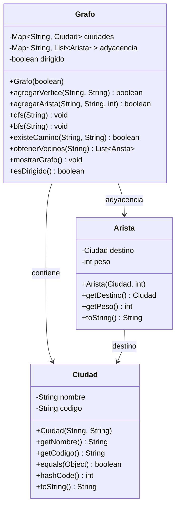
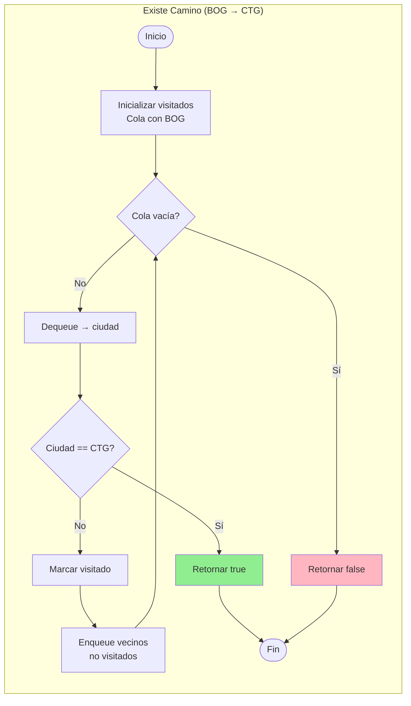
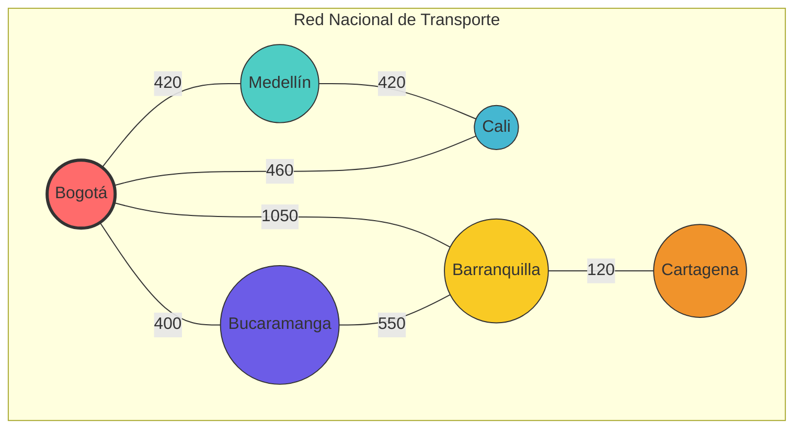

# Diagramas Mermaid - Grafos

## 1. Estructura del Grafo - Red de Ciudades



## 2. Lista de Adyacencia



## 3. Recorrido DFS (Depth First Search)



## 4. Recorrido BFS (Breadth First Search)



## 5. Flujo de Operaciones del Grafo



## 6. Diagrama de Clases UML



## 7. Comparación: Representaciones de Grafos

```mermaid
graph TB
    subgraph "Matriz de Adyacencia"
        direction TB
        M1[ ]
        M2[BOG]
        M3[MED]
        M4[CAL]
        
        M1 --> M5[BOG]
        M1 --> M6[MED]
        M1 --> M7[CAL]
        
        M2 --> M5 --> M8[0]
        M2 --> M6 --> M9[420]
        M2 --> M7 --> M10[460]
        
        M3 --> M5 --> M11[420]
        M3 --> M6 --> M12[0]
        M3 --> M7 --> M13[420]
        
        M4 --> M5 --> M14[460]
        M4 --> M6 --> M15[420]
        M4 --> M7 --> M16[0]
    end
    
    subgraph "Lista de Adyacencia"
        direction TB
        L1[BOG] --> L2[MED: 420]
        L1 --> L3[CAL: 460]
        
        L4[MED] --> L5[BOG: 420]
        L4 --> L6[CAL: 420]
        
        L7[CAL] --> L8[BOG: 460]
        L7 --> L9[MED: 420]
    end
    
    MatrizNote[O(V²) espacio] --> M1
    ListaNote[O(V+E) espacio] --> L1
```

## 8. Algoritmo de Búsqueda de Camino



## 9. Tipos de Grafos

```mermaid
graph TB
    subgraph "Grafo Dirigido"
        D1[A] --> D2[B]
        D2 --> D3[C]
        D1 -.-> D3
    end
    
    subgraph "Grafo No Dirigido"
        U1[X] --- U2[Y]
        U2 --- U3[Z]
        U1 --- U3
    end
    
    subgraph "Grafo Ponderado"
        W1[P] --5-- W2[Q]
        W2 --3-- W3[R]
        W1 --7-- W3
    end
```

## 10. Red de Ciudades Ampliada


