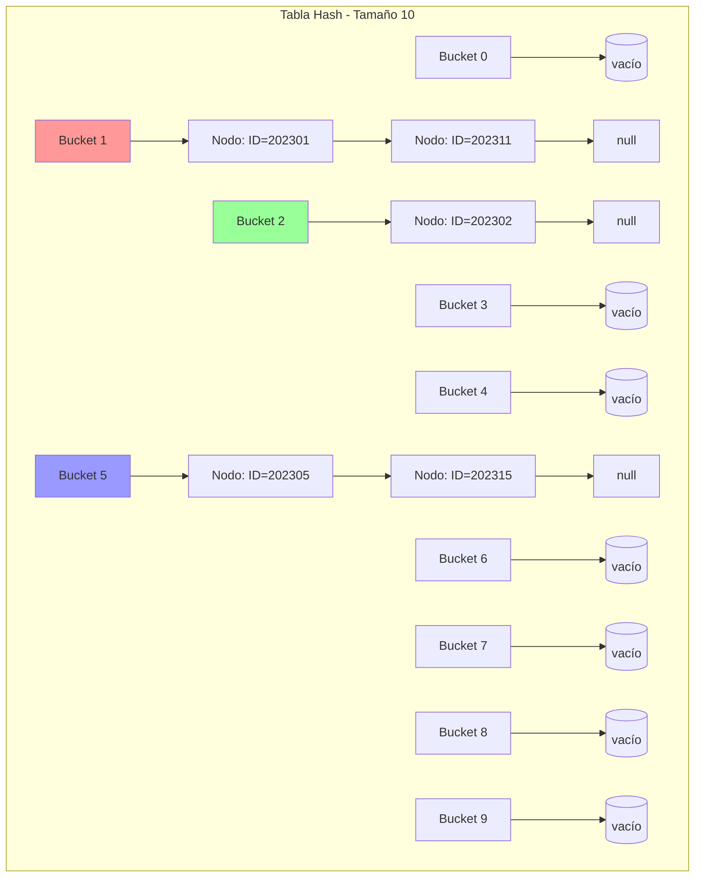
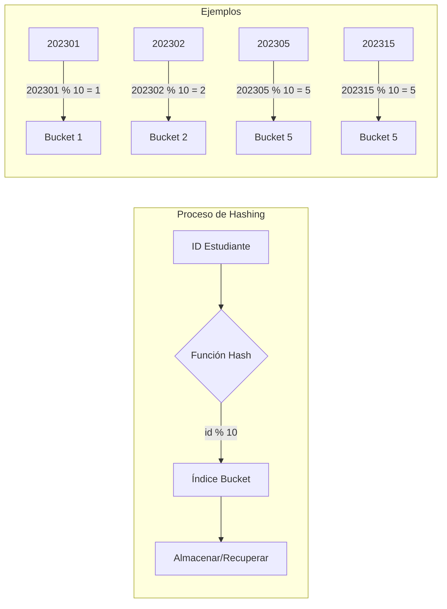
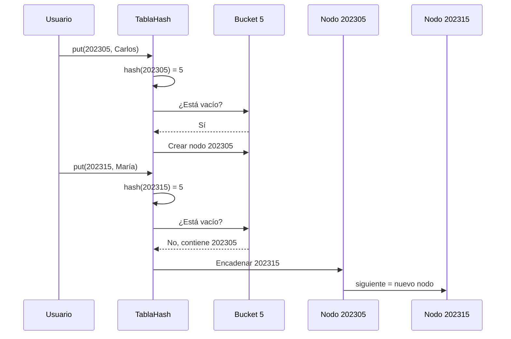
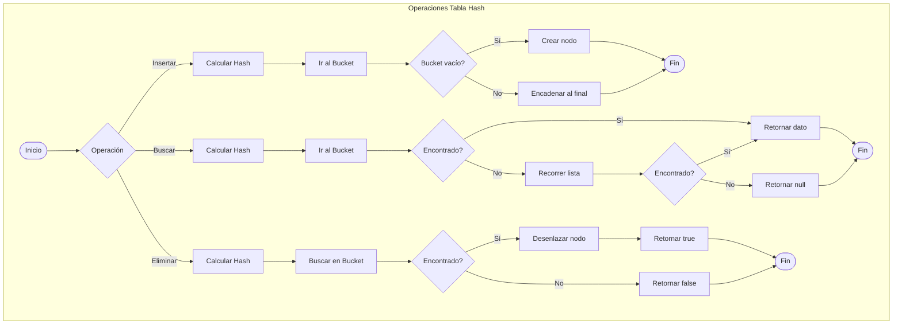
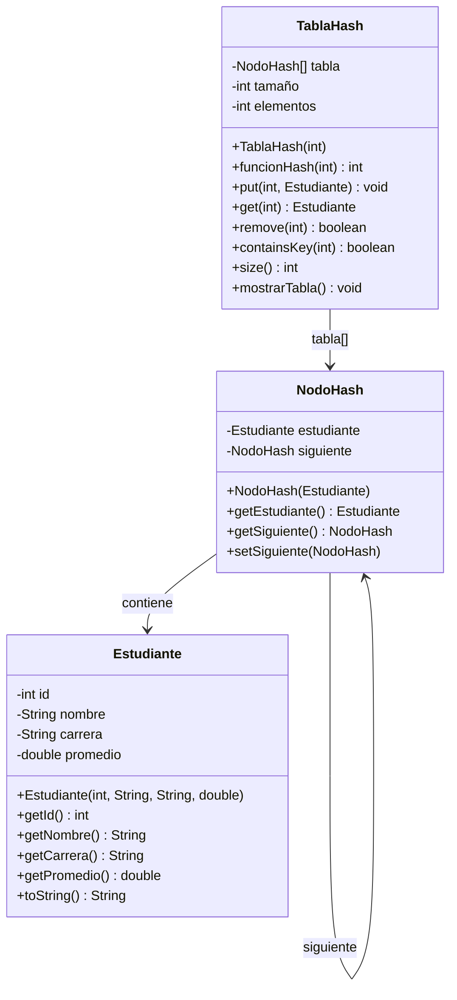
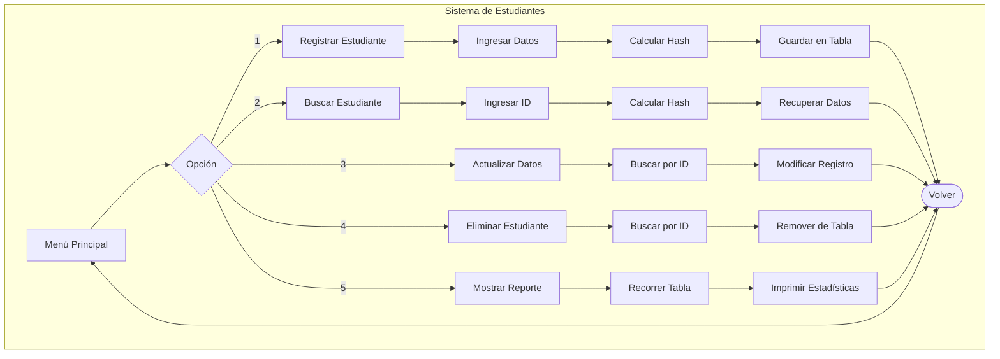

# Diagramas Mermaid - Hashing y Diccionarios

## 1. Estructura de la Tabla Hash



## 2. Funcionamiento de la Función Hash



## 3. Resolución de Colisiones - Encadenamiento



## 4. Flujo de Operaciones



## 5. Diagrama de Clases UML



## 6. Comparación de Estructuras

```mermaid
graph LR
    subgraph "Búsqueda de Elemento"
        direction TB
        
        subgraph "Lista"
            L1[Nodo 1] --> L2[Nodo 2] --> L3[Nodo 3] --> L4[Nodo 4]
            L4 --> L5[...] --> L6[Nodo n]
            style L4 fill:#ff6666
        end
        
        subgraph "Árbol Binario"
            A1[Nodo Raíz] --> A2[Nodo Izq]
            A1 --> A3[Nodo Der]
            A2 --> A4[Nodo]
            A3 --> A5[Nodo]
            style A3 fill:#66ff66
        end
        
        subgraph "Tabla Hash"
            H1[Índice Hash] --> H2[Bucket]
            H2 --> H3[Dato]
            style H2 fill:#6666ff
        end
    end
    
    ListaNote[O(n)] --> L4
    ArbolNote[O(log n)] --> A3
    HashNote[O(1)] --> H2
```

## 7. Evolución del Factor de Carga

```mermaid
xychart-beta
    title "Factor de Carga vs Rendimiento"
    x-axis [0.0, 0.25, 0.5, 0.75, 1.0, 1.5, 2.0]
    y-axis "Colisiones Promedio" 0 --> 5
    line [0, 0.1, 0.3, 0.7, 1.5, 3.0, 5.0]
    
    annotation "Óptimo" at 0.5, 0.3
    annotation "Redimensionar" at 0.75, 0.7
```

## 8. Caso de Estudio - Registro Académico


