# Diagramas Mermaid - Lista Simple con Recursividad

## Diagrama de Clases UML

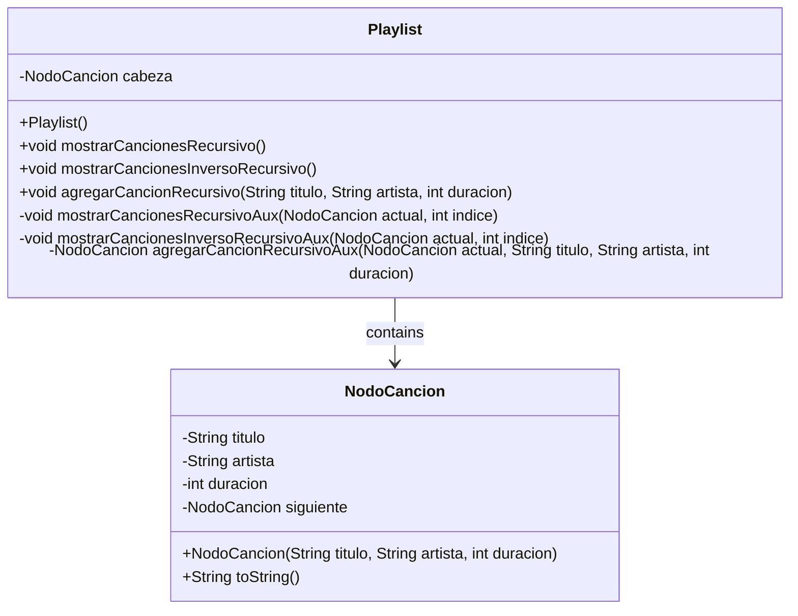

## Estructura de Lista Simple

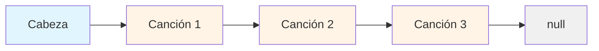

## Diagrama de Flujo - Mostrar Recursivo (Orden Normal)

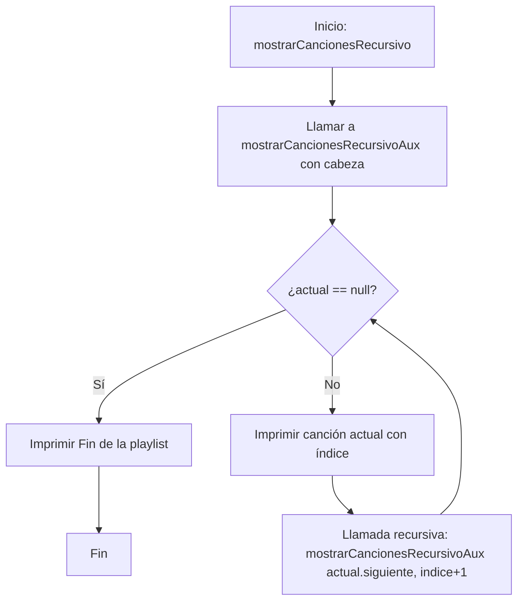

## Diagrama de Flujo - Mostrar Recursivo (Orden Inverso)

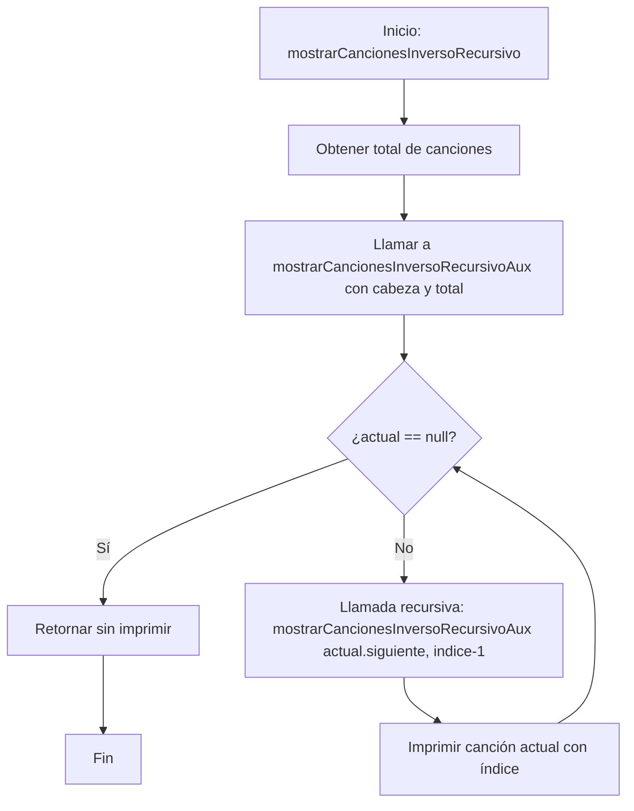

## Diagrama de Secuencia - Mostrar Recursivo

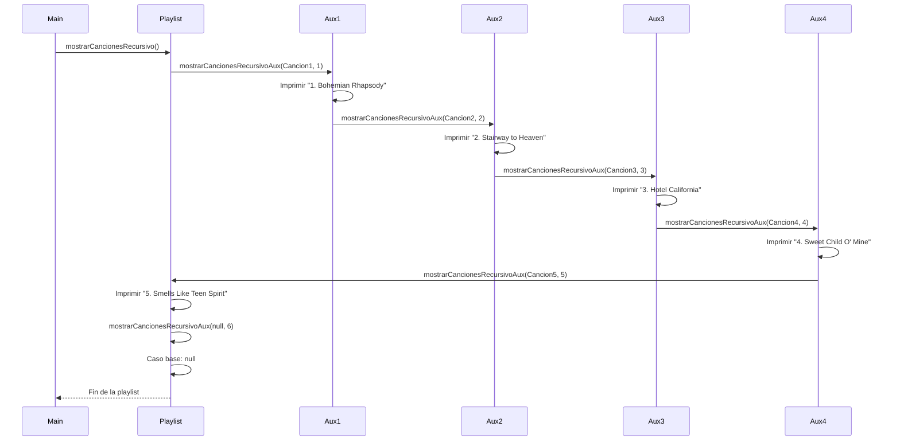

## Diagrama de Flujo - Insertar al Final (Recursivo)

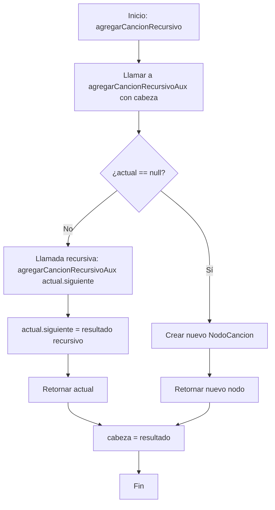

## Diagrama de Secuencia - Insertar al Final (Recursivo)

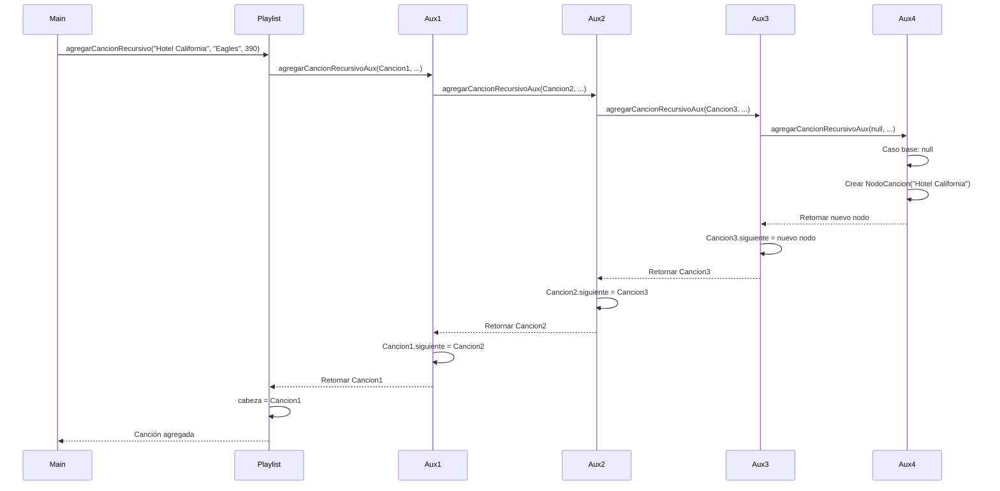

## Evolución de la Lista durante Inserciones

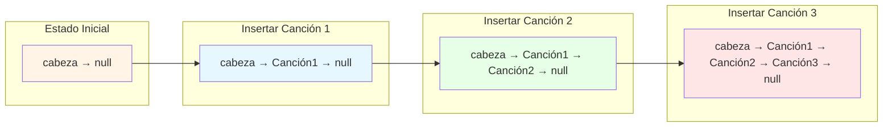

## Comparación: Recursivo vs Iterativo

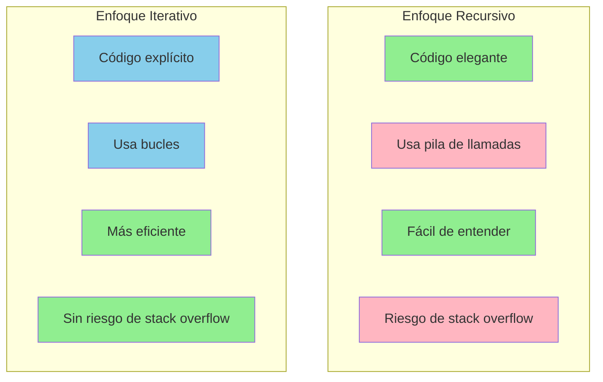

## Analogía Visual: Cadena de Personas

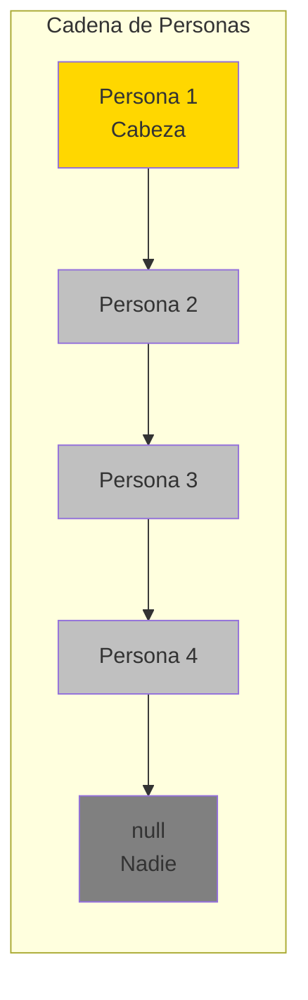

## Pila de Recursión - Mostrar Canciones

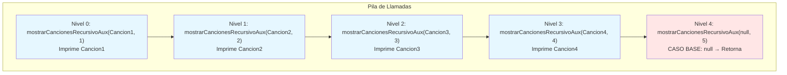

## Pila de Recursión - Insertar al Final

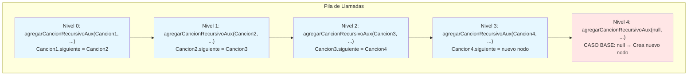
