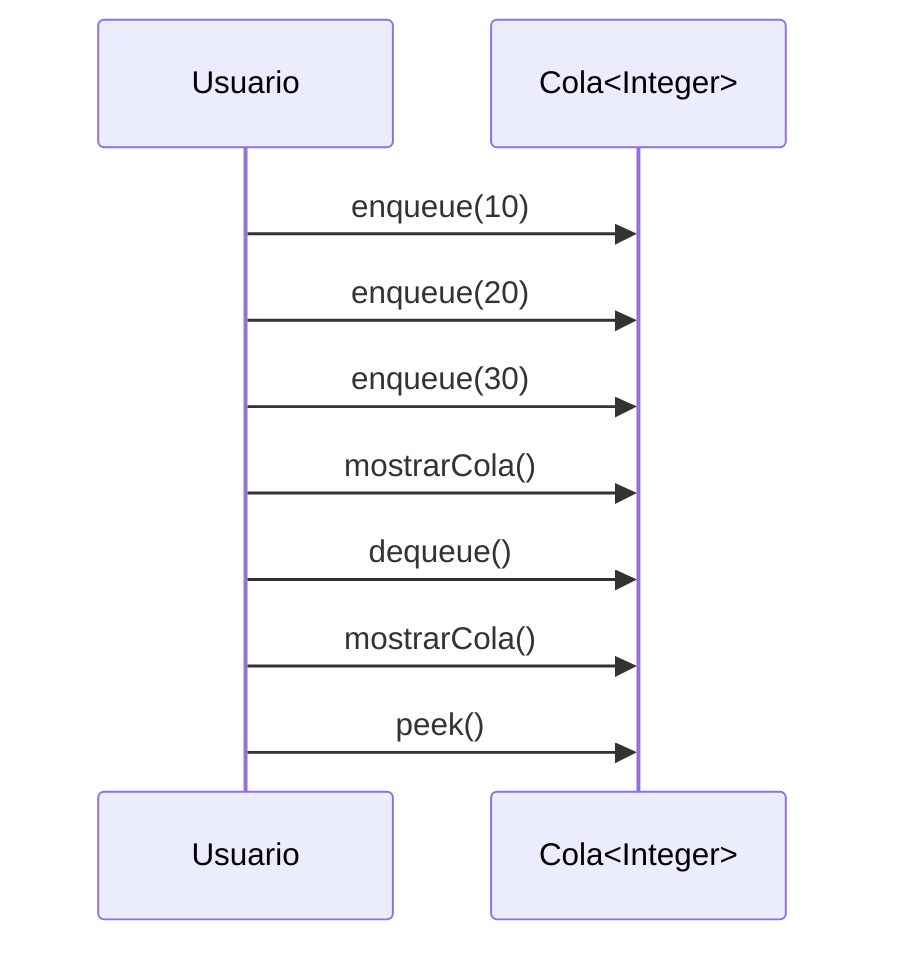
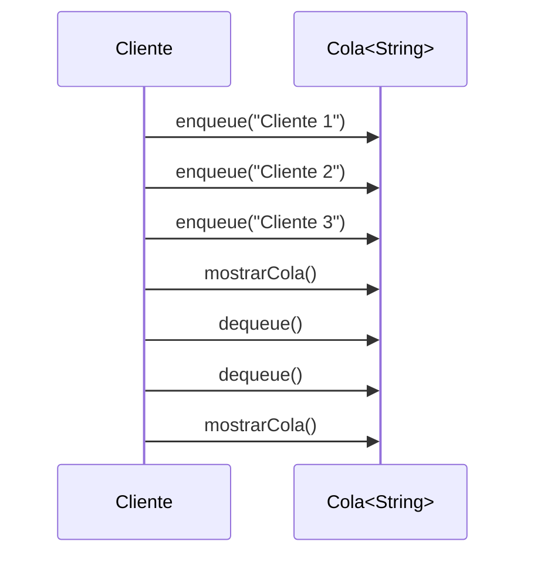
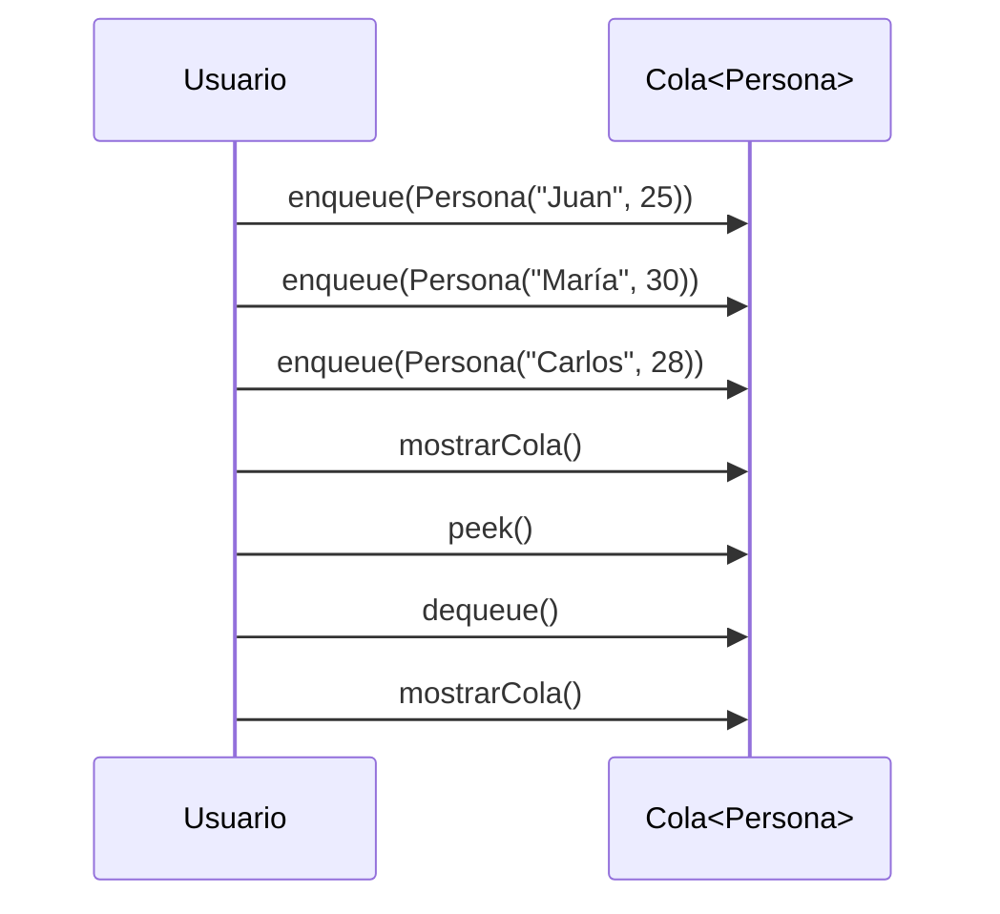
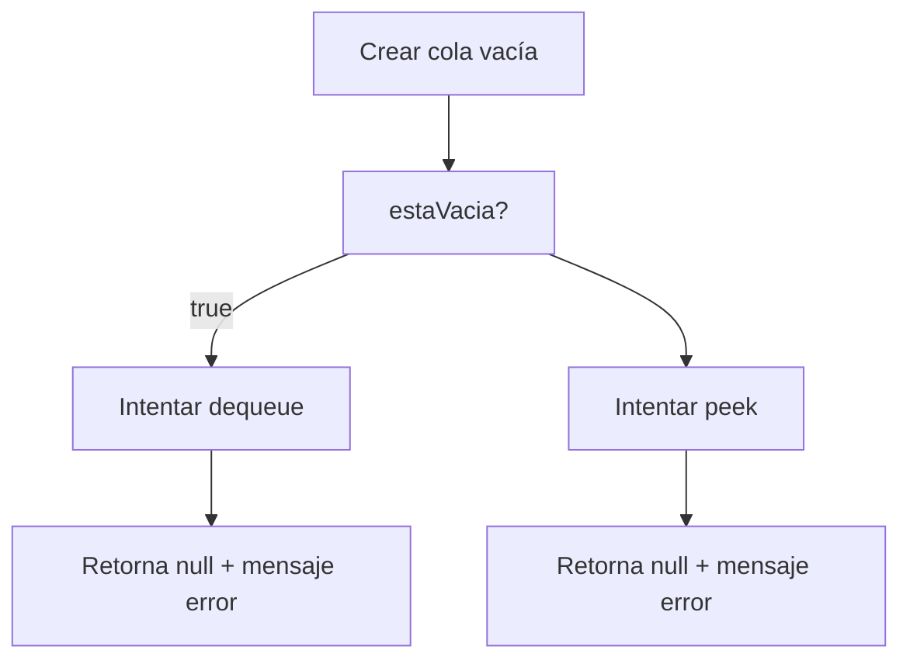
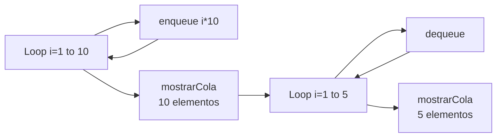
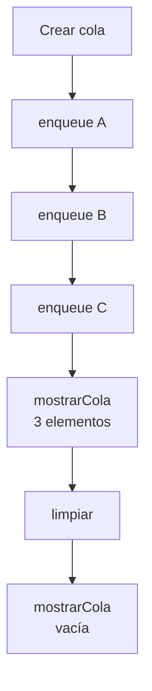

# MERMAID - Diagramas de los Ejemplos

**Microevaluación 3:** Implementación de Colas con POO en Java

Este archivo contiene todos los diagramas Mermaid de los ejemplos (casos de uso) implementados en Main.java.

---

## Diagrama - Caso 1: Cola de Enteros

---

## Diagrama - Caso 2: Cola de Strings (Clientes)

---

## Diagrama - Caso 3: Cola de Objetos Personalizados (Personas)

---

## Diagrama - Caso 4: Manejo de Cola Vacía

---

## Diagrama - Caso 5: Cola con Muchos Elementos

---

## Diagrama - Caso 6: Limpiar Cola

---

**Autor:** Raul Heredia
