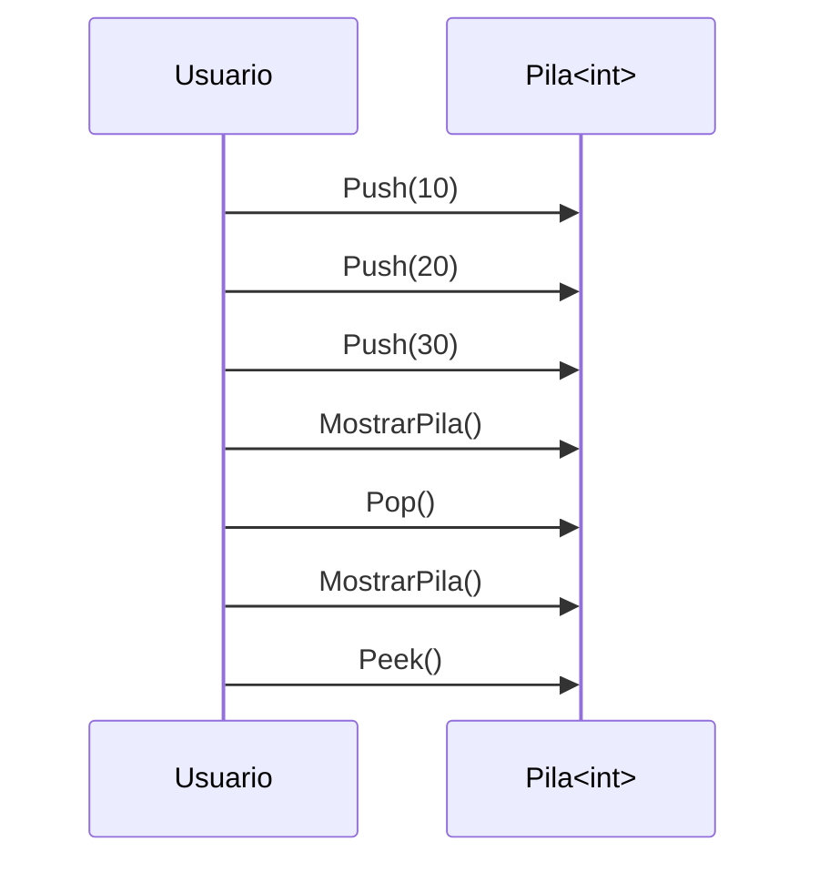
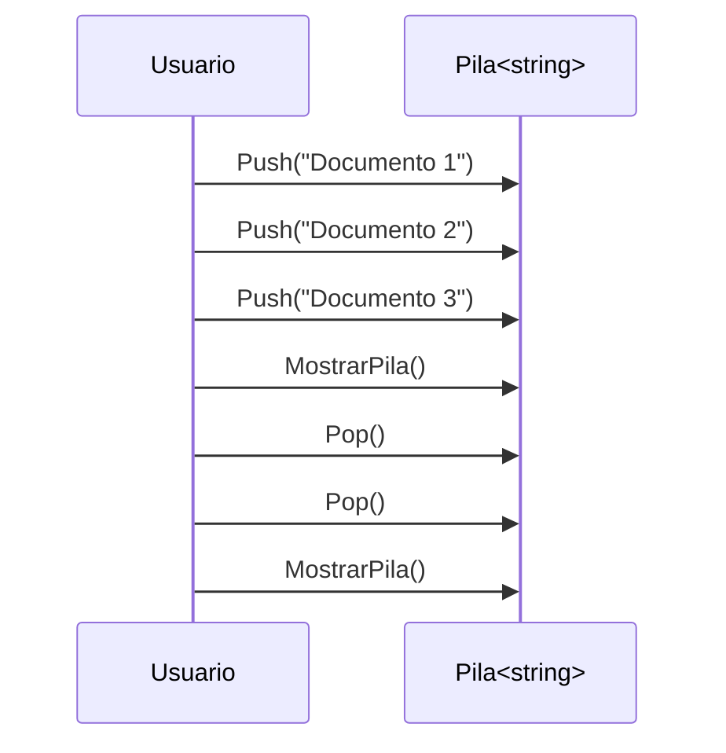
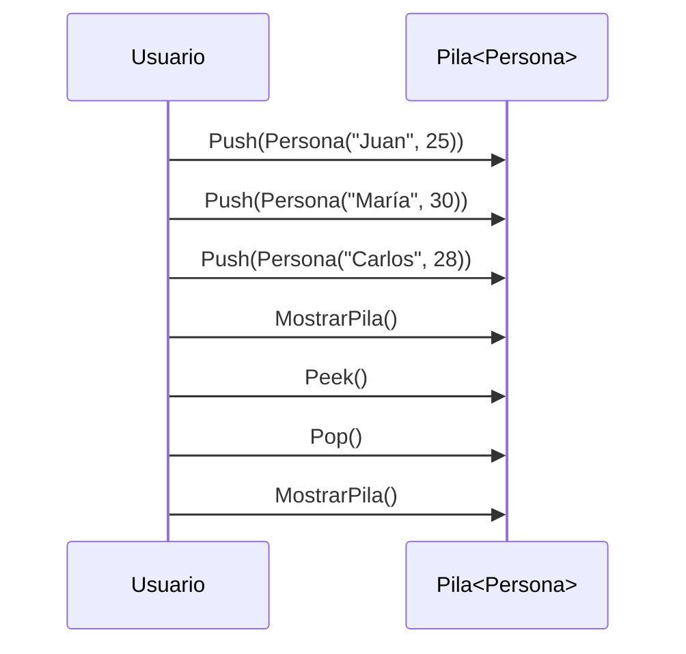
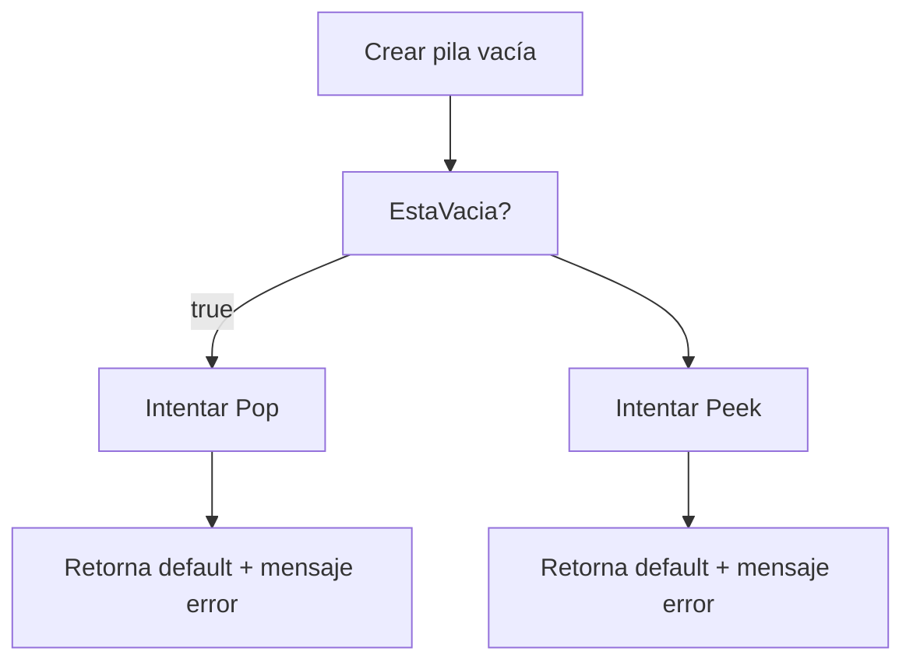
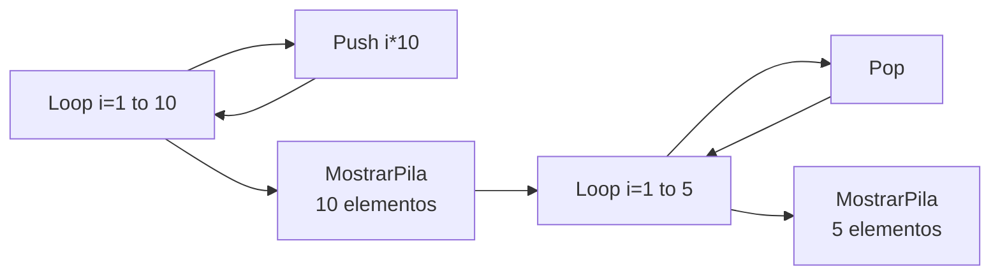
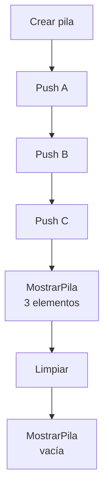

# MERMAID - Diagramas de los Ejemplos

**Examen Primer Parcial:** Implementación de Pilas con POO en C# .NET

Este archivo contiene todos los diagramas Mermaid de los ejemplos (casos de uso) implementados en Main.cs.

---

## Diagrama - Caso 1: Pila de Enteros

---

## Diagrama - Caso 2: Pila de Strings (Documentos)

---

## Diagrama - Caso 3: Pila de Objetos Personalizados (Personas)

---

## Diagrama - Caso 4: Manejo de Pila Vacía

---

## Diagrama - Caso 5: Pila con Muchos Elementos

---

## Diagrama - Caso 6: Limpiar Pila

---

**Autor:** Raul Heredia
