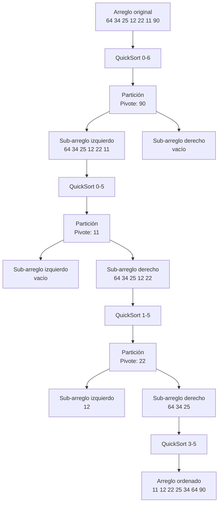
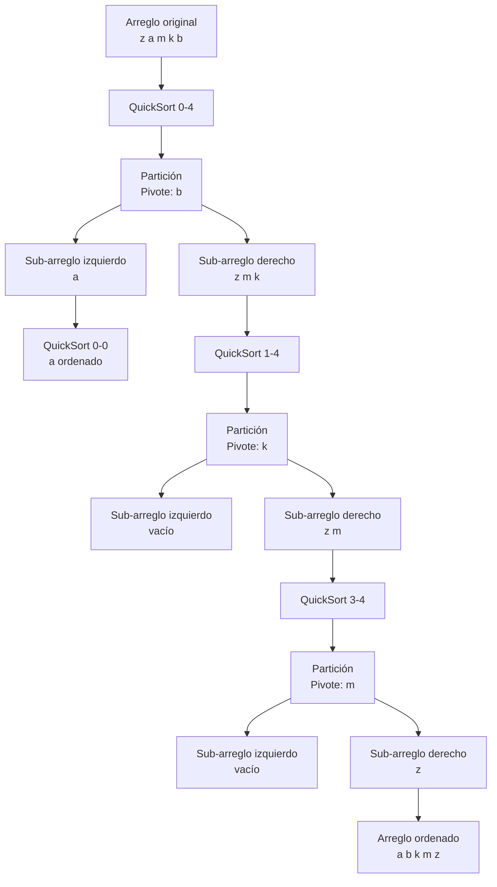
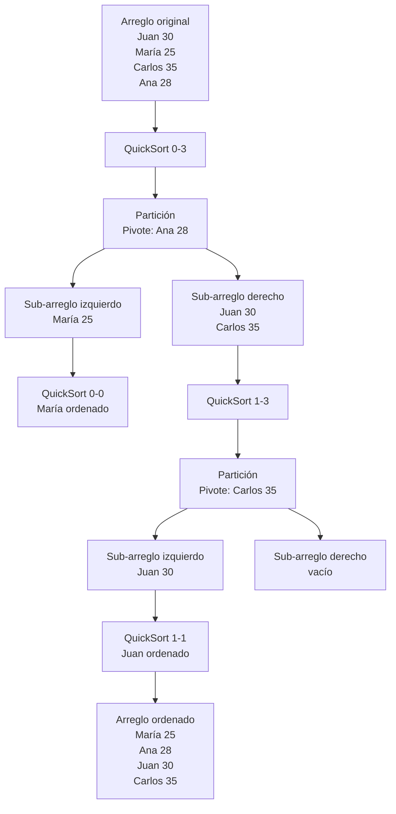
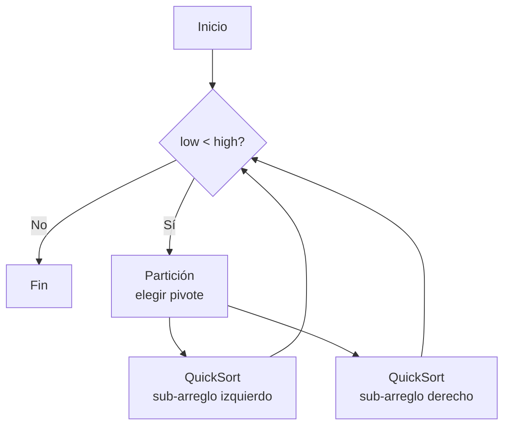

# MERMAID - Diagramas de los Ejemplos

**Examen Primer Parcial:** Implementación de Quick Sort en Java

Este archivo contiene todos los diagramas Mermaid de los ejemplos (casos de uso) implementados en Main.java.

---

## Diagrama - Caso 1: Quick Sort de Enteros



---

## Diagrama - Caso 2: Quick Sort de Strings



---

## Diagrama - Caso 3: Quick Sort de Personas (por edad)



---

## Diagrama - Flujo General de Quick Sort



---

## Diagrama - Proceso de Partición

```mermaid
flowchart TD
    A[Elegir pivote<br/>último elemento] --> B[i = low - 1]
    B --> C{j < high?}
    C -->|Sí| D{arr[j] < pivot?}
    D -->|Sí| E[i++<br/>swap i, j]
    D -->|No| F[j++]
    E --> F
    F --> C
    C -->|No| G[swap i+1, high]
    G --> H[Retornar i+1]
```

---

**Autor:** Raul Heredia
