# 🚀 Microevaluación 2: Gestión Avanzada de Base de Datos II

[](https://github.com/rraulherediaa/PracticasEstructurasDatos)
[](#)
[](#)

Esta guía representa una inmersión profunda en la administración, analítica y automatización de SGBD modernos. Abarca desde la infraestructura física hasta la lógica de negocio distribuida, diseñada como un manual técnico exhaustivo.

---

## 📑 Tabla de Contenidos
1. [🏗️ Administración Avanzada de SGBD](#-1-administración-avanzada-de-sgbd)
2. [📊 Consultas SQL Avanzadas y Analítica](#-2-consultas-sql-avanzadas-y-analítica)
3. [⚙️ Procedimientos, Funciones y Automatización](#-3-procedimientos-funciones-y-automatización)
4. [🗺️ Visualizaciones Directas (Mapas Pro)](diagramas.md)

---

## 🏗️ 1. Administración Avanzada de SGBD

### 1.1. SGBD Avanzados y Despliegue en la Nube
El ecosistema de bases de datos ha evolucionado de servidores locales a arquitecturas globales.

#### Motores Principales:
- **PostgreSQL**: Conocido como la base de datos de código abierto más avanzada. Destaca por su soporte de **MVCC (Multi-Version Concurrency Control)**, tipos de datos geográficos (PostGIS) y extensibilidad.
- **SQL Server**: La solución de Microsoft que brilla por su integración con el ecosistema .NET y sus potentes servicios de Business Intelligence (SSIS, SSRS).
- **Oracle**: El estándar de oro para grandes corporaciones, enfocado en la máxima seguridad y escalabilidad con tecnologías como **Real Application Clusters (RAC)**.
- **SQLite**: Una base de datos sin servidor, ACID y contenida en un solo archivo, ideal para dispositivos móviles y aplicaciones ligeras.

#### Cloud Computing (RDS, Cloud SQL, Azure SQL):
El despliegue en la nube ofrece **PaaS (Platform as a Service)**, donde el proveedor gestiona el parcheado, los backups y la alta disponibilidad.
- **AWS Aurora**: Una base de datos nativa de la nube compatible con MySQL/Postgres que separa el cómputo del almacenamiento.

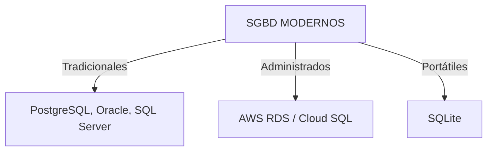

### 1.2. Gestión Multi-plataforma (On-Premise, Cloud, Híbrido)
La administración moderna requiere manejar datos en múltiples ubicaciones.
- **On-Premise**: Control total del hardware, pero mayor costo operativo (CAPEX).
- **Cloud**: Escalabilidad elástica y pago por uso (OPEX).
- **Híbrido**: El puente entre ambos. Por ejemplo, una empresa puede mantener datos sensibles localmente y usar el cloud para reportes pesados.

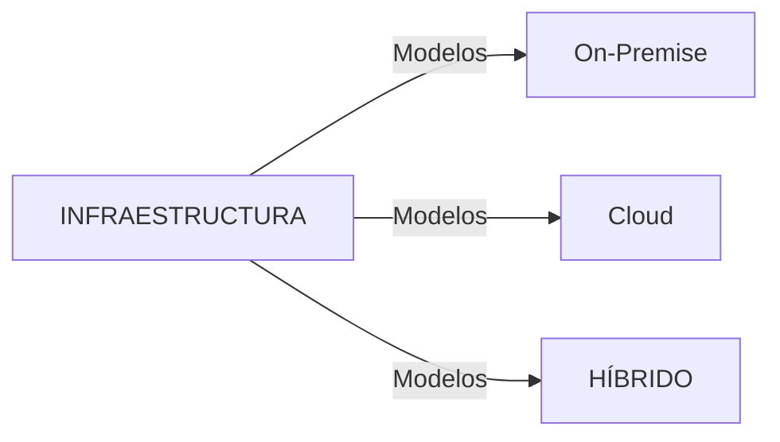

### 1.3. Tuning y Parámetros de Rendimiento
Optimizar una base de datos significa ajustar su "corazón" para el hardware disponible.

#### Parámetros Críticos:
- **PostgreSQL**: `shared_buffers` (cuánta RAM usa para cachear datos) y `work_mem` (memoria para ordenamientos complejos).
- **SQL Server**: `MAXDOP` (Maximum Degree of Parallelism) para controlar cuántos núcleos de CPU usa una sola consulta.
- **MySQL**: `innodb_buffer_pool_size`, que suele configurarse al 70-80% de la RAM total del servidor.

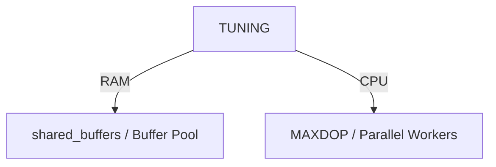

### 1.4. Herramientas Universales (CLI & GUI)
Un administrador profesional domina tanto el entorno visual como la terminal.
- **DBeaver**: La navaja suiza que se conecta a casi cualquier motor mediante JDBC.
- **Azure Data Studio**: Ideal para trabajar con SQL Server y Postgres en Linux/Mac.
- **Python (SQLAlchemy)**: Permite automatizar migraciones y limpieza de datos masivos.

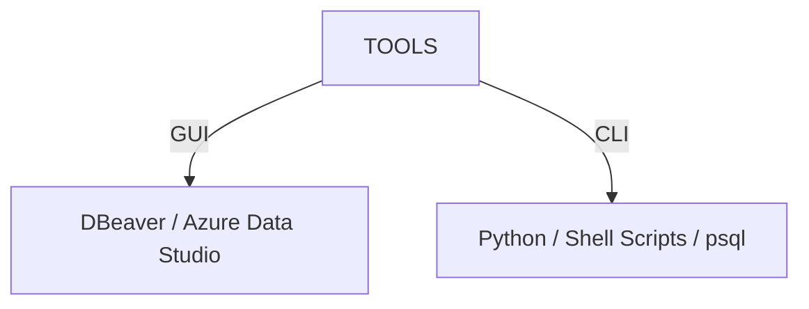

---

## 📊 2. Consultas SQL Avanzadas y Analítica

### 2.1. CTE, Consultas Recursivas y Big Data
Las **Common Table Expressions (CTE)** mejoran la legibilidad del código. Las recursivas son esenciales para procesar jerarquías.

#### Ejemplo de Jerarquía (Organigrama):
```sql
WITH RECURSIVE organigrama AS (
    SELECT id, nombre, jefe_id, 1 as nivel
    FROM empleados WHERE jefe_id IS NULL
    UNION ALL
    SELECT e.id, e.nombre, e.jefe_id, o.nivel + 1
    FROM empleados e
    INNER JOIN organigrama o ON e.jefe_id = o.id
)
SELECT * FROM organigrama;
```

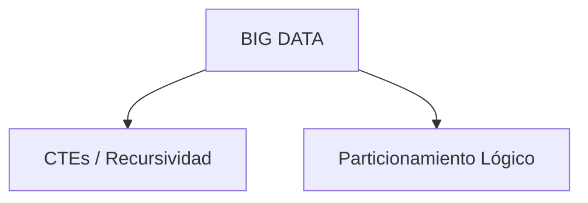

### 2.2. JOINs Avanzados y Window Functions
Las funciones de ventana permiten realizar cálculos sobre un conjunto de filas relacionadas con la actual sin agruparlas.

#### Ejemplo de Window Function:
```sql
-- Obtener el salario del empleado y el promedio de su departamento
SELECT 
    nombre, 
    departamento, 
    salario,
    AVG(salario) OVER(PARTITION BY departamento) as promedio_dept
FROM empleados;
```

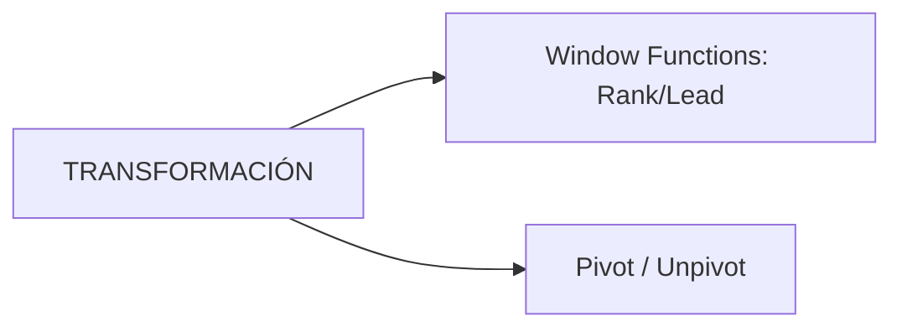

### 2.3. Consultas Analíticas (ROLLUP, CUBE)
Herramientas vitales para el reporting de Business Intelligence.
- **ROLLUP**: Crea subtotales jerárquicos (País -> Ciudad -> Total).
- **CUBE**: Genera todas las combinaciones posibles de subtotales para un conjunto de dimensiones.

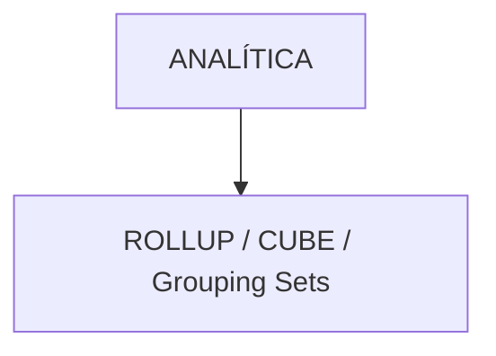

### 2.4. Optimización y Planes de Ejecución
Antes de crear un índice, debemos entender cómo piensa el motor mediante `EXPLAIN ANALYZE`.
- **Index Scan**: El motor busca directamente en el índice (Rápido).
- **Seq Scan**: El motor lee toda la tabla fila por fila (Lento).

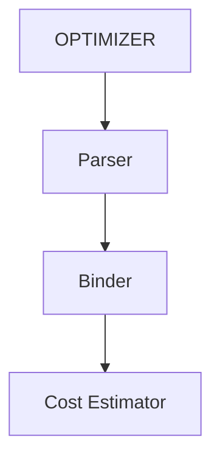

---

## ⚙️ 3. Procedimientos, Funciones y Automatización

### 3.1. Procedimientos y Funciones
La lógica portable permite que el código sea fácil de migrar entre motores.
- **Procedimientos**: Ideales para tareas que modifican datos (INSERT/UPDATE/DELETE).
- **Funciones**: Diseñadas para cálculos que retornan un valor y pueden usarse en un `SELECT`.

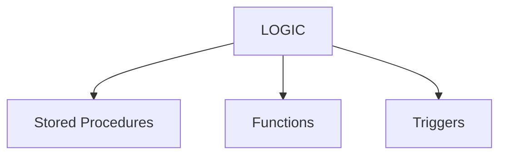

### 3.2. Orquestación y Automatización
No ejecutamos tareas a mano. Usamos herramientas de orquestación.
- **Cron Jobs**: Para tareas simples en Linux.
- **Apache Airflow**: Para flujos de datos complejos (ETL) con dependencias.

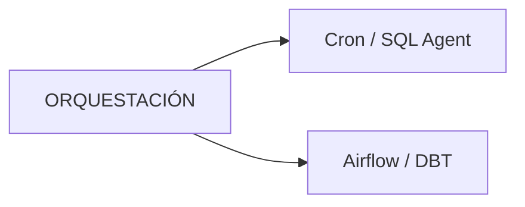

### 3.3. Auditoría y Logging
Es fundamental saber quién cambió qué. Un trigger de auditoría registra cada movimiento en una tabla histórica.

#### Ejemplo de Auditoría:
```sql
CREATE TRIGGER audit_trigger
AFTER UPDATE ON facturacion
FOR EACH ROW EXECUTE FUNCTION log_changes();
```

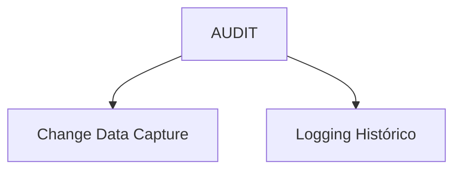

### 3.4. Historia y Buenas Prácticas
#### Evolución:
1. **Años 90 (Fat Client)**: Casi toda la lógica estaba dentro de la DB.
2. **Actualidad (Microservicios)**: La base de datos es un almacén elástico y la lógica es portable y desacoplada.

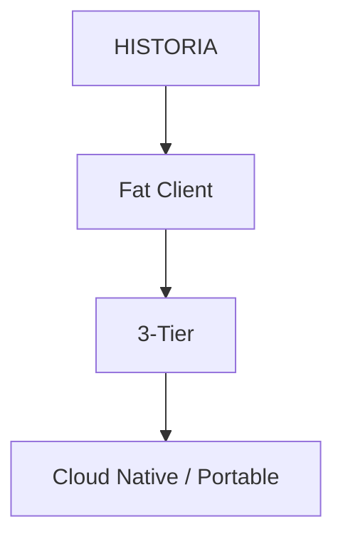

---
*Manual técnico desarrollado para la asignatura Gestión y Manejo de Base de Datos II.*
