# 🚀 Microevaluación 2: Gestión Avanzada de Base de Datos II

[](https://github.com/your-repo)
[](#)
[](#)

Esta guía representa una inmersión profunda en la administración, analítica y automatización de SGBD modernos. Abarca desde la infraestructura física hasta la lógica de negocio distribuida.

---

## 📑 Tabla de Contenidos
1.  [🏗️ Administración Avanzada de SGBD](#-1-administración-avanzada-de-sgbd)
2.  [📊 Consultas SQL Avanzadas y Analítica](#-2-consultas-sql-avanzadas-y-analítica)
3.  [⚙️ Procedimientos, Funciones y Automatización](#-3-procedimientos-funciones-y-automatización)
4.  [🗺️ Visualizaciones Directas (Mapas Pro)](visualizaciones.md)

---

## 🏗️ 1. Administración Avanzada de SGBD

### 1.1. Repaso de SGBD Relacionales Avanzados y su Despliegue en la Nube

#### **Fundamentos de SGBD Relacionales Modernos**

Los Sistemas de Gestión de Bases de Datos Relacionales (RDBMS) han evolucionado significativamente desde sus orígenes en los años 70. Los motores modernos incorporan características avanzadas que van más allá del modelo relacional tradicional, incluyendo soporte para JSON, geoespacial, full-text search, y capacidades distribuidas.

**PostgreSQL** es considerado el RDBMS open-source más avanzado, destacando por:
- **Arquitectura MVCC (Multi-Version Concurrency Control)**: Permite lecturas consistentes sin bloqueos de escritura mediante versiones de filas
- **Extensibilidad**: Sistema de extensiones que permite agregar funcionalidades (PostGIS para geoespacial, pgvector para vectores, TimescaleDB para time-series)
- **Tipos de datos avanzados**: Arrays, hstore, JSONB, rangos, tipos compuestos
- **Full-text search integrado**: Con tsvector, tsquery y diccionarios configurables
- **Replicación física y lógica**: Streaming replication, logical decoding para CDC

**SQL Server** de Microsoft ofrece:
- **Integración con ecosistema Microsoft**: Azure DevOps, Power BI, Active Directory
- **Columnstore indexes**: Para analítica de alto rendimiento (OLAP en mismo motor OLTP)
- **Always On Availability Groups**: Alta disponibilidad con failover automático
- **PolyBase**: Consultas distribuidas entre fuentes heterogéneas (Hadoop, Azure Blob Storage)
- **Machine Learning Services**: Ejecución de Python/R dentro del motor

**Oracle Database** se caracteriza por:
- **Multitenant Architecture**: Container Database (CDB) con múltiples Pluggable Databases (PDB)
- **Automatic Memory Management (AMM)**: Gestión automática de SGA y PGA
- **Exadata**: Appliance hardware-software integrado para máximo rendimiento
- **Advanced Compression**: Compresión a nivel de bloque y fila
- **GoldenGate**: Replicación en tiempo real con transformación de datos

**MariaDB** (fork de MySQL) aporta:
- **Pluggable Storage Engines**: InnoDB, MyRocks, ColumnStore, Spider
- **Galera Cluster**: Replicación síncrona multi-master
- **Window Functions**: Soporte completo desde versión 10.2
- **Temporal Tables**: Tablas con historial automático de cambios
- **Role-based access control**: Granularidad en permisos

**SQLite** se distingue por:
- **Serverless**: Biblioteca embedded sin proceso servidor
- **ACID completo**: Con write-ahead logging (WAL)
- **Single-file database**: Todo en un archivo portátil
- **Zero-configuration**: Sin setup ni administración
- **Ideal para**: Mobile apps, IoT, testing, edge computing

#### **Despliegue en la Nube: Servicios Administrados**

**AWS RDS (Relational Database Service)** soporta múltiples motores:

- **PostgreSQL en RDS**:
  - Versiones hasta 16 con extensiones pre-instaladas
  - Multi-AZ deployments con synchronous replication
  - Read Replicas para escala de lectura (hasta 15)
  - Performance Insights para monitoreo
  - Parámetros configurables vía Parameter Groups

- **SQL Server en RDS**:
  - Ediciones: Express, Web, Standard, Enterprise
  - Integration con Active Directory
  - Native backup/restauración a S3
  - Transparent Data Encryption (TDE)
  - License Included o Bring Your Own License (BYOL)

- **Oracle en RDS**:
  - Versiones 12c, 19c, 21c
  - Multitenant con hasta 5 PDBs en Enterprise
  - Oracle APEX incluido
  - Data Guard para disaster recovery
  - Enterprise Manager Cloud Control

- **MariaDB en RDS**:
  - Versiones 10.3, 10.6, 10.11
  - Aria storage engine para tablas temporales
  - Slow query log automático
  - Automated backups con retention configurable

- **Aurora (AWS)**:
  - Compatible con PostgreSQL y MySQL
  - Storage distribuido auto-scaling (hasta 128TB)
  - 5x rendimiento de MySQL estándar
  - Replicación cross-region
  - Serverless v2 con escala milisegundos

**Google Cloud SQL** ofrece:

- **PostgreSQL en Cloud SQL**:
  - Versiones 14, 15, 16
  - High availability con zona cruzada
  - Automated backups y point-in-time recovery
  - Connection pooling con PgBouncer integrado
  - Database flags para tuning
  - Integración con Cloud Logging y Monitoring

- **SQL Server en Cloud SQL**:
  - Versiones 2017, 2019, 2022
  - Always On availability groups
  - Integration con Active Directory
  - Native backup a Cloud Storage
  - SQL Server Agent para jobs

- **MySQL en Cloud SQL**:
  - Versiones 5.7, 8.0
  - Read replicas asíncronas
  - Replicación externa desde on-premise
  - Database flags para configuración

**Azure Database** proporciona:

- **Azure Database for PostgreSQL**:
  - Flexible Server (v2) o Single Server
  - Hyperscale (Citus) para sharding
  - PostgreSQL 14, 15, 16
  - Zone-redundant high availability
  - VNet integration para aislamiento de red

- **Azure SQL Database**:
  - Single database, Elastic pool, Managed instance
  - DTU-based o vCore-based purchasing models
  - Automatic tuning (index recommendations)
  - Threat detection y Advanced Data Security
  - Geo-replication con failover groups

- **Azure Database for MySQL**:
  - Flexible Server (recomendado) o Single Server
  - MySQL 5.7, 8.0
  - Read replicas
  - Serverless compute + auto-scale storage

#### **Comparativa de Características Cloud**

| Característica | AWS RDS | Google Cloud SQL | Azure Database |
|----------------|---------|------------------|----------------|
| **Multi-region** | Aurora cross-region | No nativo | Geo-replication |
| **Serverless** | Aurora Serverless v2 | No | SQL Serverless |
| **Sharding** | No nativo | No | Hyperscale (Postgres) |
| **Pricing** | Por hora + storage | Por hora + storage | Por hora + storage |
| **Free tier** | 12 meses (t2.micro) | 90 días | 12 meses (B-series) |

```mermaid
flowchart DT
    classDef central fill:#2563eb,color:#fff,font-weight:bold,stroke:#1e40af
    classDef cloud fill:#10b981,color:#fff,stroke:#059669
    classDef onprem fill:#f59e0b,color:#fff,stroke:#d97706
    
    Root(("SGBD MODERNOS")):::central
    
    Root -->|Open Source| OSS[PostgreSQL, MariaDB, SQLite]
    Root -->|Propietario| PROP[SQL Server, Oracle]
    
    OSS -->|Cloud Native| AWS1[Aurora PostgreSQL] & GCP1[Cloud SQL Postgres] & AZ1[Azure Postgres]
    PROP -->|Cloud Native| AWS2[RDS SQL Server] & GCP2[Cloud SQL SQL Server] & AZ2[Azure SQL]
    
    OSS -->|On-Premise| OP1[Self-hosted PostgreSQL] & OP2[Self-hosted MariaDB]
    PROP -->|On-Premise| OP3[Self-hosted SQL Server] & OP4[Self-hosted Oracle]
    
    Root -->|Embedded| EMB[SQLite]:::onprem
```

### 1.2. Gestión y Administración Multi-plataforma

#### **Modelos de Despliegue: On-Premise, Cloud, Híbrido**

**On-Premise (Infraestructura Propia)**

**Ventajas:**
- **Control total**: Sobre hardware, networking, seguridad, compliance
- **Latencia mínima**: Datos en red local sin dependencia de internet
- **Costos predecibles**: CAPEX (inversión inicial) vs OPEX (recurrente)
- **Compliance regulatorio**: Datos no salen de jurisdicción (GDPR, HIPAA)
- **Integración legacy**: Con sistemas existentes en datacenter

**Desventajas:**
- **CAPEX elevado**: Hardware, licencias, mantenimiento
- **Escalabilidad limitada**: Requiere compra adicional de hardware
- **Sobrecarga operativa**: Administración de OS, networking, seguridad
- **Tiempo de aprovisionamiento**: Semanas/meses para nueva capacidad
- **Disponibilidad**: Depende de redundancia on-premise (UPS, generadores)

**Casos de uso típicos:**
- Entidades bancarias y financieras (compliance SOX, PCI-DSS)
- Gobierno y defensa (seguridad nacional)
- Empresas con datacenters existentes y personal IT
- Workloads con latencia crítica (<1ms)

**Cloud (Infraestructura como Servicio)**

**Ventajas:**
- **OPEX model**: Pago por uso, sin inversión inicial
- **Escalabilidad elástica**: Auto-scaling vertical y horizontal
- **High availability nativa**: Multi-AZ, cross-region
- **Managed services**: Parches, backups, monitoring automatizados
- **Time-to-market**: Aprovisionamiento en minutos
- **Global reach**: Despliegue en múltiples regiones geográficas

**Desventajas:**
- **Vendor lock-in**: APIs y servicios propietarios
- **Costos impredecibles**: Si no se monitorea el consumo
- **Latencia de red**: Dependiente de conexión a internet
- **Compliance complejo**: Data residency requirements
- **Menor control**: Sobre infraestructura subyacente

**Casos de uso típicos:**
- Startups y empresas en crecimiento
- Workloads con patrones de tráfico variables
- Proyectos con time-to-market crítico
- Empresas sin datacenter propio
- Aplicaciones SaaS globales

**Híbrido (Mejor de ambos mundos)**

**Arquitecturas híbridas comunes:**

1. **Burst to cloud**: Base on-premise, escala peak a cloud
2. **Cloud backup**: On-premise primario, cloud para DR
3. **Data lake**: Transaccional on-premise, analítica en cloud
4. **Multi-cloud**: Distribución entre proveedores para evitar lock-in
5. **Edge + cloud**: Procesamiento edge (IoT) + centralización cloud

**Patrones de integración híbrida:**

- **VPN Site-to-Site**: Conexión segura entre datacenter y cloud VPC
- **ExpressRoute/Direct Connect**: Conexión dedicada de baja latencia
- **Hybrid data sync**: Replicación bidireccional con conflict resolution
- **Identity federation**: SSO entre AD on-premise y cloud IAM
- **Unified monitoring**: Herramientas que monitorean ambos entornos

**Desafíos de la gestión híbrida:**

- **Consistencia de datos**: Eventual consistency vs strong consistency
- **Network partitioning**: Manejo de desconexiones entre entornos
- **Cost optimization**: Balancear carga para minimizar cloud spend
- **Security posture**: Políticas unificadas de seguridad
- **Skill gap**: Equipo debe conocer ambos mundos

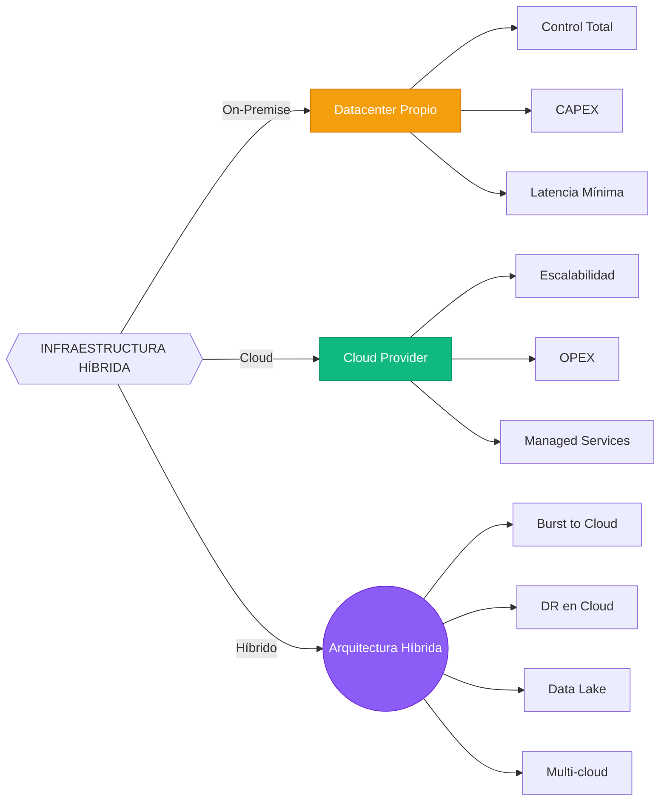

#### **Estrategias de Migración**

**Lift and Shift (Rehosting)**
- Mover aplicación tal cual a cloud VMs
- Rápido pero no aprovecha beneficios cloud
- Primer paso en journey cloud

**Replatforming**
- Migrar a managed services (RDS, Cloud SQL)
- Aprovechar automatización de cloud provider
- Balance entre velocidad y optimización

**Refactoring**
- Rediseñar para cloud-native (serverless, microservicios)
- Máximo beneficio pero mayor esfuerzo
- Ideal para nuevas aplicaciones

**Retire**
- Eliminar aplicaciones no necesarias
- Reducir footprint y costos

#### **Gestión Multi-cloud**

**Herramientas de gestión unificada:**
- **Terraform**: Infrastructure as Code multi-provider
- **Ansible**: Configuration management agnóstico
- **Prometheus + Grafana**: Monitoring stack portable
- **Consul**: Service discovery y configuration
- **Vault**: Secrets management multi-cloud

**Consideraciones multi-cloud:**
- **Cost management**: Consolidated billing y cost allocation
- **Compliance**: Data governance across providers
- **Networking**: Interconnectivity entre clouds
- **Identity**: Federated identity management
- **Disaster recovery**: Cross-cloud backup y restore

### 1.3. Tuning, Configuración Avanzada y Parámetros de Rendimiento

#### **Fundamentos de Performance Tuning**

El tuning de bases de datos es un proceso sistemático que involucra múltiples capas: hardware, sistema operativo, configuración del motor, diseño de esquema, y optimización de consultas. El enfoque debe ser data-driven, basado en métricas y no en suposiciones.

**Jerarquía de optimización:**
1. **Hardware y OS**: CPU, RAM, I/O, kernel parameters
2. **Configuración del motor**: Memory allocation, parallelism, WAL
3. **Diseño físico**: Indexing, partitioning, storage layout
4. **Diseño lógico**: Normalización, tipos de datos, constraints
5. **Consultas**: SQL optimization, execution plans

#### **Tuning de PostgreSQL**

**Parámetros de memoria críticos:**

- **shared_buffers**: Caché compartida para datos (25% de RAM en sistemas dedicados)
  ```
  shared_buffers = 4GB  # Para servidor con 16GB RAM
  ```

- **effective_cache_size**: Estimación de memoria disponible para caché (50-75% de RAM)
  ```
  effective_cache_size = 12GB
  ```

- **work_mem**: Memoria por operación de sort/hash (aumentar si hay muchas operaciones complejas)
  ```
  work_mem = 64MB  # Por conexión
  ```

- **maintenance_work_mem**: Memoria para operaciones de mantenimiento (VACUUM, CREATE INDEX)
  ```
  maintenance_work_mem = 1GB
  ```

- **wal_buffers**: Buffer para Write-Ahead Log (típicamente 16MB o 3% de shared_buffers)
  ```
  wal_buffers = 16MB
  ```

**Parámetros de WAL y checkpoint:**

- **wal_level**: Nivel de logging (minimal, replica, logical)
  ```
  wal_level = replica  # Para replicación
  ```

- **checkpoint_completion_target**: Porcentaje de WAL entre checkpoints (0.5-0.9)
  ```
  checkpoint_completion_target = 0.9
  ```

- **max_wal_size**: Tamaño máximo de WAL antes de checkpoint forzado
  ```
  max_wal_size = 4GB
  ```

- **min_wal_size**: Tamaño mínimo de WAL a reciclar
  ```
  min_wal_size = 1GB
  ```

**Parámetros de paralelismo:**

- **max_parallel_workers_per_gather**: Workers por nodo Gather
  ```
  max_parallel_workers_per_gather = 4
  ```

- **max_parallel_workers**: Total de workers para paralelismo
  ```
  max_parallel_workers = 8
  ```

- **max_parallel_maintenance_workers**: Workers para CREATE INDEX, VACUUM
  ```
  max_parallel_maintenance_workers = 4
  ```

**Parámetros de conexión:**

- **max_connections**: Máximo de conexiones simultáneas (usar pooler para alto número)
  ```
  max_connections = 200
  ```

- **superuser_reserved_connections**: Conexiones reservadas para superusuario
  ```
  superuser_reserved_connections = 3
  ```

**Autovacuum tuning:**

- **autovacuum**: Habilitar autovacuum automático
  ```
  autovacuum = on
  ```

- **autovacuum_max_workers**: Workers de autovacuum concurrentes
  ```
  autovacuum_max_workers = 3
  ```

- **autovacuum_naptime**: Tiempo entre ejecuciones de autovacuum
  ```
  autovacuum_naptime = 1min
  ```

**Query planner tuning:**

- **random_page_cost**: Costo de I/O random vs sequential (reducir en SSD)
  ```
  random_page_cost = 1.1  # Para SSD
  ```

- **effective_io_concurrency**: Operaciones I/O concurrentes (para SSD)
  ```
  effective_io_concurrency = 200
  ```

- **default_statistics_target**: Muestras para estadísticas (aumentar para mejor planificación)
  ```
  default_statistics_target = 100
  ```

#### **Tuning de SQL Server**

**Memory configuration:**

- **max server memory (MB)**: Memoria máxima para buffer pool
  ```
  sp_configure 'max server memory (MB)', 12000  # Dejar 4GB para OS en 16GB
  ```

- **min server memory (MB)**: Memoria mínima reservada
  ```
  sp_configure 'min server memory (MB)', 4096
  ```

- **memory grant reserved**: Reserva para queries con memory grant
  ```
  sp_configure 'memory grant reserved', 10
  ```

**CPU y paralelismo:**

- **max degree of parallelism (MAXDOP)**: Máximo de CPUs por query
  ```
  sp_configure 'max degree of parallelism', 4  # Para servidor de 8 cores
  ```

- **cost threshold for parallelism**: Umbral de costo para paralelismo
  ```
  sp_configure 'cost threshold for parallelism', 50
  ```

- **CPU affinity mask**: Asignación de CPUs a NUMA nodes

**Tempdb configuration:**

- **Múltiples archivos tempdb**: Un archivo por CPU core hasta 8, luego incrementar en 4
  ```
  ALTER DATABASE tempdb ADD FILE (NAME = tempdev2, FILENAME = 'tempdb2.ndf')
  ```

- **Size inicial**: Pre-size para evitar auto-growth
  ```
  ALTER DATABASE tempdb MODIFY FILE (NAME = tempdev, SIZE = 8GB)
  ```

- **Auto-growth**: En chunks grandes (64MB-256MB)
  ```
  ALTER DATABASE tempdb MODIFY FILE (NAME = tempdev, FILEGROWTH = 256MB)
  ```

**Database settings:**

- **Recovery model**: FULL para producción, SIMPLE para desarrollo
  ```
  ALTER DATABASE [MyDB] SET RECOVERY FULL
  ```

- **Auto-close/auto-shrink**: Deshabilitar en producción
  ```
  ALTER DATABASE [MyDB] SET AUTO_CLOSE OFF
  ALTER DATABASE [MyDB] SET AUTO_SHRINK OFF
  ```

- **Compatibility level**: Mantener actualizado
  ```
  ALTER DATABASE [MyDB] SET COMPATIBILITY_LEVEL = 150
  ```

#### **Tuning de Oracle**

**Memory management:**

- **SGA_TARGET**: Tamaño total de System Global Area (AMM)
  ```
  ALTER SYSTEM SET SGA_TARGET = 8G SCOPE = BOTH
  ```

- **PGA_AGGREGATE_TARGET**: Tamaño de Program Global Area
  ```
  ALTER SYSTEM SET PGA_AGGREGATE_TARGET = 4G SCOPE = BOTH
  ```

- **MEMORY_TARGET**: Suma de SGA + PGA (AMM simplificado)
  ```
  ALTER SYSTEM SET MEMORY_TARGET = 12G SCOPE = BOTH
  ```

**Parámetros de I/O:**

- **DB_BLOCK_SIZE**: Tamaño de bloque (8192 default, 16384 para DW)
  - Solo se puede setear al crear la base de datos

- **DB_FILE_MULTIBLOCK_READ_COUNT**: Bloques por I/O para full table scans
  ```
  ALTER SYSTEM SET DB_FILE_MULTIBLOCK_READ_COUNT = 16
  ```

**Optimizer parameters:**

- **OPTIMIZER_MODE**: ALL_ROWS (default), FIRST_ROWS, FIRST_ROWS_10
  ```
  ALTER SYSTEM SET OPTIMIZER_MODE = ALL_ROWS
  ```

- **OPTIMIZER_INDEX_COST_ADJ**: Ajuste de costo de índices (100 default, 10-30 para OLTP)
  ```
  ALTER SYSTEM SET OPTIMIZER_INDEX_COST_ADJ = 20
  ```

- **OPTIMIZER_USE_PENDING_STATISTICS**: Usar estadísticas pendientes
  ```
  ALTER SYSTEM SET OPTIMIZER_USE_PENDING_STATISTICS = TRUE
  ```

#### **Tuning de MariaDB/MySQL**

**InnoDB buffer pool:**

- **innodb_buffer_pool_size**: 70-80% de RAM en servidor dedicado
  ```
  innodb_buffer_pool_size = 12G  # Para 16GB RAM
  ```

- **innodb_buffer_pool_instances**: Dividir buffer pool (1 por GB hasta 8)
  ```
  innodb_buffer_pool_instances = 8
  ```

- **innodb_flush_log_at_trx_commit**: 1 (safe), 2 (faster), 0 (fastest)
  ```
  innodb_flush_log_at_trx_commit = 2  # Balance performance/safety
  ```

**InnoDB I/O:**

- **innodb_io_capacity**: IOPS para SSD (2000-20000)
  ```
  innodb_io_capacity = 2000
  ```

- **innodb_io_capacity_max**: IOPS máximo para burst
  ```
  innodb_io_capacity_max = 4000
  ```

- **innodb_flush_method**: O_DIRECT para Linux
  ```
  innodb_flush_method = O_DIRECT
  ```

**Connection handling:**

- **max_connections**: Ajustar según uso (usar pooler)
  ```
  max_connections = 500
  ```

- **thread_cache_size**: Cache de threads para reutilizar
  ```
  thread_cache_size = 50
  ```

**Query cache (MySQL 5.7, deshabilitado en 8.0):**

- **query_cache_type**: Deshabilitar en alta concurrencia
  ```
  query_cache_type = 0
  ```

#### **Monitoring y Métricas Clave**

**Métricas de performance:**

- **Throughput**: Queries por segundo, transacciones por segundo
- **Latency**: Tiempo de respuesta promedio, percentiles (p95, p99)
- **Resource utilization**: CPU%, Memory%, Disk I/O, Network
- **Database-specific**: Buffer pool hit ratio, cache hit ratio, lock waits

**Herramientas de monitoring:**

- **PostgreSQL**: pg_stat_statements, pg_stat_activity, EXPLAIN ANALYZE
- **SQL Server**: DMVs (sys.dm_exec_query_stats), Query Store, Extended Events
- **Oracle**: AWR reports, ASH reports, SQL Monitoring
- **MariaDB**: Performance Schema, Slow Query Log

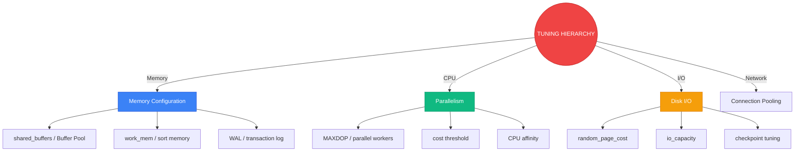

### 1.4. Herramientas Universales y CLI para Administración Avanzada

#### **Herramientas GUI Universales**

**DBeaver**

DBeaver es un cliente database multi-plataforma open-source que soporta más de 80 bases de datos.

**Características principales:**
- **Multi-database**: PostgreSQL, MySQL, Oracle, SQL Server, SQLite, MongoDB, Cassandra, etc.
- **ER Diagrams**: Generación automática de diagramas entidad-relación
- **Data transfer**: Import/export entre diferentes bases de datos
- **SQL editor**: Con syntax highlighting, auto-completion, formatting
- **Visual query builder**: Constructor visual de consultas
- **Data visualization**: Gráficos de datos directamente desde resultados
- **SSH tunneling**: Conexiones seguras a bases de datos remotas
- **Team collaboration**: Compartir configuraciones y queries
- **Extensions**: Marketplace de plugins adicionales

**Uso avanzado:**
- **Data compare**: Comparar y sincronizar datos entre bases de datos
- **Schema compare**: Comparar estructuras de esquemas
- **Mock data generation**: Generar datos de prueba
- **Task scheduling**: Programar ejecución de scripts SQL
- **Version control integration**: Git para tracking de cambios

**Azure Data Studio**

Azure Data Studio es un IDE ligero para SQL Server, Azure SQL, y PostgreSQL.

**Características principales:**
- **Cross-platform**: Windows, macOS, Linux
- **Modern UI**: Basado en VS Code
- **IntelliSense**: Auto-compleción inteligente
- **Snippet library**: Colección de snippets SQL reutilizables
- **Notebooks**: Jupyter notebooks integrados con SQL
- **Source control**: Git integration
- **Extensions**: Marketplace para funcionalidades adicionales
- **Dashboard**: Custom dashboards con widgets

**Uso avanzado:**
- **SQL notebooks**: Documentación interactiva con queries ejecutables
- **Profiler**: Captura y análisis de traces
- **Query plan viewer**: Visualización de planes de ejecución
- **Backup/restore wizards**: Interfaz simplificada para operaciones críticas
- **Azure integration**: Gestión directa de recursos Azure SQL

**pgAdmin (PostgreSQL)**

pgAdmin es la herramienta oficial de administración de PostgreSQL.

**Características principales:**
- **Complete management**: Gestión completa de objetos PostgreSQL
- **Query tool**: Editor SQL avanzado con EXPLAIN visual
- **Debugger**: Debug de funciones y procedimientos
- **Backup/restore**: Interfaz gráfica para pg_dump/pg_restore
- **Grant manager**: Gestión visual de permisos
- **Dashboard**: Monitoreo de actividad en tiempo real
- **ERD tool**: Diseño de modelos entidad-relación

**Oracle SQL Developer**

Herramienta gratuita de Oracle para desarrollo y administración.

**Características principales:**
- **PL/SQL debugger**: Debug de código PL/SQL
- **Data modeler**: Diseño de modelos de datos
- **DBA navigator**: Gestión de tareas administrativas
- **SQL worksheet**: Editor SQL con formatting
- **Reports**: Reportes predefinidos y customizados
- **Migration workbench**: Migración desde otras bases de datos

#### **CLI y Herramientas de Línea de Comandos**

**PostgreSQL CLI**

**psql** - Cliente interactivo de línea de comandos:

```bash
# Conexión básica
psql -h localhost -U postgres -d mydb

# Ejecutar script SQL
psql -f script.sql

# Ejecutar query y salir
psql -c "SELECT version();"

# Conexión con password
PGPASSWORD=mypass psql -h localhost -U postgres -d mydb

# Output format
psql -c "SELECT * FROM users" -A -t  # Unaligned, tuples only
psql -c "SELECT * FROM users" -x     # Expanded display
```

**Comandos psql útiles:**
- `\l` - Listar bases de datos
- `\c dbname` - Conectar a base de datos
- `\dt` - Listar tablas
- `\d tablename` - Describir tabla
- `\di` - Listar índices
- `\dv` - Listar vistas
- `\df` - Listar funciones
- `\du` - Listar usuarios
- `\dn` - Listar schemas
- `\s` - Historial de comandos
- `\e` - Editar último comando en editor
- `\o filename` - Redirigir output a archivo
- `\copy` - Importar/exportar datos
- `\x` - Toggle expanded display
- `\timing` - Toggle timing de queries

**pg_dump** - Backup lógico:

```bash
# Backup completo
pg_dump -h localhost -U postgres mydb > backup.sql

# Backup solo esquema
pg_dump -h localhost -U postgres --schema-only mydb > schema.sql

# Backup solo datos
pg_dump -h localhost -U postgres --data-only mydb > data.sql

# Backup con formato custom (para pg_restore)
pg_dump -h localhost -U postgres -Fc mydb > backup.dump

# Backup de tabla específica
pg_dump -h localhost -U postgres -t users mydb > users.sql

# Backup paralelo (para bases de datos grandes)
pg_dump -h localhost -U postgres -j 4 -Fd mydb -f backup_dir
```

**pg_restore** - Restaurar desde backup:

```bash
# Restaurar desde SQL
psql -h localhost -U postgres mydb < backup.sql

# Restaurar desde formato custom
pg_restore -h localhost -U postgres -d mydb backup.dump

# Restaurar solo esquema
pg_restore -h localhost -U postgres --schema-only -d mydb backup.dump

# Restaurar tabla específica
pg_restore -h localhost -U postgres -t users -d mydb backup.dump

# Restaurar paralelo
pg_restore -h localhost -U postgres -j 4 -d mydb backup.dump
```

**pgbench** - Benchmarking:

```bash
# Inicializar base de datos de prueba
pgbench -i -s 10 mydb  # -s escala (10 = 1M filas)

# Ejecutar benchmark
pgbench -c 10 -j 4 -T 60 mydb  # 10 clientes, 4 threads, 60 segundos

# Benchmark con scripts custom
pgbench -f custom_script.sql -c 10 -j 4 -T 60 mydb
```

**SQL Server CLI**

**sqlcmd** - Utilidad de línea de comandos:

```bash
# Conexión básica
sqlcmd -S localhost -U sa -P password -d mydb

# Con autenticación Windows
sqlcmd -S localhost -E -d mydb

# Ejecutar script
sqlcmd -S localhost -U sa -P password -i script.sql

# Ejecutar query
sqlcmd -S localhost -U sa -P password -Q "SELECT @@VERSION"

# Output format
sqlcmd -S localhost -U sa -P password -Q "SELECT * FROM users" -h -1 -W
```

**bcp** - Bulk Copy Program:

```bash
# Exportar datos
bcp mydb.dbo.users out users.csv -S localhost -U sa -P password -c -t, -r\n

# Importar datos
bcp mydb.dbo.users in users.csv -S localhost -U sa -P password -c -t, -r\n

# Exportar con query
bcp "SELECT * FROM users WHERE active = 1" queryout active_users.csv -S localhost -U sa -P password -c
```

**Oracle CLI**

**sqlplus** - Cliente SQL*Plus:

```bash
# Conexión básica
sqlplus username/password@hostname:port/SID

# Conexión usando tnsnames.ora
sqlplus username/password@tns_alias

# Ejecutar script
sqlplus username/password@hostname @script.sql

# Ejecutar query desde línea de comandos
sqlplus -S username/password@hostname << EOF
SELECT * FROM users;
EXIT;
EOF
```

**expdp/impdp** - Data Pump (export/import):

```bash
# Exportar esquema completo
expdp username/password@hostname DIRECTORY=dpump_dir DUMPFILE=schema.dmp LOGFILE=exp.log SCHEMAS=myschema

# Exportar tabla específica
expdp username/password@hostname DIRECTORY=dpump_dir DUMPFILE=table.dmp TABLES=users

# Exportar con paralelismo
expdp username/password@hostname DIRECTORY=dpump_dir DUMPFILE=schema%U.dmp PARALLEL=4 SCHEMAS=myschema

# Importar
impdp username/password@hostname DIRECTORY=dpump_dir DUMPFILE=schema.dmp LOGFILE=imp.log SCHEMAS=myschema

# Importar tabla específica
impdp username/password@hostname DIRECTORY=dpump_dir DUMPFILE=table.dmp TABLES=users
```

**MariaDB/MySQL CLI**

**mysql** - Cliente de línea de comandos:

```bash
# Conexión básica
mysql -h localhost -u root -p mydb

# Ejecutar script
mysql -h localhost -u root -p mydb < script.sql

# Ejecutar query
mysql -h localhost -u root -p -e "SELECT VERSION();" mydb

# Output format
mysql -h localhost -u root -p -e "SELECT * FROM users" mydb -t  # Tabular
mysql -h localhost -u root -p -e "SELECT * FROM users" mydb -H  # HTML
mysql -h localhost -u root -p -e "SELECT * FROM users" mydb -X  # XML
```

**mysqldump** - Backup lógico:

```bash
# Backup completo
mysqldump -h localhost -u root -p mydb > backup.sql

# Backup solo esquema
mysqldump -h localhost -u root -p --no-data mydb > schema.sql

# Backup solo datos
mysqldump -h localhost -u root -p --no-create-info mydb > data.sql

# Backup de tabla específica
mysqldump -h localhost -u root -p mydb users > users.sql

# Backup con procedimientos y funciones
mysqldump -h localhost -u root -p --routines --triggers mydb > backup.sql
```

**mysqlimport** - Importar datos:

```bash
# Importar desde CSV
mysqlimport -h localhost -u root -p --local mydb users.csv

# Importar con opciones
mysqlimport -h localhost -u root -p --local --fields-terminated-by=, --lines-terminated-by=\n mydb users.csv
```

#### **Scripting con Python**

**Librerías principales:**

**psycopg2** - PostgreSQL adapter:

```python
import psycopg2
from psycopg2 import pool

# Connection pooling
connection_pool = psycopg2.pool.SimpleConnectionPool(
    minconn=1,
    maxconn=10,
    host='localhost',
    database='mydb',
    user='postgres',
    password='password'
)

# Ejecutar query
conn = connection_pool.getconn()
cursor = conn.cursor()
cursor.execute("SELECT * FROM users WHERE active = %s", (True,))
results = cursor.fetchall()
cursor.close()
connection_pool.putconn(conn)
```

**pyodbc** - SQL Server:

```python
import pyodbc

conn_str = 'DRIVER={ODBC Driver 17 for SQL Server};SERVER=localhost;DATABASE=mydb;UID=sa;PWD=password'
conn = pyodbc.connect(conn_str)
cursor = conn.cursor()
cursor.execute("SELECT * FROM users")
for row in cursor:
    print(row)
```

**cx_Oracle** - Oracle:

```python
import cx_Oracle

dsn = cx_Oracle.makedsn('hostname', 1521, sid='ORCL')
conn = cx_Oracle.connect('username', 'password', dsn)
cursor = conn.cursor()
cursor.execute("SELECT * FROM users")
for row in cursor:
    print(row)
```

**pymysql** - MySQL/MariaDB:

```python
import pymysql

conn = pymysql.connect(
    host='localhost',
    user='root',
    password='password',
    database='mydb'
)
cursor = conn.cursor()
cursor.execute("SELECT * FROM users")
results = cursor.fetchall()
```

#### **Scripting con Shell (Bash)**

**PostgreSQL scripts:**

```bash
#!/bin/bash
# backup_postgres.sh

DB_NAME="mydb"
BACKUP_DIR="/backups"
DATE=$(date +%Y%m%d_%H%M%S)
BACKUP_FILE="$BACKUP_DIR/${DB_NAME}_${DATE}.sql"

pg_dump -h localhost -U postgres $DB_NAME > $BACKUP_FILE

# Comprimir backup
gzip $BACKUP_FILE

# Limpiar backups antiguos (mantener 7 días)
find $BACKUP_DIR -name "${DB_NAME}_*.sql.gz" -mtime +7 -delete
```

**SQL Server scripts:**

```bash
#!/bin/bash
# backup_sqlserver.sh

SERVER="localhost"
USER="sa"
PASSWORD="password"
DATABASE="mydb"
BACKUP_DIR="/backups"
DATE=$(date +%Y%m%d_%H%M%S)
BACKUP_FILE="$BACKUP_DIR/${DATABASE}_${DATE}.bak"

sqlcmd -S $SERVER -U $USER -P $PASSWORD -Q "BACKUP DATABASE [$DATABASE] TO DISK = '$BACKUP_FILE'"
```

**MySQL scripts:**

```bash
#!/bin/bash
# backup_mysql.sh

DATABASE="mydb"
USER="root"
PASSWORD="password"
BACKUP_DIR="/backups"
DATE=$(date +%Y%m%d_%H%M%S)
BACKUP_FILE="$BACKUP_DIR/${DATABASE}_${DATE}.sql"

mysqldump -h localhost -u $USER -p$PASSWORD $DATABASE > $BACKUP_FILE
gzip $BACKUP_FILE
```

#### **Herramientas de Automatización y Orquestación**

**Ansible** - Configuration management:

```yaml
# postgresql_config.yml
---
- name: Configure PostgreSQL
  hosts: db_servers
  become: yes
  tasks:
    - name: Install PostgreSQL
      apt:
        name: postgresql-14
        state: present
    
    - name: Configure PostgreSQL
      template:
        src: postgresql.conf.j2
        dest: /etc/postgresql/14/main/postgresql.conf
      notify: Restart PostgreSQL
    
    - name: Start PostgreSQL service
      service:
        name: postgresql
        state: started
        enabled: yes
```

**Terraform** - Infrastructure as Code:

```hcl
# main.tf - AWS RDS PostgreSQL
resource "aws_db_instance" "postgres" {
  identifier = "my-postgres-db"
  engine = "postgres"
  engine_version = "14.9"
  instance_class = "db.t3.large"
  allocated_storage = 100
  storage_encrypted = true
  db_name = "mydb"
  username = "admin"
  password = var.db_password
  multi_az = true
  backup_retention_period = 7
  skip_final_snapshot = false
  final_snapshot_identifier = "my-postgres-final-snapshot"
}
```

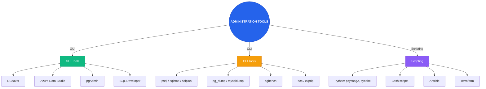

---

## 📊 2. Consultas SQL Avanzadas y Analítica de Datos

### 2.1. Subconsultas Avanzadas, CTE, Consultas Recursivas y Manejo de Grandes Volúmenes de Datos

#### **Subconsultas Avanzadas**

Las subconsultas (consultas anidadas) permiten ejecutar una consulta dentro de otra, proporcionando gran flexibilidad para resolver problemas complejos de datos.

**Tipos de subconsultas:**

**Subconsultas escalares**: Retornan un solo valor (una fila y una columna).

```sql
-- PostgreSQL
SELECT product_name, price
FROM products
WHERE price > (SELECT AVG(price) FROM products);

-- SQL Server
SELECT product_name, price
FROM products
WHERE price > (SELECT AVG(price) FROM products);
```

**Subconsultas de fila**: Retornan una sola fila con múltiples columnas.

```sql
-- PostgreSQL
SELECT product_name, category
FROM products
WHERE (category, price) = (SELECT category, MAX(price) FROM products GROUP BY category);

-- SQL Server (no soporta directamente, usar JOIN)
SELECT p.product_name, p.category
FROM products p
INNER JOIN (
    SELECT category, MAX(price) as max_price
    FROM products
    GROUP BY category
) m ON p.category = m.category AND p.price = m.max_price;
```

**Subconsultas de columna**: Retornan múltiples filas con una sola columna.

```sql
-- PostgreSQL
SELECT customer_name
FROM customers
WHERE customer_id IN (SELECT DISTINCT customer_id FROM orders WHERE order_date > '2024-01-01');

-- SQL Server
SELECT customer_name
FROM customers
WHERE customer_id IN (SELECT DISTINCT customer_id FROM orders WHERE order_date > '2024-01-01');
```

**Subconsultas de tabla**: Retornan múltiples filas y columnas (usadas en FROM).

```sql
-- PostgreSQL
SELECT dept_name, avg_salary
FROM (
    SELECT department_id, AVG(salary) as avg_salary
    FROM employees
    GROUP BY department_id
) dept_avg
JOIN departments ON dept_avg.department_id = departments.department_id;

-- SQL Server
SELECT dept_name, avg_salary
FROM (
    SELECT department_id, AVG(salary) as avg_salary
    FROM employees
    GROUP BY department_id
) AS dept_avg
JOIN departments ON dept_avg.department_id = departments.department_id;
```

**Subconsultas correlacionadas**: La subconsulta hace referencia a columnas de la consulta externa.

```sql
-- PostgreSQL
SELECT e.employee_name, e.salary
FROM employees e
WHERE e.salary > (SELECT AVG(salary) FROM employees WHERE department_id = e.department_id);

-- SQL Server
SELECT e.employee_name, e.salary
FROM employees e
WHERE e.salary > (SELECT AVG(salary) FROM employees WHERE department_id = e.department_id);
```

**Subconsultas con EXISTS/NOT EXISTS**: Verifican existencia de filas.

```sql
-- PostgreSQL
SELECT customer_name
FROM customers c
WHERE EXISTS (
    SELECT 1 FROM orders o
    WHERE o.customer_id = c.customer_id
    AND o.order_date > '2024-01-01'
);

-- SQL Server
SELECT customer_name
FROM customers c
WHERE EXISTS (
    SELECT 1 FROM orders o
    WHERE o.customer_id = c.customer_id
    AND o.order_date > '2024-01-01'
);
```

**Subconsultas con ANY/ALL**: Comparan con cualquier o todos los valores.

```sql
-- PostgreSQL
SELECT product_name, price
FROM products
WHERE price > ANY (SELECT price FROM products WHERE category = 'Electronics');

-- SQL Server
SELECT product_name, price
FROM products
WHERE price > ANY (SELECT price FROM products WHERE category = 'Electronics');
```

#### **Common Table Expressions (CTE)**

Las CTEs (WITH clauses) permiten definir consultas temporales con nombre que pueden ser referenciadas dentro de la consulta principal. Mejoran la legibilidad y permiten recursividad.

**CTE básicas:**

```sql
-- PostgreSQL
WITH department_stats AS (
    SELECT 
        department_id,
        COUNT(*) as employee_count,
        AVG(salary) as avg_salary,
        MAX(salary) as max_salary
    FROM employees
    GROUP BY department_id
)
SELECT d.department_name, ds.employee_count, ds.avg_salary
FROM department_stats ds
JOIN departments d ON ds.department_id = d.department_id
WHERE ds.employee_count > 10;

-- SQL Server
WITH department_stats AS (
    SELECT 
        department_id,
        COUNT(*) as employee_count,
        AVG(salary) as avg_salary,
        MAX(salary) as max_salary
    FROM employees
    GROUP BY department_id
)
SELECT d.department_name, ds.employee_count, ds.avg_salary
FROM department_stats ds
JOIN departments d ON ds.department_id = d.department_id
WHERE ds.employee_count > 10;
```

**CTE múltiples:**

```sql
-- PostgreSQL
WITH 
dept_employees AS (
    SELECT department_id, COUNT(*) as emp_count
    FROM employees
    GROUP BY department_id
),
dept_salaries AS (
    SELECT department_id, AVG(salary) as avg_salary
    FROM employees
    GROUP BY department_id
)
SELECT d.department_name, de.emp_count, ds.avg_salary
FROM departments d
JOIN dept_employees de ON d.department_id = de.department_id
JOIN dept_salaries ds ON d.department_id = ds.department_id;

-- SQL Server
WITH 
dept_employees AS (
    SELECT department_id, COUNT(*) as emp_count
    FROM employees
    GROUP BY department_id
),
dept_salaries AS (
    SELECT department_id, AVG(salary) as avg_salary
    FROM employees
    GROUP BY department_id
)
SELECT d.department_name, de.emp_count, ds.avg_salary
FROM departments d
JOIN dept_employees de ON d.department_id = de.department_id
JOIN dept_salaries ds ON d.department_id = ds.department_id;
```

**CTE recursivas:**

Las CTE recursivas permiten consultar estructuras jerárquicas (árboles, grafos).

```sql
-- PostgreSQL: Jerarquía de empleados (manager -> subordinados)
WITH RECURSIVE employee_hierarchy AS (
    -- Base case: empleados sin manager (top level)
    SELECT 
        employee_id,
        employee_name,
        manager_id,
        1 as level,
        ARRAY[employee_name] as path
    FROM employees
    WHERE manager_id IS NULL
    
    UNION ALL
    
    -- Recursive case: subordinados
    SELECT 
        e.employee_id,
        e.employee_name,
        e.manager_id,
        eh.level + 1,
        eh.path || e.employee_name
    FROM employees e
    JOIN employee_hierarchy eh ON e.manager_id = eh.employee_id
)
SELECT * FROM employee_hierarchy ORDER BY level, path;

-- SQL Server: Jerarquía de empleados
WITH employee_hierarchy AS (
    -- Base case
    SELECT 
        employee_id,
        employee_name,
        manager_id,
        1 as level,
        CAST(employee_name AS VARCHAR(MAX)) as path
    FROM employees
    WHERE manager_id IS NULL
    
    UNION ALL
    
    -- Recursive case
    SELECT 
        e.employee_id,
        e.employee_name,
        e.manager_id,
        eh.level + 1,
        eh.path + ' -> ' + e.employee_name
    FROM employees e
    JOIN employee_hierarchy eh ON e.manager_id = eh.employee_id
)
SELECT * FROM employee_hierarchy ORDER BY level, path;
```

**CTE para grafos:**

```sql
-- PostgreSQL: Rutas más cortas en un grafo de conexiones
WITH RECURSIVE graph_traversal AS (
    -- Base case: nodos iniciales
    SELECT 
        from_node,
        to_node,
        1 as hops,
        ARRAY[from_node, to_node] as path
    FROM edges
    WHERE from_node = 'A'
    
    UNION ALL
    
    -- Recursive case: expandir grafo
    SELECT 
        gt.from_node,
        e.to_node,
        gt.hops + 1,
        gt.path || e.to_node
    FROM graph_traversal gt
    JOIN edges e ON gt.to_node = e.from_node
    WHERE NOT e.to_node = ANY(gt.path)  -- Evitar ciclos
)
SELECT * FROM graph_traversal WHERE to_node = 'Z' ORDER BY hops LIMIT 1;
```

#### **Consultas Recursivas Avanzadas**

**Generación de secuencias:**

```sql
-- PostgreSQL: Generar serie de números
WITH RECURSIVE numbers AS (
    SELECT 1 as n
    UNION ALL
    SELECT n + 1 FROM numbers WHERE n < 100
)
SELECT n FROM numbers;

-- SQL Server: Generar serie de números
WITH numbers AS (
    SELECT 1 as n
    UNION ALL
    SELECT n + 1 FROM numbers WHERE n < 100
)
SELECT n FROM numbers
OPTION (MAXRECURSION 100);
```

**Cálculo de fechas:**

```sql
-- PostgreSQL: Calcular días entre fechas
WITH RECURSIVE date_series AS (
    SELECT '2024-01-01'::date as date_val
    UNION ALL
    SELECT date_val + INTERVAL '1 day'
    FROM date_series
    WHERE date_val < '2024-12-31'
)
SELECT date_val, EXTRACT(DOW FROM date_val) as day_of_week
FROM date_series;

-- SQL Server: Calcular días entre fechas
WITH date_series AS (
    SELECT CAST('2024-01-01' AS DATE) as date_val
    UNION ALL
    SELECT DATEADD(day, 1, date_val)
    FROM date_series
    WHERE date_val < '2024-12-31'
)
SELECT date_val, DATEPART(weekday, date_val) as day_of_week
FROM date_series
OPTION (MAXRECURSION 365);
```

#### **Manejo de Grandes Volúmenes de Datos**

**Partitioning (Particionamiento):**

El particionamiento divide tablas grandes en piezas más pequeñas y manejables.

**PostgreSQL Partitioning:**

```sql
-- Crear tabla madre (partitioned table)
CREATE TABLE sales (
    sale_id SERIAL,
    sale_date DATE NOT NULL,
    customer_id INTEGER,
    amount DECIMAL(10,2),
    product_id INTEGER
) PARTITION BY RANGE (sale_date);

-- Crear particiones
CREATE TABLE sales_2024_q1 PARTITION OF sales
    FOR VALUES FROM ('2024-01-01') TO ('2024-04-01');

CREATE TABLE sales_2024_q2 PARTITION OF sales
    FOR VALUES FROM ('2024-04-01') TO ('2024-07-01');

CREATE TABLE sales_2024_q3 PARTITION OF sales
    FOR VALUES FROM ('2024-07-01') TO ('2024-10-01');

CREATE TABLE sales_2024_q4 PARTITION OF sales
    FOR VALUES FROM ('2024-10-01') TO ('2025-01-01');

-- Particionamiento por lista
CREATE TABLE customers (
    customer_id SERIAL,
    customer_name VARCHAR(100),
    country VARCHAR(50)
) PARTITION BY LIST (country);

CREATE TABLE customers_usa PARTITION OF customers
    FOR VALUES IN ('USA');

CREATE TABLE customers_canada PARTITION OF customers
    FOR VALUES IN ('Canada');

CREATE TABLE customers_other PARTITION OF customers
    DEFAULT;
```

**SQL Server Partitioning:**

```sql
-- Crear partition function
CREATE PARTITION FUNCTION pf_sales_by_date (DATE)
AS RANGE RIGHT FOR VALUES (
    '2024-04-01',
    '2024-07-01',
    '2024-10-01',
    '2025-01-01'
);

-- Crear partition scheme
CREATE PARTITION SCHEME ps_sales_by_date
AS PARTITION pf_sales_by_date
ALL TO ([PRIMARY]);

-- Crear tabla particionada
CREATE TABLE sales (
    sale_id INT IDENTITY,
    sale_date DATE NOT NULL,
    customer_id INT,
    amount DECIMAL(10,2),
    product_id INT
) ON ps_sales_by_date(sale_date);

-- Crear índice alineado con particiones
CREATE INDEX ix_sales_date ON sales(sale_date)
ON ps_sales_by_date(sale_date);
```

**Oracle Partitioning:**

```sql
-- Range partitioning
CREATE TABLE sales (
    sale_id NUMBER,
    sale_date DATE NOT NULL,
    customer_id NUMBER,
    amount NUMBER(10,2),
    product_id NUMBER
)
PARTITION BY RANGE (sale_date) (
    PARTITION sales_2024_q1 VALUES LESS THAN (TO_DATE('2024-04-01', 'YYYY-MM-DD')),
    PARTITION sales_2024_q2 VALUES LESS THAN (TO_DATE('2024-07-01', 'YYYY-MM-DD')),
    PARTITION sales_2024_q3 VALUES LESS THAN (TO_DATE('2024-10-01', 'YYYY-MM-DD')),
    PARTITION sales_2024_q4 VALUES LESS THAN (TO_DATE('2025-01-01', 'YYYY-MM-DD'))
);

-- List partitioning
CREATE TABLE customers (
    customer_id NUMBER,
    customer_name VARCHAR2(100),
    country VARCHAR2(50)
)
PARTITION BY LIST (country) (
    PARTITION customers_usa VALUES ('USA'),
    PARTITION customers_canada VALUES ('Canada'),
    PARTITION customers_other VALUES (DEFAULT)
);
```

**Sharding (Fragmentación Horizontal):**

El sharding distribuye datos across múltiples instancias de base de datos.

**Estrategias de sharding:**
- **Hash-based**: Hash de key para determinar shard
- **Range-based**: Rangos de valores para cada shard
- **Geographic**: Por ubicación geográfica
- **Tenant-based**: Por cliente/tenant

**Batch processing para grandes volúmenes:**

```sql
-- PostgreSQL: Procesar en batches
DO $$
DECLARE
    batch_size INT := 10000;
    offset_val INT := 0;
    total_processed INT := 0;
BEGIN
    LOOP
        WITH batch AS (
            SELECT customer_id
            FROM customers
            WHERE status = 'pending'
            ORDER BY customer_id
            LIMIT batch_size OFFSET offset_val
        )
        UPDATE customers c
        SET status = 'processed'
        FROM batch b
        WHERE c.customer_id = b.customer_id;
        
        GET DIAGNOSTICS total_processed = ROW_COUNT;
        
        EXIT WHEN total_processed = 0;
        
        offset_val := offset_val + batch_size;
        COMMIT;  -- Commit cada batch
    END LOOP;
END $$;

-- SQL Server: Procesar en batches
DECLARE @batch_size INT = 10000;
DECLARE @offset_val INT = 0;
DECLARE @rows_affected INT = 1;

WHILE @rows_affected > 0
BEGIN
    WITH batch AS (
        SELECT customer_id
    FROM customers
    WHERE status = 'pending'
    ORDER BY customer_id
    OFFSET @offset_val ROWS
    FETCH NEXT @batch_size ROWS ONLY
    )
    UPDATE c
    SET status = 'processed'
    FROM customers c
    INNER JOIN batch b ON c.customer_id = b.customer_id;
    
    SET @rows_affected = @@ROWCOUNT;
    SET @offset_val = @offset_val + @batch_size;
END;
```

**Materialized Views (Vistas Materializadas):**

Las vistas materializadas almacenan el resultado de una consulta físicamente, permitiendo acceso rápido a datos agregados.

```sql
-- PostgreSQL: Crear materialized view
CREATE MATERIALIZED VIEW mv_sales_summary AS
SELECT 
    DATE_TRUNC('month', sale_date) as month,
    SUM(amount) as total_amount,
    COUNT(*) as total_sales,
    AVG(amount) as avg_sale_amount
FROM sales
GROUP BY DATE_TRUNC('month', sale_date)
WITH DATA;

-- Refresh materialized view
REFRESH MATERIALIZED VIEW mv_sales_summary;

-- Refresh concurrentemente (PostgreSQL 9.4+)
REFRESH MATERIALIZED VIEW CONCURRENTLY mv_sales_summary;

-- SQL Server: Indexed views (similar a materialized views)
CREATE VIEW vw_sales_summary WITH SCHEMABINDING
AS
SELECT 
    DATEFROMPARTS(YEAR(sale_date), MONTH(sale_date), 1) as month,
    SUM(amount) as total_amount,
    COUNT_BIG(*) as total_sales,
    AVG(amount) as avg_sale_amount
FROM dbo.sales
GROUP BY DATEFROMPARTS(YEAR(sale_date), MONTH(sale_date), 1);

-- Crear índice clustered para materializar
CREATE UNIQUE CLUSTERED INDEX ix_sales_summary_month
ON vw_sales_summary(month);

-- Oracle: Materialized view
CREATE MATERIALIZED VIEW mv_sales_summary
BUILD IMMEDIATE
REFRESH FAST ON COMMIT
ENABLE QUERY REWRITE
AS
SELECT 
    TRUNC(sale_date, 'MONTH') as month,
    SUM(amount) as total_amount,
    COUNT(*) as total_sales,
    AVG(amount) as avg_sale_amount
FROM sales
GROUP BY TRUNC(sale_date, 'MONTH');
```

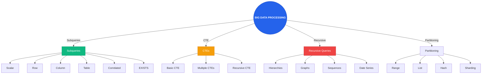

### 2.2. JOINs Avanzados, Funciones de Ventana, UNIONS, PIVOT/UNPIVOT

#### **JOINs Avanzados**

**Tipos de JOINs:**

**INNER JOIN**: Retorna filas cuando hay coincidencia en ambas tablas.

```sql
-- PostgreSQL
SELECT c.customer_name, o.order_id, o.order_date
FROM customers c
INNER JOIN orders o ON c.customer_id = o.customer_id;

-- SQL Server
SELECT c.customer_name, o.order_id, o.order_date
FROM customers c
INNER JOIN orders o ON c.customer_id = o.customer_id;
```

**LEFT JOIN (LEFT OUTER JOIN)**: Retorna todas las filas de la tabla izquierda, y coincidencias de la derecha.

```sql
-- PostgreSQL
SELECT c.customer_name, o.order_id, o.order_date
FROM customers c
LEFT JOIN orders o ON c.customer_id = o.customer_id;

-- SQL Server
SELECT c.customer_name, o.order_id, o.order_date
FROM customers c
LEFT OUTER JOIN orders o ON c.customer_id = o.customer_id;
```

**RIGHT JOIN (RIGHT OUTER JOIN)**: Retorna todas las filas de la tabla derecha, y coincidencias de la izquierda.

```sql
-- PostgreSQL
SELECT c.customer_name, o.order_id, o.order_date
FROM customers c
RIGHT JOIN orders o ON c.customer_id = o.customer_id;

-- SQL Server
SELECT c.customer_name, o.order_id, o.order_date
FROM customers c
RIGHT OUTER JOIN orders o ON c.customer_id = o.customer_id;
```

**FULL OUTER JOIN**: Retorna filas cuando hay coincidencia en cualquiera de las tablas.

```sql
-- PostgreSQL
SELECT c.customer_name, o.order_id, o.order_date
FROM customers c
FULL OUTER JOIN orders o ON c.customer_id = o.customer_id;

-- SQL Server
SELECT c.customer_name, o.order_id, o.order_date
FROM customers c
FULL OUTER JOIN orders o ON c.customer_id = o.customer_id;
```

**CROSS JOIN**: Producto cartesiano de ambas tablas.

```sql
-- PostgreSQL
SELECT c.customer_name, p.product_name
FROM customers c
CROSS JOIN products p;

-- SQL Server
SELECT c.customer_name, p.product_name
FROM customers c
CROSS JOIN products p;
```

**SELF JOIN**: Una tabla se une a sí misma.

```sql
-- PostgreSQL: Empleados y sus managers
SELECT 
    e.employee_name as employee,
    m.employee_name as manager
FROM employees e
LEFT JOIN employees m ON e.manager_id = m.employee_id;

-- SQL Server
SELECT 
    e.employee_name as employee,
    m.employee_name as manager
FROM employees e
LEFT JOIN employees m ON e.manager_id = m.employee_id;
```

**JOINs con múltiples condiciones:**

```sql
-- PostgreSQL
SELECT o.order_id, c.customer_name, p.product_name
FROM orders o
INNER JOIN customers c ON o.customer_id = c.customer_id AND c.country = 'USA'
INNER JOIN order_items oi ON o.order_id = oi.order_id
INNER JOIN products p ON oi.product_id = p.product_id AND p.category = 'Electronics';

-- SQL Server
SELECT o.order_id, c.customer_name, p.product_name
FROM orders o
INNER JOIN customers c ON o.customer_id = c.customer_id AND c.country = 'USA'
INNER JOIN order_items oi ON o.order_id = oi.order_id
INNER JOIN products p ON oi.product_id = p.product_id AND p.category = 'Electronics';
```

**JOINs con subconsultas:**

```sql
-- PostgreSQL
SELECT c.customer_name, o.order_id, o.total_amount
FROM customers c
INNER JOIN (
    SELECT 
        order_id, 
        customer_id, 
        SUM(amount) as total_amount
    FROM orders
    GROUP BY order_id, customer_id
) o ON c.customer_id = o.customer_id
WHERE o.total_amount > 1000;

-- SQL Server
SELECT c.customer_name, o.order_id, o.total_amount
FROM customers c
INNER JOIN (
    SELECT 
        order_id, 
        customer_id, 
        SUM(amount) as total_amount
    FROM orders
    GROUP BY order_id, customer_id
) o ON c.customer_id = o.customer_id
WHERE o.total_amount > 1000;
```

**LATERAL JOINs (PostgreSQL):**

```sql
-- PostgreSQL: LATERAL JOIN para cálculos por fila
SELECT 
    c.customer_name,
    recent_orders.order_id,
    recent_orders.order_date
FROM customers c
CROSS JOIN LATERAL (
    SELECT order_id, order_date
    FROM orders
    WHERE customer_id = c.customer_id
    ORDER BY order_date DESC
    LIMIT 3
) recent_orders;
```

**APPLY (SQL Server):**

```sql
-- SQL Server: CROSS APPLY (similar a LATERAL)
SELECT 
    c.customer_name,
    recent_orders.order_id,
    recent_orders.order_date
FROM customers c
CROSS APPLY (
    SELECT TOP 3 order_id, order_date
    FROM orders
    WHERE customer_id = c.customer_id
    ORDER BY order_date DESC
) recent_orders;

-- SQL Server: OUTER APPLY (similar a LEFT JOIN LATERAL)
SELECT 
    c.customer_name,
    recent_orders.order_id,
    recent_orders.order_date
FROM customers c
OUTER APPLY (
    SELECT TOP 3 order_id, order_date
    FROM orders
    WHERE customer_id = c.customer_id
    ORDER BY order_date DESC
) recent_orders;
```

#### **Funciones de Ventana (Window Functions)**

Las funciones de ventana realizan cálculos sobre un conjunto de filas relacionadas con la fila actual, sin agrupar las filas.

**Sintaxis básica:**

```sql
function_name OVER (
    [PARTITION BY partition_expression]
    [ORDER BY sort_expression]
    [WINDOW_FRAME]
)
```

**Funciones de agregación como ventana:**

```sql
-- PostgreSQL
SELECT 
    department_id,
    employee_name,
    salary,
    AVG(salary) OVER (PARTITION BY department_id) as dept_avg_salary,
    SUM(salary) OVER (PARTITION BY department_id) as dept_total_salary,
    COUNT(*) OVER (PARTITION BY department_id) as dept_employee_count
FROM employees;

-- SQL Server
SELECT 
    department_id,
    employee_name,
    salary,
    AVG(salary) OVER (PARTITION BY department_id) as dept_avg_salary,
    SUM(salary) OVER (PARTITION BY department_id) as dept_total_salary,
    COUNT(*) OVER (PARTITION BY department_id) as dept_employee_count
FROM employees;
```

**Funciones de ranking:**

```sql
-- PostgreSQL
SELECT 
    employee_name,
    department_id,
    salary,
    ROW_NUMBER() OVER (PARTITION BY department_id ORDER BY salary DESC) as row_num,
    RANK() OVER (PARTITION BY department_id ORDER BY salary DESC) as rank,
    DENSE_RANK() OVER (PARTITION BY department_id ORDER BY salary DESC) as dense_rank,
    NTILE(4) OVER (PARTITION BY department_id ORDER BY salary DESC) as quartile
FROM employees;

-- SQL Server
SELECT 
    employee_name,
    department_id,
    salary,
    ROW_NUMBER() OVER (PARTITION BY department_id ORDER BY salary DESC) as row_num,
    RANK() OVER (PARTITION BY department_id ORDER BY salary DESC) as rank,
    DENSE_RANK() OVER (PARTITION BY department_id ORDER BY salary DESC) as dense_rank,
    NTILE(4) OVER (PARTITION BY department_id ORDER BY salary DESC) as quartile
FROM employees;
```

**Diferencias entre funciones de ranking:**
- **ROW_NUMBER()**: Número único consecutivo, sin empates
- **RANK()**: Mismo número para empates, salta números después de empates
- **DENSE_RANK()**: Mismo número para empates, no salta números
- **NTILE(n)**: Divide en n grupos aproximadamente iguales

**Funciones de offset (LAG/LEAD):**

```sql
-- PostgreSQL
SELECT 
    sale_date,
    amount,
    LAG(amount) OVER (ORDER BY sale_date) as prev_amount,
    LEAD(amount) OVER (ORDER BY sale_date) as next_amount,
    amount - LAG(amount) OVER (ORDER BY sale_date) as change_from_prev
FROM sales;

-- SQL Server
SELECT 
    sale_date,
    amount,
    LAG(amount) OVER (ORDER BY sale_date) as prev_amount,
    LEAD(amount) OVER (ORDER BY sale_date) as next_amount,
    amount - LAG(amount) OVER (ORDER BY sale_date) as change_from_prev
FROM sales;
```

**Funciones FIRST_VALUE/LAST_VALUE:**

```sql
-- PostgreSQL
SELECT 
    department_id,
    employee_name,
    salary,
    FIRST_VALUE(salary) OVER (PARTITION BY department_id ORDER BY salary DESC) as highest_salary,
    LAST_VALUE(salary) OVER (PARTITION BY department_id ORDER BY salary DESC 
        ROWS BETWEEN UNBOUNDED PRECEDING AND UNBOUNDED FOLLOWING) as lowest_salary
FROM employees;

-- SQL Server
SELECT 
    department_id,
    employee_name,
    salary,
    FIRST_VALUE(salary) OVER (PARTITION BY department_id ORDER BY salary DESC) as highest_salary,
    LAST_VALUE(salary) OVER (PARTITION BY department_id ORDER BY salary DESC 
        ROWS BETWEEN UNBOUNDED PRECEDING AND UNBOUNDED FOLLOWING) as lowest_salary
FROM employees;
```

**Window Frames:**

```sql
-- PostgreSQL
SELECT 
    sale_date,
    amount,
    SUM(amount) OVER (
        ORDER BY sale_date
        ROWS BETWEEN 2 PRECEDING AND CURRENT ROW
    ) as moving_avg_3day,
    SUM(amount) OVER (
        ORDER BY sale_date
        ROWS BETWEEN UNBOUNDED PRECEDING AND CURRENT ROW
    ) as running_total
FROM sales;

-- SQL Server
SELECT 
    sale_date,
    amount,
    SUM(amount) OVER (
        ORDER BY sale_date
        ROWS BETWEEN 2 PRECEDING AND CURRENT ROW
    ) as moving_avg_3day,
    SUM(amount) OVER (
        ORDER BY sale_date
        ROWS BETWEEN UNBOUNDED PRECEDING AND CURRENT ROW
    ) as running_total
FROM sales;
```

**Tipos de window frames:**
- **ROWS**: Filas físicas
- **RANGE**: Filas con valores en rango
- **GROUPS**: Grupos de filas con igual valor

**Ejemplo avanzado: Calculando running totals con reset:**

```sql
-- PostgreSQL
SELECT 
    customer_id,
    order_date,
    amount,
    SUM(amount) OVER (
        PARTITION BY customer_id
        ORDER BY order_date
        ROWS BETWEEN UNBOUNDED PRECEDING AND CURRENT ROW
    ) as customer_running_total,
    SUM(amount) OVER (
        ORDER BY order_date
        ROWS BETWEEN UNBOUNDED PRECEDING AND CURRENT ROW
    ) as global_running_total
FROM orders;

-- SQL Server
SELECT 
    customer_id,
    order_date,
    amount,
    SUM(amount) OVER (
        PARTITION BY customer_id
        ORDER BY order_date
        ROWS BETWEEN UNBOUNDED PRECEDING AND CURRENT ROW
    ) as customer_running_total,
    SUM(amount) OVER (
        ORDER BY order_date
        ROWS BETWEEN UNBOUNDED PRECEDING AND CURRENT ROW
    ) as global_running_total
FROM orders;
```

#### **UNION, UNION ALL, INTERSECT, EXCEPT**

**UNION**: Combina resultados de múltiples consultas, eliminando duplicados.

```sql
-- PostgreSQL
SELECT customer_id, customer_name FROM customers_usa
UNION
SELECT customer_id, customer_name FROM customers_canada;

-- SQL Server
SELECT customer_id, customer_name FROM customers_usa
UNION
SELECT customer_id, customer_name FROM customers_canada;
```

**UNION ALL**: Combina resultados manteniendo duplicados (más rápido).

```sql
-- PostgreSQL
SELECT customer_id, customer_name FROM customers_usa
UNION ALL
SELECT customer_id, customer_name FROM customers_canada;

-- SQL Server
SELECT customer_id, customer_name FROM customers_usa
UNION ALL
SELECT customer_id, customer_name FROM customers_canada;
```

**INTERSECT**: Retorna filas que existen en ambos resultados.

```sql
-- PostgreSQL
SELECT customer_id FROM customers_2023
INTERSECT
SELECT customer_id FROM customers_2024;

-- SQL Server
SELECT customer_id FROM customers_2023
INTERSECT
SELECT customer_id FROM customers_2024;
```

**EXCEPT (PostgreSQL) / EXCEPT (SQL Server)**: Retorna filas del primer resultado que no existen en el segundo.

```sql
-- PostgreSQL
SELECT customer_id FROM customers_2023
EXCEPT
SELECT customer_id FROM customers_2024;

-- SQL Server
SELECT customer_id FROM customers_2023
EXCEPT
SELECT customer_id FROM customers_2024;
```

**MINUS (Oracle):** Equivalente a EXCEPT.

```sql
-- Oracle
SELECT customer_id FROM customers_2023
MINUS
SELECT customer_id FROM customers_2024;
```

#### **PIVOT y UNPIVOT**

**PIVOT**: Transforma filas en columnas (rotación de datos).

**SQL Server PIVOT:**

```sql
-- SQL Server: Pivot ventas por mes
SELECT 
    product_id,
    [2024-01] as jan_sales,
    [2024-02] as feb_sales,
    [2024-03] as mar_sales,
    [2024-04] as apr_sales
FROM (
    SELECT 
        product_id,
        FORMAT(sale_date, 'yyyy-MM') as sale_month,
        amount
    FROM sales
) AS source_table
PIVOT (
    SUM(amount)
    FOR sale_month IN ([2024-01], [2024-02], [2024-03], [2024-04])
) AS pivot_table;
```

**PostgreSQL PIVOT (usando crosstab o CASE):**

```sql
-- PostgreSQL: Pivot usando CASE
SELECT 
    product_id,
    SUM(CASE WHEN TO_CHAR(sale_date, 'YYYY-MM') = '2024-01' THEN amount ELSE 0 END) as jan_sales,
    SUM(CASE WHEN TO_CHAR(sale_date, 'YYYY-MM') = '2024-02' THEN amount ELSE 0 END) as feb_sales,
    SUM(CASE WHEN TO_CHAR(sale_date, 'YYYY-MM') = '2024-03' THEN amount ELSE 0 END) as mar_sales,
    SUM(CASE WHEN TO_CHAR(sale_date, 'YYYY-MM') = '2024-04' THEN amount ELSE 0 END) as apr_sales
FROM sales
GROUP BY product_id;

-- PostgreSQL: Pivot usando crosstab (requiere tablefunc extension)
CREATE EXTENSION IF NOT EXISTS tablefunc;

SELECT * FROM crosstab(
    'SELECT product_id, TO_CHAR(sale_date, ''YYYY-MM'') as sale_month, SUM(amount) 
     FROM sales 
     GROUP BY product_id, TO_CHAR(sale_date, ''YYYY-MM'') 
     ORDER BY 1, 2',
    'SELECT DISTINCT TO_CHAR(sale_date, ''YYYY-MM'') FROM sales ORDER BY 1'
) AS (
    product_id INT,
    "2024-01" NUMERIC,
    "2024-02" NUMERIC,
    "2024-03" NUMERIC,
    "2024-04" NUMERIC
);
```

**Oracle PIVOT:**

```sql
-- Oracle: Pivot ventas por mes
SELECT *
FROM (
    SELECT 
        product_id,
        TO_CHAR(sale_date, 'YYYY-MM') as sale_month,
        amount
    FROM sales
)
PIVOT (
    SUM(amount)
    FOR sale_month IN ('2024-01' as jan_sales, '2024-02' as feb_sales, '2024-03' as mar_sales)
);
```

**UNPIVOT**: Transforma columnas en filas (rotación inversa).

**SQL Server UNPIVOT:**

```sql
-- SQL Server: Unpivot datos
SELECT 
    product_id,
    sale_month,
    amount
FROM (
    SELECT 
        product_id,
        jan_sales,
        feb_sales,
        mar_sales,
        apr_sales
    FROM sales_pivoted
) AS source_table
UNPIVOT (
    amount FOR sale_month IN (jan_sales, feb_sales, mar_sales, apr_sales)
) AS unpivot_table;
```

**PostgreSQL UNPIVOT (usando UNION ALL):**

```sql
-- PostgreSQL: Unpivot usando UNION ALL
SELECT 
    product_id,
    'jan_sales' as sale_month,
    jan_sales as amount
FROM sales_pivoted
UNION ALL
SELECT 
    product_id,
    'feb_sales' as sale_month,
    feb_sales as amount
FROM sales_pivoted
UNION ALL
SELECT 
    product_id,
    'mar_sales' as sale_month,
    mar_sales as amount
FROM sales_pivoted
UNION ALL
SELECT 
    product_id,
    'apr_sales' as sale_month,
    apr_sales as amount
FROM sales_pivoted;
```

**Oracle UNPIVOT:**

```sql
-- Oracle: Unpivot datos
SELECT 
    product_id,
    sale_month,
    amount
FROM sales_pivoted
UNPIVOT (
    amount FOR sale_month IN (jan_sales, feb_sales, mar_sales, apr_sales)
);
```

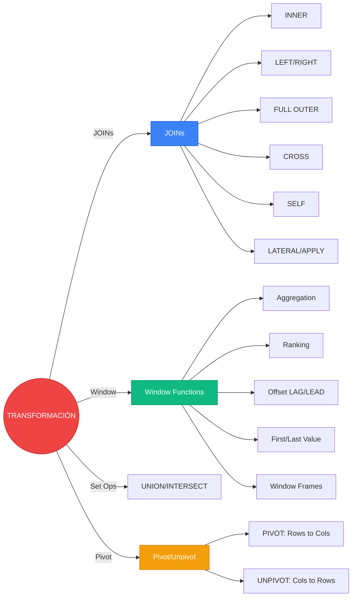

### 2.3. Consultas Analíticas para BI y Reporting (ROLLUP, CUBE, Agregaciones Complejas)

#### **Agregaciones Avanzadas para Business Intelligence**

Las consultas analíticas permiten generar reportes complejos con múltiples niveles de agregación, esenciales para Business Intelligence y reporting.

**GROUP BY con ROLLUP:**

ROLLUP genera subtotales y un gran total, creando una jerarquía de agregación.

```sql
-- PostgreSQL
SELECT 
    region,
    country,
    city,
    SUM(sales_amount) as total_sales,
    COUNT(*) as transaction_count
FROM sales
GROUP BY ROLLUP(region, country, city)
ORDER BY region, country, city;

-- Resultado:
-- region | country | city     | total_sales | transaction_count
-- -------|---------|----------|-------------|------------------
-- NA     | USA     | NY       | 100000      | 500
-- NA     | USA     | LA       | 80000       | 400
-- NA     | USA     | NULL     | 180000      | 900  (subtotal USA)
-- NA     | Canada  | Toronto  | 60000       | 300
-- NA     | Canada  | NULL     | 60000       | 300  (subtotal Canada)
-- NA     | NULL    | NULL     | 240000      | 1200 (subtotal NA)
-- NULL   | NULL    | NULL     | 240000      | 1200 (grand total)

-- SQL Server
SELECT 
    region,
    country,
    city,
    SUM(sales_amount) as total_sales,
    COUNT(*) as transaction_count
FROM sales
GROUP BY ROLLUP(region, country, city)
ORDER BY region, country, city;
```

**GROUP BY con CUBE:**

CUBE genera todas las combinaciones posibles de agregación, creando una matriz multidimensional.

```sql
-- PostgreSQL
SELECT 
    region,
    product_category,
    sales_channel,
    SUM(sales_amount) as total_sales
FROM sales
GROUP BY CUBE(region, product_category, sales_channel)
ORDER BY region, product_category, sales_channel;

-- Resultado: 2^3 = 8 combinaciones
-- region | category | channel  | total_sales
-- -------|----------|----------|-------------
-- NA     | Electronics | Online | 50000
-- NA     | Electronics | Retail | 30000
-- NA     | Electronics | NULL   | 80000
-- NA     | Clothing    | Online | 40000
-- NA     | Clothing    | Retail | 20000
-- NA     | Clothing    | NULL   | 60000
-- NA     | NULL        | Online | 90000
-- NA     | NULL        | Retail | 50000
-- NA     | NULL        | NULL   | 140000
-- ... (más combinaciones para otras regiones)

-- SQL Server
SELECT 
    region,
    product_category,
    sales_channel,
    SUM(sales_amount) as total_sales
FROM sales
GROUP BY CUBE(region, product_category, sales_channel)
ORDER BY region, product_category, sales_channel;
```

**GROUPING SETS:**

GROUPING SETS permite definir combinaciones específicas de agregación.

```sql
-- PostgreSQL
SELECT 
    region,
    country,
    product_category,
    SUM(sales_amount) as total_sales
FROM sales
GROUP BY GROUPING SETS (
    (region, country, product_category),  -- Detalle completo
    (region, country),                    -- Subtotal por país
    (region),                             -- Subtotal por región
    ()                                    -- Gran total
)
ORDER BY region, country, product_category;

-- SQL Server
SELECT 
    region,
    country,
    product_category,
    SUM(sales_amount) as total_sales
FROM sales
GROUP BY GROUPING SETS (
    (region, country, product_category),
    (region, country),
    (region),
    ()
)
ORDER BY region, country, product_category;
```

**Función GROUPING:**

GROUPING identifica si una columna es NULL por agregación o por valor real.

```sql
-- PostgreSQL
SELECT 
    region,
    country,
    SUM(sales_amount) as total_sales,
    GROUPING(region) as is_region_agg,
    GROUPING(country) as is_country_agg
FROM sales
GROUP BY ROLLUP(region, country)
ORDER BY region, country;

-- SQL Server
SELECT 
    region,
    country,
    SUM(sales_amount) as total_sales,
    GROUPING(region) as is_region_agg,
    GROUPING(country) as is_country_agg
FROM sales
GROUP BY ROLLUP(region, country)
ORDER BY region, country;
```

**Función GROUPING_ID (SQL Server):**

GROUPING_ID genera un bitmap para identificar el nivel de agregación.

```sql
-- SQL Server
SELECT 
    region,
    country,
    product_category,
    SUM(sales_amount) as total_sales,
    GROUPING_ID(region, country, product_category) as grouping_level
FROM sales
GROUP BY CUBE(region, country, product_category)
ORDER BY grouping_level, region, country, product_category;
```

#### **Agregaciones Condicionales**

**CASE en agregaciones:**

```sql
-- PostgreSQL
SELECT 
    region,
    SUM(CASE WHEN sales_amount > 1000 THEN sales_amount ELSE 0 END) as high_value_sales,
    SUM(CASE WHEN sales_amount BETWEEN 500 AND 1000 THEN sales_amount ELSE 0 END) as medium_value_sales,
    SUM(CASE WHEN sales_amount < 500 THEN sales_amount ELSE 0 END) as low_value_sales,
    COUNT(CASE WHEN sales_amount > 1000 THEN 1 END) as high_value_count
FROM sales
GROUP BY region;

-- SQL Server
SELECT 
    region,
    SUM(CASE WHEN sales_amount > 1000 THEN sales_amount ELSE 0 END) as high_value_sales,
    SUM(CASE WHEN sales_amount BETWEEN 500 AND 1000 THEN sales_amount ELSE 0 END) as medium_value_sales,
    SUM(CASE WHEN sales_amount < 500 THEN sales_amount ELSE 0 END) as low_value_sales,
    COUNT(CASE WHEN sales_amount > 1000 THEN 1 END) as high_value_count
FROM sales
GROUP BY region;
```

**FILTER (PostgreSQL):**

```sql
-- PostgreSQL
SELECT 
    region,
    SUM(sales_amount) FILTER (WHERE sales_amount > 1000) as high_value_sales,
    SUM(sales_amount) FILTER (WHERE sales_amount BETWEEN 500 AND 1000) as medium_value_sales,
    SUM(sales_amount) FILTER (WHERE sales_amount < 500) as low_value_sales
FROM sales
GROUP BY region;
```

#### **Percentiles y Distribuciones**

**Percentiles (PostgreSQL):**

```sql
-- PostgreSQL
SELECT 
    product_category,
    PERCENTILE_CONT(0.5) WITHIN GROUP (ORDER BY sales_amount) as median_sales,
    PERCENTILE_CONT(0.25) WITHIN GROUP (ORDER BY sales_amount) as q25_sales,
    PERCENTILE_CONT(0.75) WITHIN GROUP (ORDER BY sales_amount) as q75_sales,
    PERCENTILE_DISC(0.5) WITHIN GROUP (ORDER BY sales_amount) as median_discrete
FROM sales
GROUP BY product_category;
```

**Percentiles (SQL Server):**

```sql
-- SQL Server
SELECT 
    product_category,
    PERCENTILE_CONT(0.5) WITHIN GROUP (ORDER BY sales_amount) OVER (PARTITION BY product_category) as median_sales,
    PERCENTILE_CONT(0.25) WITHIN GROUP (ORDER BY sales_amount) OVER (PARTITION BY product_category) as q25_sales,
    PERCENTILE_CONT(0.75) WITHIN GROUP (ORDER BY sales_amount) OVER (PARTITION BY product_category) as q75_sales
FROM sales
GROUP BY product_category;
```

**Percentiles (Oracle):**

```sql
-- Oracle
SELECT 
    product_category,
    PERCENTILE_CONT(0.5) WITHIN GROUP (ORDER BY sales_amount) as median_sales,
    PERCENTILE_CONT(0.25) WITHIN GROUP (ORDER BY sales_amount) as q25_sales,
    PERCENTILE_CONT(0.75) WITHIN GROUP (ORDER BY sales_amount) as q75_sales
FROM sales
GROUP BY product_category;
```

#### **Histogramas y Buckets**

**NTILE para histogramas:**

```sql
-- PostgreSQL
SELECT 
    product_category,
    NTILE(10) OVER (ORDER BY sales_amount) as decile,
    AVG(sales_amount) OVER (PARTITION BY product_category, NTILE(10) OVER (ORDER BY sales_amount)) as avg_in_decile
FROM sales;

-- SQL Server
SELECT 
    product_category,
    NTILE(10) OVER (PARTITION BY product_category ORDER BY sales_amount) as decile,
    AVG(sales_amount) OVER (PARTITION BY product_category, NTILE(10) OVER (PARTITION BY product_category ORDER BY sales_amount)) as avg_in_decile
FROM sales;
```

**WIDTH_BUCKET (PostgreSQL/Oracle):**

```sql
-- PostgreSQL
SELECT 
    product_category,
    WIDTH_BUCKET(sales_amount, 0, 10000, 10) as bucket,
    COUNT(*) as count_in_bucket
FROM sales
GROUP BY product_category, WIDTH_BUCKET(sales_amount, 0, 10000, 10)
ORDER BY product_category, bucket;
```

#### **Análisis de Tendencias**

**Comparación año sobre año (YoY):**

```sql
-- PostgreSQL
WITH monthly_sales AS (
    SELECT 
        EXTRACT(YEAR FROM sale_date) as year,
        EXTRACT(MONTH FROM sale_date) as month,
        SUM(sales_amount) as monthly_total
    FROM sales
    GROUP BY EXTRACT(YEAR FROM sale_date), EXTRACT(MONTH FROM sale_date)
),
yoy_comparison AS (
    SELECT 
        year,
        month,
        monthly_total,
        LAG(monthly_total, 12) OVER (ORDER BY year, month) as same_month_last_year,
        (monthly_total - LAG(monthly_total, 12) OVER (ORDER BY year, month)) / 
            LAG(monthly_total, 12) OVER (ORDER BY year, month) * 100 as yoy_growth_pct
    FROM monthly_sales
)
SELECT * FROM yoy_comparison;

-- SQL Server
WITH monthly_sales AS (
    SELECT 
        YEAR(sale_date) as year,
        MONTH(sale_date) as month,
        SUM(sales_amount) as monthly_total
    FROM sales
    GROUP BY YEAR(sale_date), MONTH(sale_date)
),
yoy_comparison AS (
    SELECT 
        year,
        month,
        monthly_total,
        LAG(monthly_total, 12) OVER (ORDER BY year, month) as same_month_last_year,
        (monthly_total - LAG(monthly_total, 12) OVER (ORDER BY year, month)) * 1.0 / 
            LAG(monthly_total, 12) OVER (ORDER BY year, month) * 100 as yoy_growth_pct
    FROM monthly_sales
)
SELECT * FROM yoy_comparison;
```

**Moving averages:**

```sql
-- PostgreSQL
SELECT 
    sale_date,
    sales_amount,
    AVG(sales_amount) OVER (
        ORDER BY sale_date
        ROWS BETWEEN 6 PRECEDING AND CURRENT ROW
    ) as moving_avg_7day,
    AVG(sales_amount) OVER (
        ORDER BY sale_date
        ROWS BETWEEN 29 PRECEDING AND CURRENT ROW
    ) as moving_avg_30day
FROM sales;

-- SQL Server
SELECT 
    sale_date,
    sales_amount,
    AVG(sales_amount) OVER (
        ORDER BY sale_date
        ROWS BETWEEN 6 PRECEDING AND CURRENT ROW
    ) as moving_avg_7day,
    AVG(sales_amount) OVER (
        ORDER BY sale_date
        ROWS BETWEEN 29 PRECEDING AND CURRENT ROW
    ) as moving_avg_30day
FROM sales;
```

#### **Análisis de Cohortes**

**Cohort analysis por mes de adquisición:**

```sql
-- PostgreSQL
WITH customer_cohorts AS (
    SELECT 
        customer_id,
        DATE_TRUNC('month', MIN(sale_date)) as cohort_month
    FROM sales
    GROUP BY customer_id
),
cohort_activity AS (
    SELECT 
        cc.cohort_month,
        DATE_TRUNC('month', s.sale_date) as activity_month,
        COUNT(DISTINCT s.customer_id) as active_customers
    FROM customer_cohorts cc
    JOIN sales s ON cc.customer_id = s.customer_id
    GROUP BY cc.cohort_month, DATE_TRUNC('month', s.sale_date)
),
cohort_sizes AS (
    SELECT 
        cohort_month,
        COUNT(DISTINCT customer_id) as cohort_size
    FROM customer_cohorts
    GROUP BY cohort_month
)
SELECT 
    ca.cohort_month,
    ca.activity_month,
    ca.active_customers,
    cs.cohort_size,
    ROUND(ca.active_customers * 100.0 / cs.cohort_size, 2) as retention_pct,
    EXTRACT(MONTH FROM AGE(ca.activity_month, ca.cohort_month)) as month_number
FROM cohort_activity ca
JOIN cohort_sizes cs ON ca.cohort_month = cs.cohort_month
ORDER BY ca.cohort_month, ca.activity_month;
```

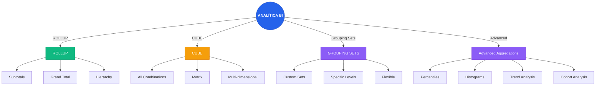

### 2.4. Optimización de Consultas, Análisis de Planes de Ejecución y Tuning Específico por Motor

#### **Fundamentos de Optimización de Consultas**

La optimización de consultas es el proceso de mejorar el rendimiento de las consultas SQL reduciendo el tiempo de ejecución y el consumo de recursos. Involucra entender cómo el motor de base de datos procesa la consulta y aplicar técnicas para mejorar su eficiencia.

**Proceso de ejecución de una consulta:**

1. **Parsing**: Análisis sintáctico de la consulta SQL
2. **Binding**: Resolución de nombres de tablas y columnas
3. **Optimization**: El query planner genera múltiples planes de ejecución y selecciona el más eficiente
4. **Execution**: El motor ejecuta el plan seleccionado
5. **Return**: Los resultados son retornados al cliente

#### **EXPLAIN y Análisis de Planes de Ejecución**

**PostgreSQL EXPLAIN:**

```sql
-- EXPLAIN básico
EXPLAIN SELECT * FROM customers WHERE country = 'USA';

-- EXPLAIN ANALYZE (ejecuta y muestra tiempos reales)
EXPLAIN ANALYZE SELECT * FROM customers WHERE country = 'USA';

-- EXPLAIN con buffers (muestra uso de memoria)
EXPLAIN (ANALYZE, BUFFERS) SELECT * FROM customers WHERE country = 'USA';

-- EXPLAIN con formato JSON
EXPLAIN (FORMAT JSON) SELECT * FROM customers WHERE country = 'USA';

-- Resultado ejemplo:
-- QUERY PLAN
-- --------------------------------------------------------------
-- Seq Scan on customers  (cost=0.00..45.00 rows=1000 width=100)
--   Filter: (country = 'USA')
```

**Interpretación del plan PostgreSQL:**

- **cost**: Costo estimado (startup cost..total cost)
- **rows**: Número estimado de filas
- **width**: Ancho promedio de fila en bytes
- **actual time**: Tiempo real de ejecución (EXPLAIN ANALYZE)
- **actual rows**: Filas reales procesadas (EXPLAIN ANALYZE)
- **loops**: Número de iteraciones

**Tipos de operaciones:**
- **Seq Scan**: Escaneo secuencial de tabla (lento para tablas grandes)
- **Index Scan**: Escaneo usando índice (rápido para búsquedas específicas)
- **Index Only Scan**: Solo lee del índice (más rápido si el índice tiene todas las columnas necesarias)
- **Bitmap Heap Scan**: Combina múltiples índices
- **Hash Join**: Join usando hash table (eficiente para tablas grandes)
- **Merge Join**: Join usando ordenamiento (eficiente si datos ya ordenados)
- **Nested Loop**: Join iterando filas (eficiente para tablas pequeñas)

**SQL Server Execution Plan:**

```sql
-- Mostrar plan de ejecución estimado
SET SHOWPLAN_TEXT ON;
GO
SELECT * FROM customers WHERE country = 'USA';
GO
SET SHOWPLAN_TEXT OFF;
GO

-- Mostrar plan de ejecución real
SET STATISTICS PROFILE ON;
GO
SELECT * FROM customers WHERE country = 'USA';
GO
SET STATISTICS PROFILE OFF;
GO

-- Usar SSMS: Query > Display Estimated Execution Plan
-- Usar SSMS: Query > Include Actual Execution Plan
```

**DMVs para análisis de planes en SQL Server:**

```sql
-- Ver planes en caché
SELECT 
    qp.query_plan,
    st.text,
    qs.execution_count,
    qs.total_elapsed_time / qs.execution_count as avg_elapsed_time
FROM sys.dm_exec_query_stats qs
CROSS APPLY sys.dm_exec_sql_text(qs.sql_handle) st
CROSS APPLY sys.dm_exec_query_plan(qs.plan_handle) qp
ORDER BY qs.total_elapsed_time DESC;

-- Ver missing indexes
SELECT 
    mid.statement as table_name,
    mid.equality_columns,
    mid.inequality_columns,
    mid.included_columns,
    migs.user_seeks,
    migs.user_scans,
    migs.avg_total_user_cost,
    migs.avg_user_impact
FROM sys.dm_db_missing_index_details mid
JOIN sys.dm_db_missing_index_groups mig ON mid.index_handle = mig.index_handle
JOIN sys.dm_db_missing_index_group_stats migs ON mig.index_group_handle = migs.group_handle
ORDER BY migs.avg_user_impact DESC;
```

**Oracle Execution Plan:**

```sql
-- EXPLAIN PLAN
EXPLAIN PLAN FOR
SELECT * FROM customers WHERE country = 'USA';

-- Ver el plan
SELECT * FROM TABLE(DBMS_XPLAN.DISPLAY);

-- EXPLAIN PLAN con detalles
SELECT * FROM TABLE(DBMS_XPLAN.DISPLAY_CURSOR(NULL, NULL, 'ALLSTATS LAST'));

-- AWR report
SELECT * FROM TABLE(DBMS_XPLAN.DISPLAY_AWR('sql_id'));
```

**AWR y ASH en Oracle:**

```sql
-- AWR report para un periodo específico
SELECT * FROM TABLE(DBMS_WORKLOAD_REPOSITORY.AWR_REPORT_HTML(
    DBID => 123456789,
    INST_NUM => 1,
    BID => 1000,
    EID => 2000
));

-- ASH report para análisis de actividad
SELECT * FROM TABLE(DBMS_WORKLOAD_REPOSITORY.ASH_REPORT_HTML(
    DBID => 123456789,
    INST_NUM => 1,
    BID => 1000,
    EID => 2000
));
```

#### **Estrategias de Indexación**

**Tipos de índices:**

**B-Tree Index (índice por defecto):**

```sql
-- PostgreSQL
CREATE INDEX idx_customers_country ON customers(country);
CREATE INDEX idx_customers_name ON customers(last_name, first_name);

-- SQL Server
CREATE INDEX idx_customers_country ON customers(country);
CREATE INDEX idx_customers_name ON customers(last_name, first_name);

-- Oracle
CREATE INDEX idx_customers_country ON customers(country);
CREATE INDEX idx_customers_name ON customers(last_name, first_name);
```

**Partial Index (PostgreSQL):**

```sql
-- Índice solo para filas que cumplen condición
CREATE INDEX idx_active_customers_country ON customers(country) WHERE active = true;
```

**Functional Index (PostgreSQL/Oracle):**

```sql
-- PostgreSQL
CREATE INDEX idx_customers_lower_name ON customers(LOWER(last_name));

-- Oracle
CREATE INDEX idx_customers_lower_name ON customers(LOWER(last_name));
```

**Computed Column Index (SQL Server):**

```sql
-- SQL Server
ALTER TABLE customers ADD lower_name AS LOWER(last_name) PERSISTED;
CREATE INDEX idx_customers_lower_name ON customers(lower_name);
```

**Composite Index:**

```sql
-- Orden de columnas es crítico
-- Bueno para: WHERE last_name = 'Smith' AND first_name = 'John'
-- Bueno para: WHERE last_name = 'Smith'
-- NO bueno para: WHERE first_name = 'John'
CREATE INDEX idx_customers_name ON customers(last_name, first_name);
```

**Covering Index:**

```sql
-- PostgreSQL: INCLUDE (PostgreSQL 11+)
CREATE INDEX idx_orders_customer_date_amount ON orders(customer_id, order_date)
INCLUDE (amount);

-- SQL Server: INCLUDE
CREATE INDEX idx_orders_customer_date_amount ON orders(customer_id, order_date)
INCLUDE (amount);

-- Oracle: Index-only scan con columnas adicionales
CREATE INDEX idx_orders_customer_date_amount ON orders(customer_id, order_date, amount);
```

**Unique Index:**

```sql
-- PostgreSQL
CREATE UNIQUE INDEX idx_customers_email ON customers(email);

-- SQL Server
CREATE UNIQUE INDEX idx_customers_email ON customers(email);

-- Oracle
CREATE UNIQUE INDEX idx_customers_email ON customers(email);
```

**Hash Index (PostgreSQL):**

```sql
-- Solo para igualdad, no para rangos
CREATE INDEX idx_customers_country_hash ON customers USING HASH(country);
```

**GIN Index (PostgreSQL):**

```sql
-- Para arrays, JSONB, full-text search
CREATE INDEX idx_products_tags ON products USING GIN(tags);
CREATE INDEX idx_documents_content ON documents USING GIN(to_tsvector('english', content));
```

**GiST Index (PostgreSQL):**

```sql
-- Para datos geoespaciales, rangos
CREATE INDEX idx_locations_geom ON locations USING GIST(geom);
```

#### **Tuning Específico por Motor**

**PostgreSQL Tuning:**

**Usar índices apropiadamente:**

```sql
-- Forzar uso de índice (no recomendado en producción)
SET enable_seqscan = off;
-- Ejecutar query
SET enable_seqscan = on;

-- Analizar por qué no usa índice
EXPLAIN ANALYZE SELECT * FROM customers WHERE country = 'USA';
-- Si usa Seq Scan, verificar:
-- - Estadísticas desactualizadas: ANALYZE customers;
-- - Selectividad baja: Si retorna >10% de filas, Seq Scan puede ser más rápido
-- - Índice no covering: Si necesita leer tabla de todos modos
```

**VACUUM y ANALYZE:**

```sql
-- ANALYZE actualiza estadísticas para el query planner
ANALYZE customers;

-- VACUUM reclama espacio de filas eliminadas
VACUUM customers;

-- VACUUM FULL reorganiza tabla (bloquea tabla)
VACUUM FULL customers;

-- VACUUM ANALYZE hace ambos
VACUUM ANALYZE customers;

-- Autovacuum automático (configurado en postgresql.conf)
autovacuum = on
autovacuum_naptime = 1min
```

**SQL Server Tuning:**

**Query Store:**

```sql
-- Habilitar Query Store
ALTER DATABASE [MyDB] SET QUERY_STORE = ON;
ALTER DATABASE [MyDB] SET QUERY_STORE (OPERATION_MODE = READ_WRITE);

-- Ver queries con peor rendimiento
SELECT 
    query_id,
    query_sql_text,
    execution_count,
    avg_duration,
    avg_cpu_time,
    avg_logical_io_reads
FROM sys.query_store_query q
JOIN sys.query_store_query_text qt ON q.query_text_id = qt.query_text_id
JOIN sys.query_store_plan p ON q.query_id = p.query_id
JOIN sys.query_store_runtime_stats rs ON p.plan_id = rs.plan_id
ORDER BY avg_duration DESC;

-- Forzar plan específico
EXEC sp_query_store_force_plan @query_id = 42, @plan_id = 43;
```

**Database Engine Tuning Advisor:**

Herramienta GUI que analiza workload y recomienda índices.

**Statistics:**

```sql
-- Actualizar estadísticas
UPDATE STATISTICS customers;
UPDATE STATISTICS customers WITH FULLSCAN;

-- Ver estadísticas
DBCC SHOW_STATISTICS('customers', 'idx_customers_country');
```

**Oracle Tuning:**

**SQL Tuning Advisor:**

```sql
-- Crear tuning task
DECLARE
    l_task_name VARCHAR2(30);
BEGIN
    l_task_name := DBMS_SQLTUNE.CREATE_TUNING_TASK(
        sql_id => 'abc123def456',
        scope => DBMS_SQLTUNE.SCOPE_COMPREHENSIVE,
        time_limit => 60,
        task_name => 'my_tuning_task',
        description => 'Tuning task for slow query'
    );
    
    DBMS_SQLTUNE.EXECUTE_TUNING_TASK(task_name => l_task_name);
END;
/

-- Ver recomendaciones
SELECT DBMS_SQLTUNE.REPORT_TUNING_TASK('my_tuning_task') FROM dual;
```

**Optimizer Hints:**

```sql
-- Hint para usar índice específico
SELECT /*+ INDEX(customers idx_customers_country) */ *
FROM customers
WHERE country = 'USA';

-- Hint para usar hash join
SELECT /*+ USE_HASH(c o) */ *
FROM customers c
JOIN orders o ON c.customer_id = o.customer_id;

-- Hint para paralelismo
SELECT /*+ PARALLEL(4) */ *
FROM large_table;
```

**SQL Plan Management:**

```sql
-- Capturar plan baseline
DECLARE
    l_plans PLS_INTEGER;
BEGIN
    l_plans := DBMS_SPM.LOAD_PLANS_FROM_CURSOR_CACHE(
        sql_id => 'abc123def456',
        plan_hash_value => 123456789
    );
END;
/
```

#### **Anti-Patrones Comunes**

**SELECT \***:

```sql
-- MAL: Trae todas las columnas innecesariamente
SELECT * FROM customers WHERE country = 'USA';

-- BIEN: Solo columnas necesarias
SELECT customer_id, customer_name, email FROM customers WHERE country = 'USA';
```

**Funciones en columnas indexadas:**

```sql
-- MAL: Función en columna indexada impide uso de índice
SELECT * FROM customers WHERE LOWER(last_name) = 'smith';

-- BIEN: Usar índice funcional o comparar directamente
SELECT * FROM customers WHERE last_name = 'Smith';
-- O crear índice funcional: CREATE INDEX idx_customers_lower_name ON customers(LOWER(last_name));
```

**LIKE con wildcard al inicio:**

```sql
-- MAL: No puede usar índice B-Tree
SELECT * FROM customers WHERE last_name LIKE '%Smith%';

-- BIEN: Puede usar índice si wildcard al final
SELECT * FROM customers WHERE last_name LIKE 'Smith%';

-- O usar full-text search o trigram index
```

**OR en lugar de UNION ALL:**

```sql
-- A veces UNION ALL es más eficiente
SELECT * FROM customers WHERE country = 'USA'
UNION ALL
SELECT * FROM customers WHERE country = 'Canada';
```

**Subconsultas no optimizadas:**

```sql
-- MAL: Subconsulta correlacionada
SELECT * FROM customers c
WHERE EXISTS (SELECT 1 FROM orders o WHERE o.customer_id = c.customer_id);

-- BIEN: JOIN
SELECT DISTINCT c.* FROM customers c
INNER JOIN orders o ON c.customer_id = o.customer_id;
```

#### **Monitoring de Performance**

**PostgreSQL:**

```sql
-- Queries lentas (pg_stat_statements)
SELECT 
    query,
    calls,
    total_time,
    mean_time,
    rows
FROM pg_stat_statements
ORDER BY mean_time DESC
LIMIT 10;

-- Conexiones activas
SELECT * FROM pg_stat_activity WHERE state = 'active';

-- Locks bloqueantes
SELECT 
    pid,
    usename,
    query,
    state
FROM pg_stat_activity
WHERE pid IN (
    SELECT blocking_pid FROM pg_locks
);
```

**SQL Server:**

```sql
-- Queries lentos
SELECT 
    execution_count,
    total_elapsed_time / execution_count as avg_elapsed_time,
    total_logical_reads / execution_count as avg_logical_reads,
    SUBSTRING(st.text, (qs.statement_start_offset/2)+1, 
        ((CASE qs.statement_end_offset
            WHEN -1 THEN DATALENGTH(st.text)
            ELSE qs.statement_end_offset
        END - qs.statement_start_offset)/2) + 1) as query_text
FROM sys.dm_exec_query_stats qs
CROSS APPLY sys.dm_exec_sql_text(qs.sql_handle) st
ORDER BY avg_elapsed_time DESC;

-- Bloqueos
SELECT 
    blocking_session_id,
    session_id,
    wait_type,
    wait_time
FROM sys.dm_exec_requests
WHERE blocking_session_id <> 0;
```

**Oracle:**

```sql
-- Queries lentos (v$sql)
SELECT 
    sql_text,
    executions,
    elapsed_time / executions as avg_elapsed_time,
    buffer_gets / executions as avg_buffer_gets
FROM v$sql
WHERE executions > 0
ORDER BY elapsed_time DESC;

-- Sesiones activas
SELECT sid, serial#, username, sql_id, wait_event
FROM v$session
WHERE status = 'ACTIVE';

-- Locks
SELECT 
    s.sid,
    s.serial#,
    s.username,
    l.locked_mode,
    o.object_name
FROM v$session s
JOIN v$lock l ON s.sid = l.sid
JOIN dba_objects o ON l.id1 = o.object_id
WHERE l.locked_mode > 0;
```

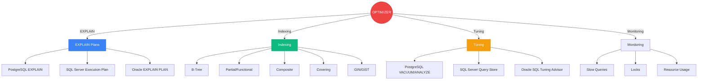

---

## ⚙️ 3. Procedimientos, Funciones, Triggers y Automatización

### 3.1. Procedimientos Almacenados Portables, Funciones Definidas por Usuario y Triggers en Múltiples SGBD

#### **Procedimientos Almacenados (Stored Procedures)**

Los procedimientos almacenados son bloques de código SQL precompilados que residen en la base de datos y pueden ser ejecutados con una llamada. Ofrecen ventajas de rendimiento, seguridad y reutilización.

**PostgreSQL Stored Procedures:**

```sql
-- Crear procedimiento simple
CREATE OR REPLACE PROCEDURE add_customer(
    p_name VARCHAR(100),
    p_email VARCHAR(100),
    p_country VARCHAR(50)
)
LANGUAGE plpgsql
AS $$
BEGIN
    INSERT INTO customers (customer_name, email, country, created_at)
    VALUES (p_name, p_email, p_country, NOW());
    
    COMMIT;
END;
$$;

-- Ejecutar procedimiento
CALL add_customer('John Doe', 'john@example.com', 'USA');

-- Procedimiento con parámetros OUT
CREATE OR REPLACE PROCEDURE get_customer_stats(
    p_country VARCHAR(50),
    OUT customer_count INTEGER,
    OUT total_orders INTEGER
)
LANGUAGE plpgsql
AS $$
BEGIN
    SELECT COUNT(*) INTO customer_count
    FROM customers
    WHERE country = p_country;
    
    SELECT COUNT(*) INTO total_orders
    FROM orders o
    JOIN customers c ON o.customer_id = c.customer_id
    WHERE c.country = p_country;
END;
$$;

-- Ejecutar con parámetros OUT
CALL get_customer_stats('USA');
```

**SQL Server Stored Procedures:**

```sql
-- Crear procedimiento
CREATE OR ALTER PROCEDURE add_customer
    @name VARCHAR(100),
    @email VARCHAR(100),
    @country VARCHAR(50)
AS
BEGIN
    INSERT INTO customers (customer_name, email, country, created_at)
    VALUES (@name, @email, @country, GETDATE());
END;
GO

-- Ejecutar procedimiento
EXEC add_customer 'John Doe', 'john@example.com', 'USA';

-- Procedimiento con parámetros OUTPUT
CREATE OR ALTER PROCEDURE get_customer_stats
    @country VARCHAR(50),
    @customer_count INTEGER OUTPUT,
    @total_orders INTEGER OUTPUT
AS
BEGIN
    SELECT @customer_count = COUNT(*)
    FROM customers
    WHERE country = @country;
    
    SELECT @total_orders = COUNT(*)
    FROM orders o
    INNER JOIN customers c ON o.customer_id = c.customer_id
    WHERE c.country = @country;
END;
GO

-- Ejecutar con parámetros OUTPUT
DECLARE @cust_count INT, @ord_count INT;
EXEC get_customer_stats 'USA', @cust_count OUTPUT, @ord_count OUTPUT;
SELECT @cust_count as customer_count, @ord_count as total_orders;
```

**Oracle Stored Procedures:**

```sql
-- Crear procedimiento
CREATE OR REPLACE PROCEDURE add_customer(
    p_name IN VARCHAR2,
    p_email IN VARCHAR2,
    p_country IN VARCHAR2
)
AS
BEGIN
    INSERT INTO customers (customer_name, email, country, created_at)
    VALUES (p_name, p_email, p_country, SYSDATE);
    
    COMMIT;
END;
/

-- Ejecutar procedimiento
EXEC add_customer('John Doe', 'john@example.com', 'USA');

-- Procedimiento con parámetros OUT
CREATE OR REPLACE PROCEDURE get_customer_stats(
    p_country IN VARCHAR2,
    p_customer_count OUT NUMBER,
    p_total_orders OUT NUMBER
)
AS
BEGIN
    SELECT COUNT(*) INTO p_customer_count
    FROM customers
    WHERE country = p_country;
    
    SELECT COUNT(*) INTO p_total_orders
    FROM orders o
    JOIN customers c ON o.customer_id = c.customer_id
    WHERE c.country = p_country;
END;
/

-- Ejecutar con parámetros OUT
DECLARE
    v_cust_count NUMBER;
    v_ord_count NUMBER;
BEGIN
    get_customer_stats('USA', v_cust_count, v_ord_count);
    DBMS_OUTPUT.PUT_LINE('Customer Count: ' || v_cust_count);
    DBMS_OUTPUT.PUT_LINE('Total Orders: ' || v_ord_count);
END;
/
```

**MariaDB/MySQL Stored Procedures:**

```sql
-- Crear procedimiento
DELIMITER //
CREATE PROCEDURE add_customer(
    IN p_name VARCHAR(100),
    IN p_email VARCHAR(100),
    IN p_country VARCHAR(50)
)
BEGIN
    INSERT INTO customers (customer_name, email, country, created_at)
    VALUES (p_name, p_email, p_country, NOW());
END //
DELIMITER ;

-- Ejecutar procedimiento
CALL add_customer('John Doe', 'john@example.com', 'USA');

-- Procedimiento con parámetros OUT
DELIMITER //
CREATE PROCEDURE get_customer_stats(
    IN p_country VARCHAR(50),
    OUT p_customer_count INT,
    OUT p_total_orders INT
)
BEGIN
    SELECT COUNT(*) INTO p_customer_count
    FROM customers
    WHERE country = p_country;
    
    SELECT COUNT(*) INTO p_total_orders
    FROM orders o
    INNER JOIN customers c ON o.customer_id = c.customer_id
    WHERE c.country = p_country;
END //
DELIMITER ;

-- Ejecutar con parámetros OUT
CALL get_customer_stats('USA', @cust_count, @ord_count);
SELECT @cust_count, @ord_count;
```

**Procedimientos con control de flujo:**

```sql
-- PostgreSQL: Procedimiento con lógica condicional
CREATE OR REPLACE PROCEDURE process_order(
    p_order_id INTEGER
)
LANGUAGE plpgsql
AS $$
DECLARE
    v_order_status VARCHAR(20);
    v_customer_id INTEGER;
BEGIN
    -- Obtener estado del pedido
    SELECT status, customer_id INTO v_order_status, v_customer_id
    FROM orders
    WHERE order_id = p_order_id;
    
    -- Lógica condicional
    IF v_order_status = 'pending' THEN
        UPDATE orders SET status = 'processing' WHERE order_id = p_order_id;
        RAISE NOTICE 'Order % moved to processing', p_order_id;
    ELSIF v_order_status = 'processing' THEN
        UPDATE orders SET status = 'shipped' WHERE order_id = p_order_id;
        RAISE NOTICE 'Order % shipped', p_order_id;
    ELSE
        RAISE NOTICE 'Order % already processed', p_order_id;
    END IF;
    
    -- Loop
    FOR i IN 1..5 LOOP
        INSERT INTO order_log (order_id, message, created_at)
        VALUES (p_order_id, 'Processing step ' || i, NOW());
    END LOOP;
    
    COMMIT;
END;
$$;
```

#### **Funciones Definidas por Usuario (UDF)**

Las funciones son similares a los procedimientos pero retornan un valor y pueden ser usadas en consultas SQL.

**PostgreSQL Functions:**

```sql
-- Función escalar
CREATE OR REPLACE FUNCTION calculate_discount(p_amount NUMERIC, p_discount_pct NUMERIC)
RETURNS NUMERIC
LANGUAGE plpgsql
AS $$
BEGIN
    RETURN p_amount * (1 - p_discount_pct / 100);
END;
$$;

-- Usar en consulta
SELECT 
    order_id,
    amount,
    calculate_discount(amount, 10) as discounted_amount
FROM orders;

-- Función que retorna tabla (set-returning function)
CREATE OR REPLACE FUNCTION get_customer_orders(p_customer_id INTEGER)
RETURNS TABLE (
    order_id INTEGER,
    order_date DATE,
    amount NUMERIC
)
LANGUAGE plpgsql
AS $$
BEGIN
    RETURN QUERY
    SELECT o.order_id, o.order_date, o.amount
    FROM orders o
    WHERE o.customer_id = p_customer_id
    ORDER BY o.order_date DESC;
END;
$$;

-- Usar función que retorna tabla
SELECT * FROM get_customer_orders(123);
```

**SQL Server Functions:**

```sql
-- Función escalar
CREATE OR ALTER FUNCTION calculate_discount(@amount NUMERIC(10,2), @discount_pct NUMERIC(5,2))
RETURNS NUMERIC(10,2)
AS
BEGIN
    RETURN @amount * (1 - @discount_pct / 100);
END;
GO

-- Usar en consulta
SELECT 
    order_id,
    amount,
    dbo.calculate_discount(amount, 10) as discounted_amount
FROM orders;

-- Función con valores de tabla (inline)
CREATE OR ALTER FUNCTION get_customer_orders(@customer_id INT)
RETURNS TABLE
(
    order_id INT,
    order_date DATE,
    amount NUMERIC(10,2)
)
AS
RETURN
(
    SELECT o.order_id, o.order_date, o.amount
    FROM orders o
    WHERE o.customer_id = @customer_id
    ORDER BY o.order_date DESC
);
GO

-- Usar función con valores de tabla
SELECT * FROM get_customer_orders(123);
```

**Oracle Functions:**

```sql
-- Función escalar
CREATE OR REPLACE FUNCTION calculate_discount(
    p_amount IN NUMBER,
    p_discount_pct IN NUMBER
) RETURN NUMBER
IS
BEGIN
    RETURN p_amount * (1 - p_discount_pct / 100);
END;
/

-- Usar en consulta
SELECT 
    order_id,
    amount,
    calculate_discount(amount, 10) as discounted_amount
FROM orders;

-- Función que retorna tabla (pipelined)
CREATE OR REPLACE FUNCTION get_customer_orders(p_customer_id NUMBER)
RETURN SYS_REFCURSOR
IS
    v_cursor SYS_REFCURSOR;
BEGIN
    OPEN v_cursor FOR
    SELECT o.order_id, o.order_date, o.amount
    FROM orders o
    WHERE o.customer_id = p_customer_id
    ORDER BY o.order_date DESC;
    
    RETURN v_cursor;
END;
/

-- Usar función que retorna cursor
VAR rc REFCURSOR;
EXEC :rc := get_customer_orders(123);
PRINT rc;
```

**MariaDB/MySQL Functions:**

```sql
-- Función escalar
DELIMITER //
CREATE FUNCTION calculate_discount(p_amount DECIMAL(10,2), p_discount_pct DECIMAL(5,2))
RETURNS DECIMAL(10,2)
DETERMINISTIC
BEGIN
    RETURN p_amount * (1 - p_discount_pct / 100);
END //
DELIMITER ;

-- Usar en consulta
SELECT 
    order_id,
    amount,
    calculate_discount(amount, 10) as discounted_amount
FROM orders;
```

#### **Triggers**

Los triggers son procedimientos que se ejecutan automáticamente en respuesta a eventos específicos en una tabla (INSERT, UPDATE, DELETE).

**PostgreSQL Triggers:**

```sql
-- Crear función de trigger
CREATE OR REPLACE FUNCTION update_customer_order_count()
RETURNS TRIGGER
LANGUAGE plpgsql
AS $$
BEGIN
    IF TG_OP = 'INSERT' THEN
        UPDATE customers
        SET order_count = order_count + 1
        WHERE customer_id = NEW.customer_id;
        RETURN NEW;
    ELSIF TG_OP = 'DELETE' THEN
        UPDATE customers
        SET order_count = order_count - 1
        WHERE customer_id = OLD.customer_id;
        RETURN OLD;
    END IF;
END;
$$;

-- Crear trigger
CREATE TRIGGER trg_orders_insert
AFTER INSERT ON orders
FOR EACH ROW
EXECUTE FUNCTION update_customer_order_count();

CREATE TRIGGER trg_orders_delete
AFTER DELETE ON orders
FOR EACH ROW
EXECUTE FUNCTION update_customer_order_count();

-- Trigger para auditoría
CREATE OR REPLACE FUNCTION audit_orders()
RETURNS TRIGGER
LANGUAGE plpgsql
AS $$
BEGIN
    IF TG_OP = 'INSERT' THEN
        INSERT INTO orders_audit (order_id, operation, old_values, new_values, changed_at, changed_by)
        VALUES (NEW.order_id, 'INSERT', NULL, row_to_json(NEW), NOW(), current_user);
        RETURN NEW;
    ELSIF TG_OP = 'UPDATE' THEN
        INSERT INTO orders_audit (order_id, operation, old_values, new_values, changed_at, changed_by)
        VALUES (NEW.order_id, 'UPDATE', row_to_json(OLD), row_to_json(NEW), NOW(), current_user);
        RETURN NEW;
    ELSIF TG_OP = 'DELETE' THEN
        INSERT INTO orders_audit (order_id, operation, old_values, new_values, changed_at, changed_by)
        VALUES (OLD.order_id, 'DELETE', row_to_json(OLD), NULL, NOW(), current_user);
        RETURN OLD;
    END IF;
END;
$$;

CREATE TRIGGER trg_orders_audit
AFTER INSERT OR UPDATE OR DELETE ON orders
FOR EACH ROW
EXECUTE FUNCTION audit_orders();
```

**SQL Server Triggers:**

```sql
-- Trigger AFTER INSERT
CREATE TRIGGER trg_orders_insert
ON orders
AFTER INSERT
AS
BEGIN
    UPDATE c
    SET order_count = c.order_count + COUNT(i.order_id)
    FROM customers c
    INNER JOIN inserted i ON c.customer_id = i.customer_id;
END;
GO

-- Trigger para auditoría
CREATE TRIGGER trg_orders_audit
ON orders
AFTER INSERT, UPDATE, DELETE
AS
BEGIN
    DECLARE @operation VARCHAR(10);
    
    IF EXISTS (SELECT * FROM inserted) AND EXISTS (SELECT * FROM deleted)
        SET @operation = 'UPDATE';
    ELSE IF EXISTS (SELECT * FROM inserted)
        SET @operation = 'INSERT';
    ELSE IF EXISTS (SELECT * FROM deleted)
        SET @operation = 'DELETE';
    
    IF @operation = 'INSERT'
    BEGIN
        INSERT INTO orders_audit (order_id, operation, old_values, new_values, changed_at, changed_by)
        SELECT order_id, 'INSERT', NULL, (SELECT * FROM inserted FOR JSON PATH), GETDATE(), SUSER_NAME()
        FROM inserted;
    END
    ELSE IF @operation = 'UPDATE'
    BEGIN
        INSERT INTO orders_audit (order_id, operation, old_values, new_values, changed_at, changed_by)
        SELECT i.order_id, 'UPDATE', (SELECT * FROM deleted FOR JSON PATH), (SELECT * FROM inserted FOR JSON PATH), GETDATE(), SUSER_NAME()
        FROM inserted i
        INNER JOIN deleted d ON i.order_id = d.order_id;
    END
    ELSE IF @operation = 'DELETE'
    BEGIN
        INSERT INTO orders_audit (order_id, operation, old_values, new_values, changed_at, changed_by)
        SELECT order_id, 'DELETE', (SELECT * FROM deleted FOR JSON PATH), NULL, GETDATE(), SUSER_NAME()
        FROM deleted;
    END
END;
GO
```

**Oracle Triggers:**

```sql
-- Trigger BEFORE INSERT
CREATE OR REPLACE TRIGGER trg_orders_before_insert
BEFORE INSERT ON orders
FOR EACH ROW
BEGIN
    :NEW.created_at := SYSDATE;
    :NEW.updated_at := SYSDATE;
END;
/

-- Trigger AFTER INSERT para actualizar contador
CREATE OR REPLACE TRIGGER trg_orders_after_insert
AFTER INSERT ON orders
FOR EACH ROW
BEGIN
    UPDATE customers
    SET order_count = order_count + 1
    WHERE customer_id = :NEW.customer_id;
END;
/

-- Trigger para auditoría
CREATE OR REPLACE TRIGGER trg_orders_audit
AFTER INSERT OR UPDATE OR DELETE ON orders
FOR EACH ROW
DECLARE
    v_operation VARCHAR2(10);
BEGIN
    IF INSERTING THEN
        v_operation := 'INSERT';
        INSERT INTO orders_audit (order_id, operation, old_values, new_values, changed_at, changed_by)
        VALUES (:NEW.order_id, v_operation, NULL, NULL, SYSDATE, USER);
    ELSIF UPDATING THEN
        v_operation := 'UPDATE';
        INSERT INTO orders_audit (order_id, operation, old_values, new_values, changed_at, changed_by)
        VALUES (:NEW.order_id, v_operation, NULL, NULL, SYSDATE, USER);
    ELSIF DELETING THEN
        v_operation := 'DELETE';
        INSERT INTO orders_audit (order_id, operation, old_values, new_values, changed_at, changed_by)
        VALUES (:OLD.order_id, v_operation, NULL, NULL, SYSDATE, USER);
    END IF;
END;
/
```

**MariaDB/MySQL Triggers:**

```sql
-- Trigger AFTER INSERT
DELIMITER //
CREATE TRIGGER trg_orders_after_insert
AFTER INSERT ON orders
FOR EACH ROW
BEGIN
    UPDATE customers
    SET order_count = order_count + 1
    WHERE customer_id = NEW.customer_id;
END //
DELIMITER ;

-- Trigger BEFORE UPDATE
DELIMITER //
CREATE TRIGGER trg_orders_before_update
BEFORE UPDATE ON orders
FOR EACH ROW
BEGIN
    SET NEW.updated_at = NOW();
END //
DELIMITER ;

-- Trigger para auditoría
DELIMITER //
CREATE TRIGGER trg_orders_audit_insert
AFTER INSERT ON orders
FOR EACH ROW
BEGIN
    INSERT INTO orders_audit (order_id, operation, old_values, new_values, changed_at, changed_by)
    VALUES (NEW.order_id, 'INSERT', NULL, NULL, NOW(), CURRENT_USER());
END //
DELIMITER ;
```

#### **Portabilidad de Código**

**Estrategias para código portable:**

1. **Usar SQL estándar cuando sea posible**: Evitar funciones propietarias
2. **Abstraer lógica de negocio en la aplicación**: No depender exclusivamente de la base de datos
3. **Usar ORMs mapeadores**: Hibernate, Entity Framework, SQLAlchemy
4. **Crear capas de abstracción**: Funciones wrapper para operaciones comunes
5. **Documentar diferencias**: Mantener documentación de variaciones por motor

**Ejemplo de función portable:**

```sql
-- PostgreSQL
CREATE OR REPLACE FUNCTION get_total_sales(p_customer_id INTEGER)
RETURNS NUMERIC
LANGUAGE SQL
AS $$
    SELECT COALESCE(SUM(amount), 0)
    FROM orders
    WHERE customer_id = p_customer_id;
$$;

-- SQL Server
CREATE OR ALTER FUNCTION get_total_sales(@customer_id INT)
RETURNS NUMERIC(10,2)
AS
BEGIN
    DECLARE @total NUMERIC(10,2);
    SELECT @total = ISNULL(SUM(amount), 0)
    FROM orders
    WHERE customer_id = @customer_id;
    RETURN @total;
END;
```

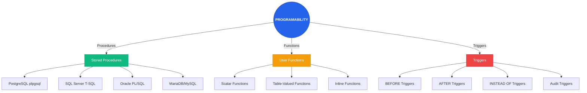

### 3.2. Automatización y Orquestación de Tareas Administrativas

#### **Scheduling Nativo por Motor**

**SQL Server Agent:**

SQL Server Agent es el servicio nativo de SQL Server para programación y automatización de tareas.

```sql
-- Crear job
USE msdb;
GO

EXEC sp_add_job
    @job_name = 'Daily Backup',
    @enabled = 1,
    @description = 'Daily full backup of user databases';

GO

-- Crear job step (backup)
EXEC sp_add_jobstep
    @job_name = 'Daily Backup',
    @step_name = 'Backup Databases',
    @subsystem = 'TSQL',
    @command = 'BACKUP DATABASE [MyDB] TO DISK = ''C:\backups\MyDB.bak'' WITH COMPRESSION',
    @database_name = 'master';

GO

-- Crear schedule (diario a las 2 AM)
EXEC sp_add_schedule
    @schedule_name = 'Daily 2AM',
    @freq_type = 4,  -- Daily
    @freq_interval = 1,
    @active_start_time = 020000;

GO

-- Adjuntar schedule al job
EXEC sp_attach_schedule
    @job_name = 'Daily Backup',
    @schedule_name = 'Daily 2AM';

GO

-- Habilitar job
EXEC sp_start_job 'Daily Backup';
GO
```

**Oracle DBMS_SCHEDULER:**

```sql
-- Crear job
BEGIN
    DBMS_SCHEDULER.CREATE_JOB (
        job_name        => 'daily_backup_job',
        job_type        => 'PLSQL_BLOCK',
        job_action      => 'BEGIN
            -- Backup logic here
            NULL;
        END;',
        start_date      => SYSTIMESTAMP,
        repeat_interval => 'FREQ=DAILY; BYHOUR=2; BYMINUTE=0; BYSECOND=0',
        enabled         => TRUE,
        comments        => 'Daily backup job'
    );
END;
/

-- Crear job que ejecuta stored procedure
BEGIN
    DBMS_SCHEDULER.CREATE_JOB (
        job_name        => 'purge_old_data_job',
        job_type        => 'STORED_PROCEDURE',
        job_action      => 'purge_old_data',
        start_date      => SYSTIMESTAMP,
        repeat_interval => 'FREQ=WEEKLY; BYDAY=SUN; BYHOUR=3',
        enabled         => TRUE
    );
END;
/

-- Ver jobs
SELECT job_name, enabled, state, last_start_date, next_run_date
FROM dba_scheduler_jobs;
```

**PostgreSQL pg_cron (extensión):**

```sql
-- Instalar extensión
CREATE EXTENSION pg_cron;

-- Programar job (cron syntax)
SELECT cron.schedule(
    'daily-backup',
    '0 2 * * *',  -- Todos los días a las 2 AM
    $$
    DO $$
    BEGIN
        -- Backup logic
        RAISE NOTICE 'Running daily backup';
    END $$;
    $$
);

-- Ver jobs
SELECT * FROM cron.job;

-- Eliminar job
SELECT cron.unschedule('daily-backup');
```

**MariaDB Event Scheduler:**

```sql
-- Habilitar event scheduler
SET GLOBAL event_scheduler = ON;

-- Crear evento
DELIMITER //
CREATE EVENT daily_backup
ON SCHEDULE EVERY 1 DAY
STARTS CURRENT_TIMESTAMP + INTERVAL 1 HOUR
DO
BEGIN
    -- Backup logic
    CALL backup_database();
END //
DELIMITER ;

-- Ver eventos
SHOW EVENTS;

-- Eliminar evento
DROP EVENT IF EXISTS daily_backup;
```

#### **Herramientas de Orquestación Externas**

**Cron (Linux/Unix):**

```bash
# Crontab syntax
# minute hour day_of_month month day_of_week command

# Backup diario a las 2 AM
0 2 * * * /usr/bin/pg_dump -U postgres mydb > /backups/mydb_$(date +\%Y\%m\%d).sql

# Limpieza de logs semanal
0 3 * * 0 find /var/log/postgresql -name "*.log" -mtime +7 -delete

# Script de mantenimiento
*/15 * * * * /scripts/check_disk_space.sh
```

**Airflow:**

Airflow es una plataforma de orquestación de workflows programables.

```python
# DAG de Airflow para backup de base de datos
from airflow import DAG
from airflow.operators.bash import BashOperator
from datetime import datetime, timedelta

default_args = {
    'owner': 'data-team',
    'depends_on_past': False,
    'start_date': datetime(2024, 1, 1),
    'email_on_failure': True,
    'retries': 1,
    'retry_delay': timedelta(minutes=5),
}

dag = DAG(
    'database_backup',
    default_args=default_args,
    description='Daily database backup',
    schedule_interval='0 2 * * *',  # Daily at 2 AM
    catchup=False,
)

backup_postgres = BashOperator(
    task_id='backup_postgres',
    bash_command='pg_dump -U postgres mydb > /backups/mydb_{{ ds_nodash }}.sql',
    dag=dag,
)

backup_sqlserver = BashOperator(
    task_id='backup_sqlserver',
    bash_command='sqlcmd -S localhost -U sa -P password -Q "BACKUP DATABASE [MyDB] TO DISK = ''/backups/MyDB_{{ ds_nodash }}.bak''"',
    dag=dag,
)

backup_postgres >> backup_sqlserver
```

**dbt (data build tool):**

dbt es una herramienta de transformación de datos que permite definir transformaciones como código SQL.

```sql
-- models/sales_summary.sql
WITH monthly_sales AS (
    SELECT 
        DATE_TRUNC('month', sale_date) as month,
        SUM(amount) as total_sales,
        COUNT(*) as transaction_count
    FROM {{ source('raw', 'sales') }}
    GROUP BY DATE_TRUNC('month', sale_date)
)
SELECT * FROM monthly_sales
```

```yaml
# dbt_project.yml
name: 'my_project'
version: '1.0.0'
config-version: 2

profile: 'my_project'

model-paths: ["models"]
seed-paths: ["seeds"]
test-paths: ["tests"]
analysis-paths: ["analyses"]
macro-paths: ["macros"]

target-path: "target"
clean-targets:
  - "target"
  - "dbt_packages"
```

**Prefect:**

Prefect es una alternativa moderna a Airflow para orquestación de workflows.

```python
from prefect import task, Flow
from prefect.schedules import Schedule
from prefect.schedules.clocks import CronClock
import subprocess

@task
def backup_postgres():
    subprocess.run(['pg_dump', '-U', 'postgres', 'mydb', '>', '/backups/mydb.sql'])

@task
def verify_backup():
    # Verify backup integrity
    pass

schedule = Schedule(clocks=[CronClock('0 2 * * *')])

with Flow('database_backup', schedule=schedule) as flow:
    backup = backup_postgres()
    verify = verify_backup(upstream_tasks=[backup])

flow.run()
```

#### **Automatización con Scripts**

**Python con APScheduler:**

```python
from apscheduler.schedulers.blocking import BlockingScheduler
import psycopg2
import subprocess

def backup_postgres():
    conn = psycopg2.connect(
        host='localhost',
        database='mydb',
        user='postgres',
        password='password'
    )
    
    # Backup logic
    subprocess.run(['pg_dump', '-U', 'postgres', 'mydb', '>', '/backups/mydb.sql'])
    
    conn.close()

def cleanup_old_backups():
    # Remove backups older than 7 days
    pass

scheduler = BlockingScheduler()

# Schedule backup daily at 2 AM
scheduler.add_job(backup_postgres, 'cron', hour=2, minute=0)

# Schedule cleanup weekly on Sunday at 3 AM
scheduler.add_job(cleanup_old_backups, 'cron', day_of_week='sun', hour=3, minute=0)

scheduler.start()
```

**Bash con systemd timers:**

```bash
# /etc/systemd/system/db-backup.service
[Unit]
Description=Database Backup Service

[Service]
Type=oneshot
ExecStart=/usr/local/bin/backup_db.sh
User=postgres
```

```bash
# /etc/systemd/system/db-backup.timer
[Unit]
Description=Run database backup daily

[Timer]
OnCalendar=*-*-* 02:00:00
Persistent=true

[Install]
WantedBy=timers.target
```

```bash
# Habilitar timer
systemctl enable db-backup.timer
systemctl start db-backup.timer
```

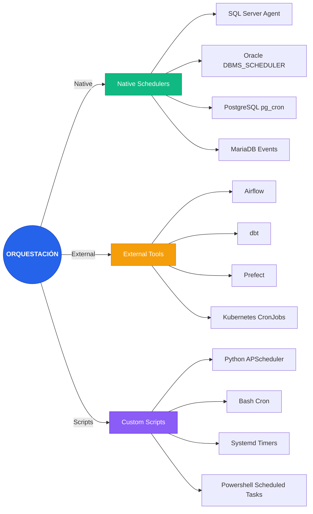

### 3.3. Auditoría y Logging Automatizado

#### **Auditoría de Base de Datos**

La auditoría en bases de datos es el proceso de tracking y logging de actividades para cumplir con requisitos de seguridad, compliance y forense.

**PostgreSQL Auditing:**

**Usar pg_audit (extensión):**

```sql
-- Instalar extensión (requiere instalación previa del paquete)
CREATE EXTENSION IF NOT EXISTS pgaudit;

-- Configurar postgresql.conf
shared_preload_libraries = 'pgaudit'
pgaudit.log = 'all'  -- all, none, read, write, function, role, ddl, misc
pgaudit.log_client = on
pgaudit.log_parameter = on
pgaudit.log_relation = on
pgaudit.log_statement = all
pgaudit.log_catalog = on

-- Reiniciar PostgreSQL para aplicar cambios
-- SELECT pg_reload_conf();

-- Ver logs de auditoría
-- Los logs se escriben en el log de PostgreSQL configurado
```

**Auditoría con triggers:**

```sql
-- Tabla de auditoría
CREATE TABLE audit_log (
    audit_id SERIAL PRIMARY KEY,
    table_name VARCHAR(100) NOT NULL,
    operation VARCHAR(10) NOT NULL,
    old_values JSONB,
    new_values JSONB,
    changed_by VARCHAR(100) NOT NULL,
    changed_at TIMESTAMP NOT NULL DEFAULT NOW(),
    client_ip INET
);

-- Función de auditoría genérica
CREATE OR REPLACE FUNCTION audit_trigger_func()
RETURNS TRIGGER
LANGUAGE plpgsql
AS $$
BEGIN
    IF TG_OP = 'INSERT' THEN
        INSERT INTO audit_log (table_name, operation, new_values, changed_by, client_ip)
        VALUES (TG_TABLE_NAME, 'INSERT', to_jsonb(NEW), current_user, inet_client_addr());
        RETURN NEW;
    ELSIF TG_OP = 'UPDATE' THEN
        INSERT INTO audit_log (table_name, operation, old_values, new_values, changed_by, client_ip)
        VALUES (TG_TABLE_NAME, 'UPDATE', to_jsonb(OLD), to_jsonb(NEW), current_user, inet_client_addr());
        RETURN NEW;
    ELSIF TG_OP = 'DELETE' THEN
        INSERT INTO audit_log (table_name, operation, old_values, changed_by, client_ip)
        VALUES (TG_TABLE_NAME, 'DELETE', to_jsonb(OLD), current_user, inet_client_addr());
        RETURN OLD;
    END IF;
END;
$$;

-- Aplicar trigger a tabla
CREATE TRIGGER audit_customers
AFTER INSERT OR UPDATE OR DELETE ON customers
FOR EACH ROW EXECUTE FUNCTION audit_trigger_func();
```

**SQL Server Auditing:**

**SQL Server Audit:**

```sql
-- Crear server audit
CREATE SERVER AUDIT MyServerAudit
TO FILE (
    FILEPATH = 'C:\Audit\',
    MAXSIZE = 100MB,
    MAX_ROLLOVER_FILES = 10
);
GO

ALTER SERVER AUDIT MyServerAudit WITH (STATE = ON);
GO

-- Crear especificación de auditoría a nivel de base de datos
USE MyDB;
GO

CREATE DATABASE AUDIT SPECIFICATION MyDatabaseAudit
FOR SERVER AUDIT MyServerAudit
ADD (INSERT, UPDATE, DELETE ON SCHEMA::dbo BY PUBLIC);
GO

ALTER DATABASE AUDIT SPECIFICATION MyDatabaseAudit WITH (STATE = ON);
GO

-- Ver logs de auditoría
SELECT * FROM sys.fn_get_audit_file('C:\Audit\*.sqlaudit', DEFAULT, DEFAULT);
```

**Change Data Capture (CDC):**

```sql
-- Habilitar CDC en base de datos
USE MyDB;
GO
EXEC sys.sp_cdc_enable_db;
GO

-- Habilitar CDC en tabla
EXEC sys.sp_cdc_enable_table
    @source_schema = 'dbo',
    @source_name = 'customers',
    @role_name = NULL;
GO

-- Consultar cambios
SELECT * FROM cdc.dbo_customers_CT;
```

**Oracle Auditing:**

**Standard Auditing:**

```sql
-- Habilitar auditoría
AUDIT ALL BY ACCESS;

-- Auditoría específica
AUDIT SELECT, INSERT, UPDATE, DELETE ON customers BY ACCESS;
AUDIT EXECUTE PROCEDURE BY ACCESS;

-- Ver registros de auditoría
SELECT * FROM dba_audit_trail;
```

**Fine-Grained Auditing (FGA):**

```sql
-- Crear política FGA
BEGIN
    DBMS_FGA.ADD_POLICY(
        object_schema => 'SCOTT',
        object_name => 'EMP',
        policy_name => 'audit_emp_salary',
        audit_condition => 'SALARY > 10000',
        audit_column => 'SALARY',
        handler_schema => NULL,
        handler_module => NULL,
        enable => TRUE
    );
END;
/

-- Ver registros FGA
SELECT * FROM dba_fga_audit_trail;
```

**Unified Auditing:**

```sql
-- Crear política de auditoría unificada
BEGIN
    DBMS_AUDIT_MGMT.CREATE_AUDIT_POLICY(
        policy_name => 'unified_audit_policy',
        audit_condition => NULL,
        audit_column => NULL,
        audit_trail => DBMS_AUDIT_MGMT.AUDIT_TRAIL_UNIFIED,
        audit_category => DBMS_AUDIT_MGMT.AUDIT_CAT_ADMIN
    );
END;
/

-- Habilitar política
BEGIN
    DBMS_AUDIT_MGMT.ENABLE_AUDIT_POLICY(
        policy_name => 'unified_audit_policy',
        enable => TRUE
    );
END;
/
```

#### **Logging Automatizado**

**PostgreSQL Logging:**

```sql
-- Configurar logging en postgresql.conf
logging_collector = on
log_directory = 'log'
log_filename = 'postgresql-%Y-%m-%d_%H%M%S.log'
log_min_duration_statement = 1000  # Log queries que toman más de 1 segundo
log_line_prefix = '%t [%p]: [%l-1] user=%u,db=%d,app=%a,client=%h '
log_lock_waits = on
log_statement = 'all'  # none, ddl, mod, all

-- Ver logs de consultas lentas
SELECT * FROM pg_stat_statements
ORDER BY mean_exec_time DESC
LIMIT 10;
```

**SQL Server Extended Events:**

```sql
-- Crear sesión de Extended Events
CREATE EVENT SESSION SlowQueries ON SERVER
ADD EVENT sqlserver.rpc_completed(
    ACTION(sqlserver.client_app_name, sqlserver.client_hostname, sqlserver.database_name)
    WHERE (duration > 1000000)  -- Más de 1 segundo
)
ADD TARGET package0.event_file(SET filename = N'C:\Logs\SlowQueries.xel');

-- Iniciar sesión
ALTER EVENT SESSION SlowQueries ON SERVER STATE = START;

-- Ver logs
SELECT * FROM sys.fn_xe_file_target_read_file('C:\Logs\SlowQueries*.xel', NULL, NULL, NULL);
```

**Oracle Alert Log:**

```sql
-- Ver alert log
SELECT * FROM v$diag_alert_ext
ORDER BY originating_timestamp DESC;

-- Usar ADRCI para manejo de logs
-- $ adrci
-- ADRCI> show alert
-- ADRCI> show alert -p "message_text like '%ORA-%'"
```

#### **Centralización de Logs**

**ELK Stack (Elasticsearch, Logstash, Kibana):**

```conf
# logstash.conf
input {
  file {
    path => "/var/log/postgresql/*.log"
    type => "postgresql"
  }
  file {
    path => "/var/opt/mssql/log/*.log"
    type => "sqlserver"
  }
}

filter {
  if [type] == "postgresql" {
    grok {
      match => { "message" => "%{TIMESTAMP_ISO8601:timestamp} \[%{NUMBER:pid}\]: user=%{WORD:user},db=%{WORD:database},client=%{IP:client_ip} %{GREEDYDATA:query}" }
    }
  }
}

output {
  elasticsearch {
    hosts => ["localhost:9200"]
    index => "db-logs-%{+YYYY.MM.dd}"
  }
}
```

**Prometheus + Grafana:**

```yaml
# postgres_exporter config
datasources:
  - name: postgres
    host: localhost
    port: 5432
    database: postgres
    user: postgres
    password: password
```

```yaml
# prometheus.yml
scrape_configs:
  - job_name: 'postgres'
    static_configs:
      - targets: ['localhost:9187']
```

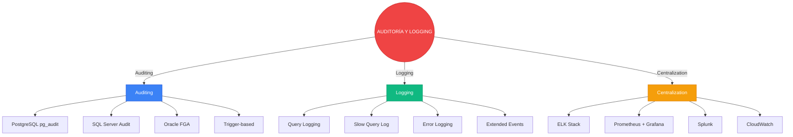

### 3.4. Buenas Prácticas para Lógica de Negocio en la Base de Datos y Mantenimiento de Código Portable

#### **Cuándo Usar Lógica de Negocio en la Base de Datos**

**Ventajas:**

1. **Performance**: Procesamiento cercano a los datos reduce overhead de red
2. **Consistencia**: Lógica centralizada garantiza integridad de datos
3. **Seguridad**: Permisos granulares a nivel de procedimiento
4. **Atomicidad**: Transacciones ACID completas
5. **Reutilización**: Procedimientos pueden ser llamados desde múltiples aplicaciones

**Casos de uso apropiados:**

- **Validaciones de integridad complejas**: Reglas de negocio que involucran múltiples tablas
- **Cálculos complejos**: Agregaciones, transformaciones de datos
- **Auditoría y logging**: Tracking automático de cambios
- **Batch processing**: Operaciones en lotes sobre grandes volúmenes
- **Data warehousing**: ETL processes

**Casos de uso inapropiados:**

- **Lógica de presentación**: Formateo de datos para UI
- **Lógica de aplicación**: Workflows específicos de la aplicación
- **Procesamiento de archivos**: Manipulación de archivos externos
- **Integración con APIs externas**: Llamadas HTTP, servicios web

#### **Principios de Diseño**

**1. Single Responsibility:**

Cada procedimiento/función debe tener una única responsabilidad bien definida.

```sql
-- MAL: Procedimiento que hace múltiples cosas
CREATE PROCEDURE process_customer(p_customer_id INT)
AS
BEGIN
    -- Valida customer
    -- Actualiza customer
    -- Envía email
    -- Crea invoice
    -- Actualiza inventory
END;

-- BIEN: Procedimientos especializados
CREATE PROCEDURE validate_customer(p_customer_id INT);
CREATE PROCEDURE update_customer(p_customer_id INT, ...);
CREATE PROCEDURE send_customer_email(p_customer_id INT);
CREATE PROCEDURE create_invoice(p_customer_id INT);
CREATE PROCEDURE update_inventory(p_order_id INT);
```

**2. Nombres descriptivos:**

Usar convención de nombres clara y consistente.

```sql
-- Buena convención
usp_customers_insert
usp_customers_update
usp_customers_delete
fn_calculate_discount
trg_customers_audit

-- Otras convenciones comunes
sp_customer_insert
customer_insert
insert_customer
```

**3. Manejo de errores robusto:**

```sql
-- PostgreSQL: Manejo de excepciones
CREATE OR REPLACE PROCEDURE transfer_funds(
    p_from_account INT,
    p_to_account INT,
    p_amount NUMERIC
)
LANGUAGE plpgsql
AS $$
DECLARE
    v_balance NUMERIC;
BEGIN
    -- Verificar saldo
    SELECT balance INTO v_balance
    FROM accounts
    WHERE account_id = p_from_account
    FOR UPDATE;
    
    IF v_balance < p_amount THEN
        RAISE EXCEPTION 'Insufficient funds. Balance: %, Required: %', v_balance, p_amount;
    END IF;
    
    -- Realizar transferencia
    UPDATE accounts SET balance = balance - p_amount WHERE account_id = p_from_account;
    UPDATE accounts SET balance = balance + p_amount WHERE account_id = p_to_account;
    
    COMMIT;
    
EXCEPTION
    WHEN OTHERS THEN
        ROLLBACK;
        RAISE NOTICE 'Transfer failed: %', SQLERRM;
END;
$$;
```

**4. Documentación:**

```sql
-- PostgreSQL: Comentarios en código
CREATE OR REPLACE FUNCTION calculate_tax(p_amount NUMERIC, p_tax_rate NUMERIC)
RETURNS NUMERIC
LANGUAGE plpgsql
AS $$
/**
 * Calculate tax amount based on principal amount and tax rate.
 * 
 * @param p_amount Principal amount
 * @param p_tax_rate Tax rate as percentage (e.g., 10 for 10%)
 * @return Tax amount
 * 
 * Example:
 * SELECT calculate_tax(1000, 10);  -- Returns 100
 */
BEGIN
    RETURN p_amount * (p_tax_rate / 100);
END;
$$;

-- Comentarios en objetos
COMMENT ON FUNCTION calculate_tax IS 'Calculate tax amount based on principal and rate';
COMMENT ON TABLE customers IS 'Customer master data';
COMMENT ON COLUMN customers.email IS 'Primary email address for customer';
```

#### **Portabilidad y Mantenibilidad**

**1. Abstracción de diferencias:**

```sql
-- Función wrapper para fechas (portable)
CREATE OR REPLACE FUNCTION current_timestamp_utc()
RETURNS TIMESTAMP
LANGUAGE SQL
AS $$
    -- PostgreSQL
    SELECT CURRENT_TIMESTAMP AT TIME ZONE 'UTC';
$$;

-- SQL Server equivalente
CREATE OR ALTER FUNCTION current_timestamp_utc()
RETURNS DATETIME2
AS
BEGIN
    RETURN GETUTCDATE();
END;
```

**2. Evitar funciones propietarias:**

```sql
-- MAL: Funciones específicas de PostgreSQL
SELECT string_agg(name, ', ') FROM customers;

-- PORTABLE: Usar SQL estándar cuando sea posible
-- (aunque string_agg es estándar SQL:2016, no todos los motores lo soportan)
```

**3. Testing:**

```sql
-- PostgreSQL: pgTAP para testing
CREATE OR REPLACE FUNCTION test_calculate_tax()
RETURNS SETOF TEXT
LANGUAGE plpgsql
AS $$
BEGIN
    RETURN NEXT is(calculate_tax(1000, 10), 100, '10% of 1000 should be 100');
    RETURN NEXT is(calculate_tax(500, 20), 100, '20% of 500 should be 100');
END;
$$;

SELECT * FROM test_calculate_tax();
```

**4. Version Control:**

- Mantener todos los scripts SQL en Git
- Usar migraciones (Flyway, Liquibase) para cambios de esquema
- Separar DDL (estructura) de DML (datos)
- Usar branches para desarrollo y PRs para review

**5. Code Review:**

- Revisar todo código SQL antes de deploy
- Verificar performance con EXPLAIN
- Chequear seguridad (SQL injection, permisos)
- Validar portabilidad si aplica

#### **Ejemplo de Arquitectura Portable**

```sql
-- Tabla de configuración para parámetros portables
CREATE TABLE db_config (
    config_key VARCHAR(100) PRIMARY KEY,
    config_value TEXT,
    description TEXT,
    updated_at TIMESTAMP DEFAULT NOW()
);

-- Función portable para obtener configuración
CREATE OR REPLACE FUNCTION get_config(p_key VARCHAR)
RETURNS TEXT
LANGUAGE SQL
AS $$
    SELECT config_value FROM db_config WHERE config_key = p_key;
$$;

-- Procedimiento portable que usa configuración
CREATE OR REPLACE PROCEDURE purge_old_data()
LANGUAGE plpgsql
AS $$
DECLARE
    v_retention_days INT;
BEGIN
    v_retention_days := get_config('data_retention_days')::INT;
    
    DELETE FROM audit_log
    WHERE changed_at < NOW() - (v_retention_days || ' days')::INTERVAL;
    
    RAISE NOTICE 'Purged data older than % days', v_retention_days;
END;
$$;
```

#### **Monitoreo y Alertas**

```sql
-- PostgreSQL: Monitoreo de procedimientos lentos
CREATE EXTENSION pg_stat_statements;

SELECT 
    query,
    calls,
    total_time,
    mean_time,
    rows
FROM pg_stat_statements
WHERE query LIKE '%PROCEDURE%'
ORDER BY mean_time DESC
LIMIT 10;
```

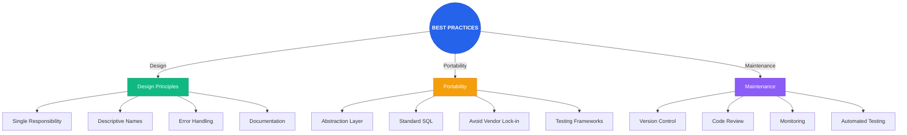

---

*Documentación avanzada para la asignatura Gestión y Manejo de Base de Datos II. Este README cubre administración avanzada de SGBD, consultas SQL avanzadas y analítica, y procedimientos/funciones/triggers con automatización.*

Para ver los diagramas detallados en formato Mermaid, consulta el archivo [diagramas.md](diagramas.md).
