# 🚀 Microevaluación 2: Gestión Avanzada de Base de Datos II

Esta guía representa una inmersión profunda en la administración, analítica y automatización de SGBD modernos. Abarca desde la infraestructura física hasta la lógica de negocio distribuida.

---

## 📑 Tabla de Contenidos
1.  [🏗️ Administración Avanzada de SGBD](#-1-administración-avanzada-de-sgbd)
2.  [📊 Consultas SQL Avanzadas y Analítica](#-2-consultas-sql-avanzadas-y-analítica)
3.  [⚙️ Procedimientos, Funciones y Automatización](#-3-procedimientos-funciones-y-automatización)
4.  [🗺️ Visualizaciones Directas (Mapas Pro)](diagramas.md)

---

## 🏗️ 1. Administración Avanzada de SGBD

### 1.1. SGBD Avanzados y Cloud
El ecosistema actual se divide entre motores tradicionales y soluciones administradas.

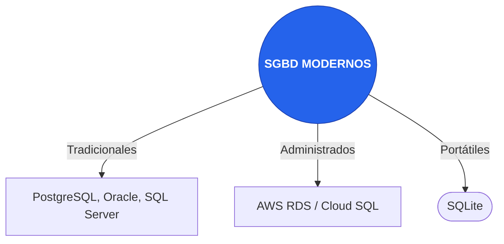

### 1.2. Gestión Multi-plataforma
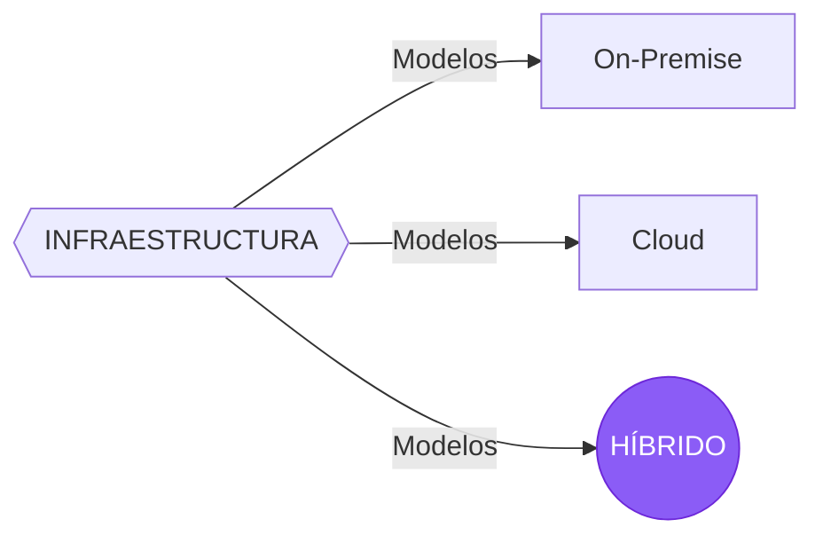

### 1.3. Tuning y Rendimiento
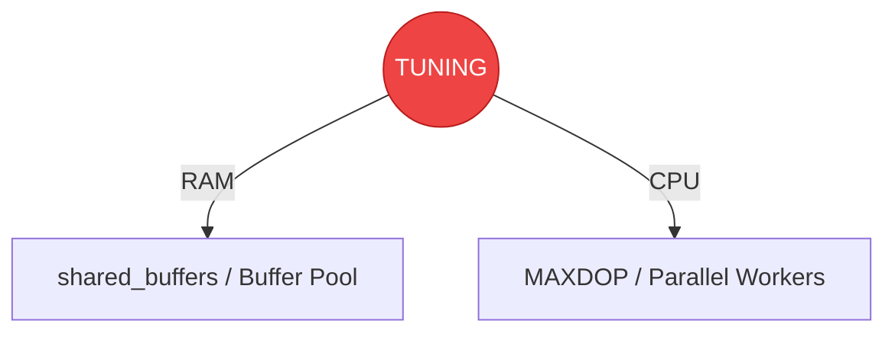

### 1.4. Herramientas y CLI
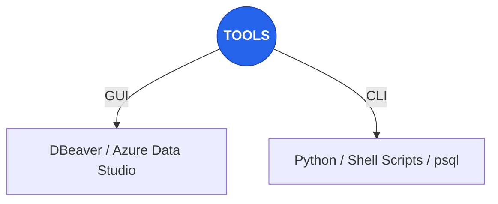

---

## 📊 2. Consultas SQL Avanzadas y Analítica

### 2.1. Procesamiento Complejo y Big Data
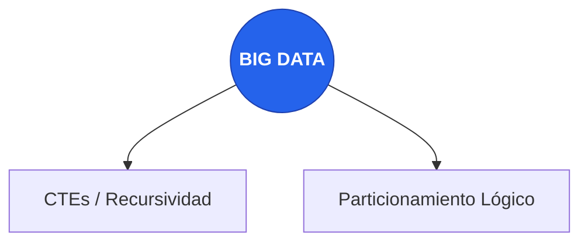

### 2.2. Transformaciones y Ventanas
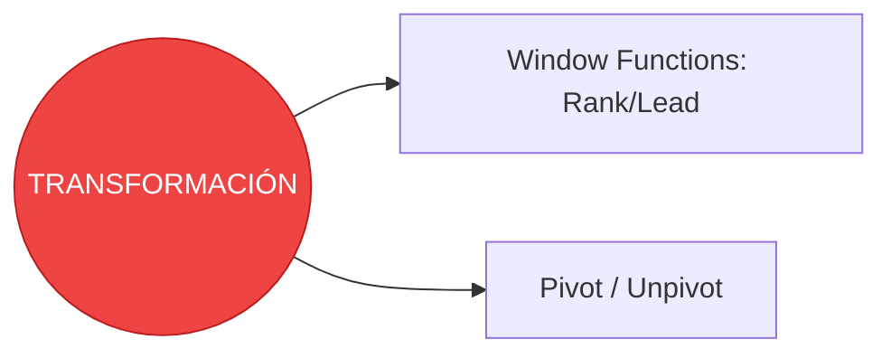

### 2.3. Analítica para BI
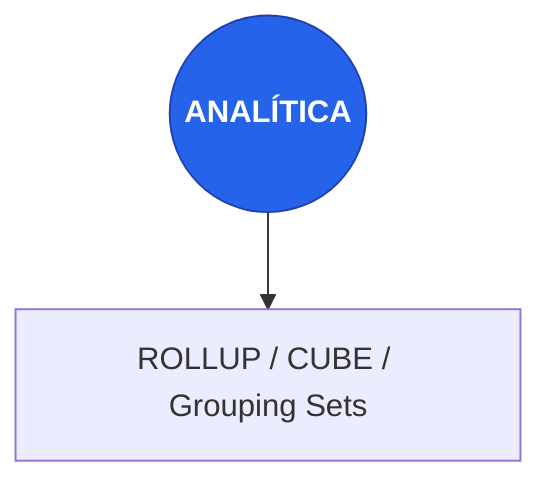

### 2.4. Optimización (El Cerebro)
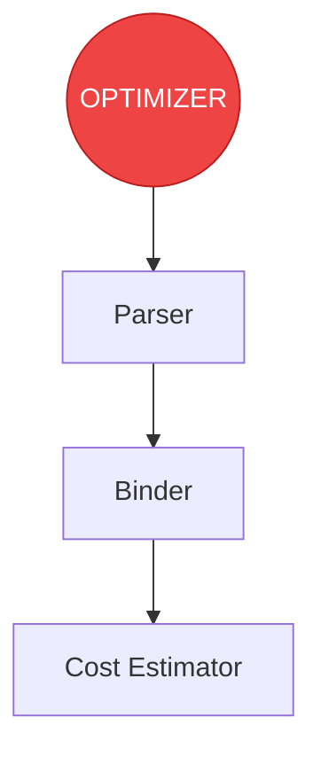

---

## ⚙️ 3. Procedimientos, Funciones y Automatización

### 3.1. Programabilidad
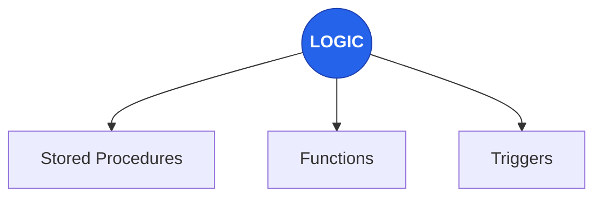

### 3.2. Orquestación
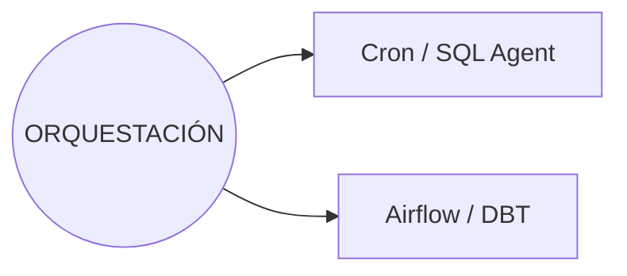

### 3.3. Auditoría
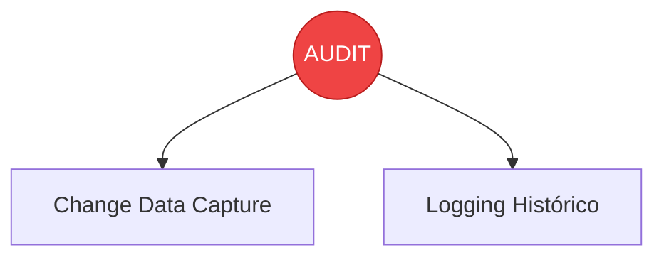

### 3.4. Historia y Evolución
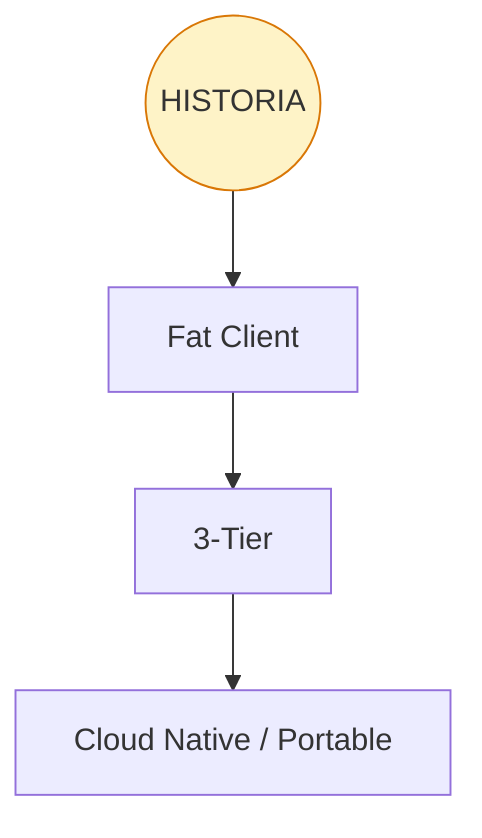

---
*Documentación avanzada para la asignatura Gestión y Manejo de Base de Datos II. Visita [diagramas.md](diagramas.md) para ver los mapas en tamaño completo.*
