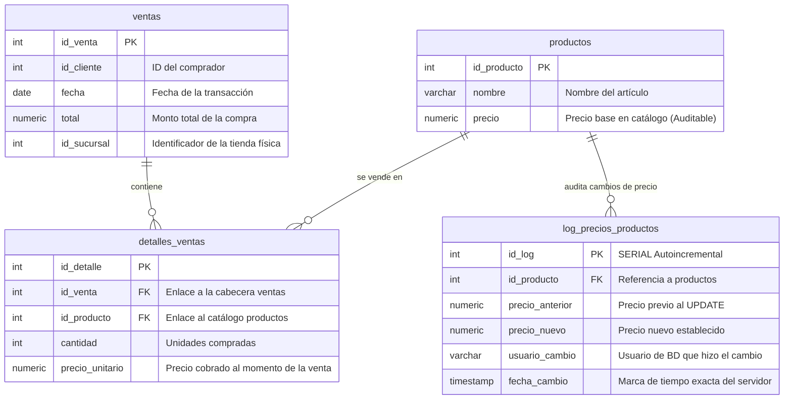
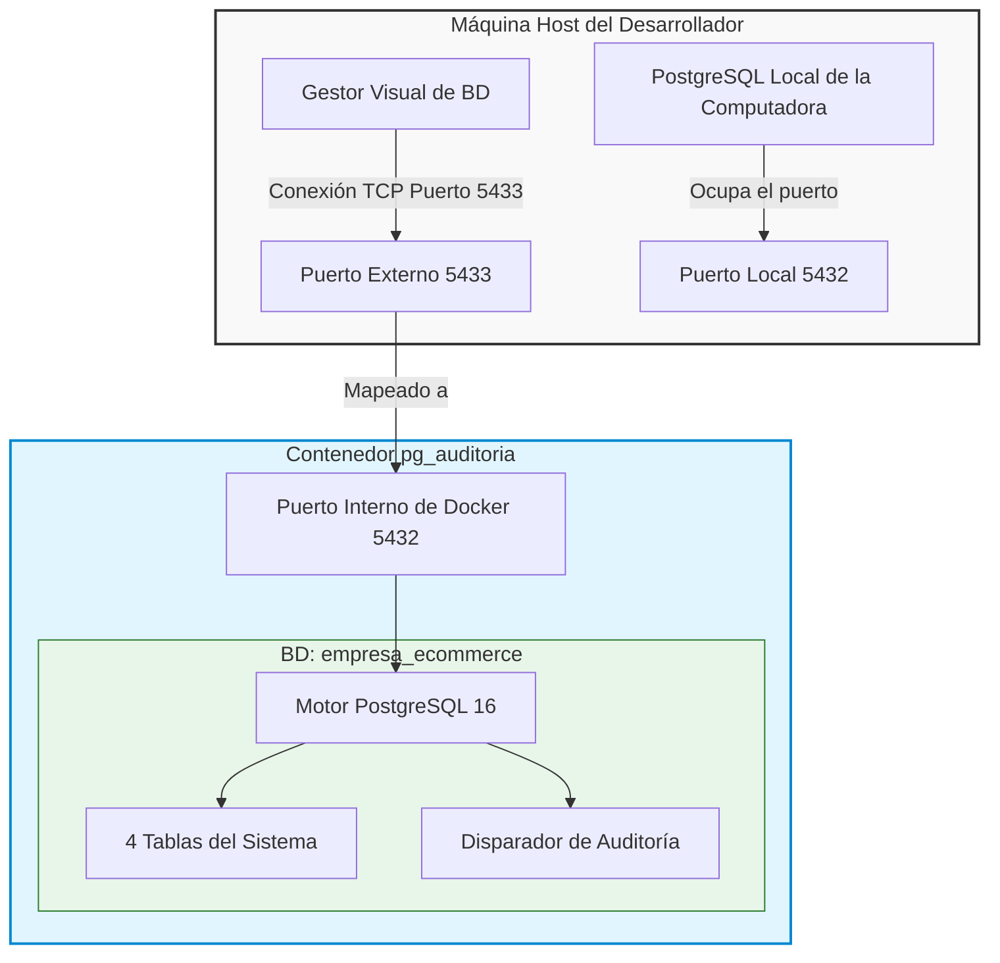
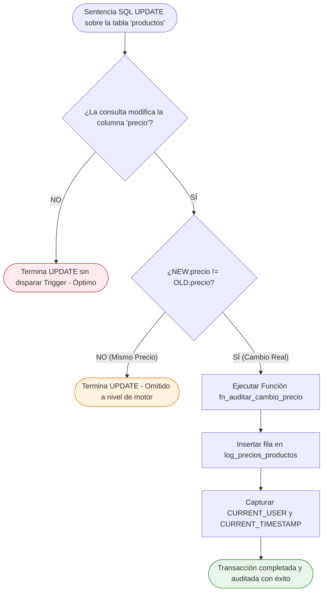
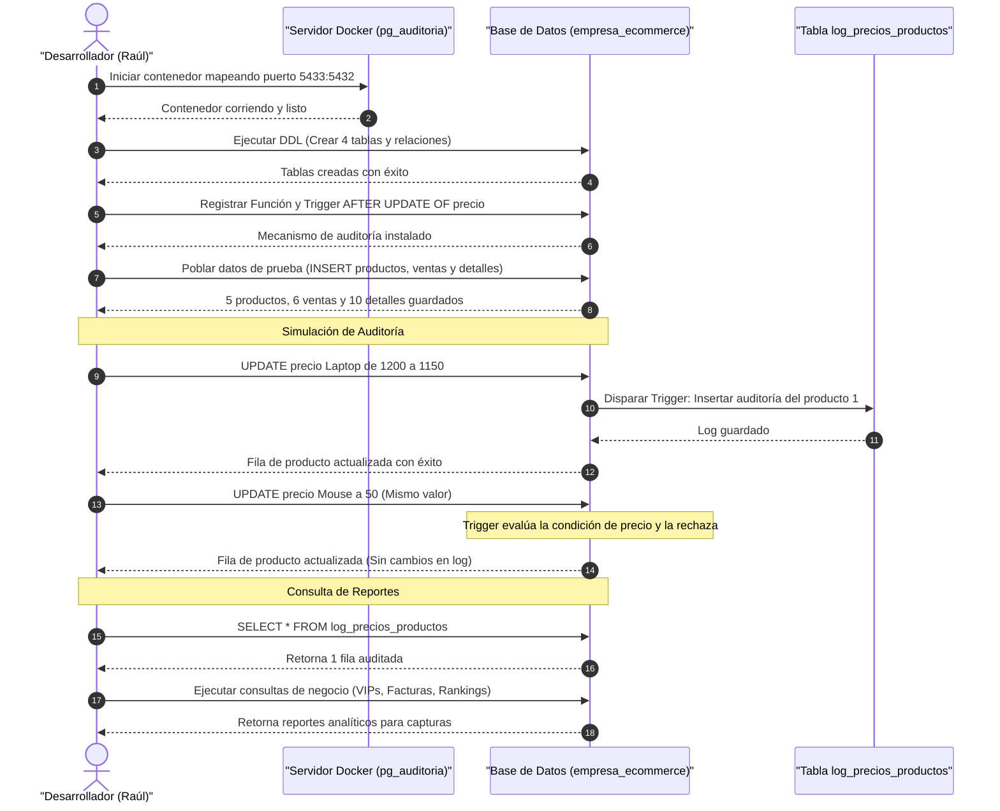

# Arquitectura del Sistema: Diagramas y Flujos (Mermaid)

Este documento contiene la representación visual completa de la arquitectura de la base de datos, el flujo lógico de ejecución del Trigger de seguridad y la secuencia de operaciones del laboratorio de comercio electrónico.

---

## 1. Diagrama Entidad-Relación (DER) de la Base de Datos

Este diagrama representa el diseño físico y lógico de las **4 tablas** conectadas en la base de datos `empresa_ecommerce`. Ilustra las llaves primarias (`PK`), llaves foráneas (`FK`), tipos de datos y la cardinalidad de las relaciones.

---

## 2. Diagrama de Despliegue e Infraestructura (Docker)

Muestra cómo se mapea el entorno aislado de base de datos desde la máquina física del desarrollador hacia el contenedor Docker, aislando los servicios locales.

---

## 3. Flujo de Ejecución Lógico del Trigger (Optimización)

Este diagrama de flujo detalla el comportamiento del disparador **`trg_auditar_precio`** ante una sentencia `UPDATE` de precio, demostrando el control de rendimiento a nivel de base de datos.

---

## 4. Secuencia Completa del Laboratorio

Representa el flujo de trabajo cronológico desde que se levanta el servidor hasta que se extraen los reportes finales de negocio.

