# 🗺️ Diagramas Mermaid - Gestión Avanzada de Base de Datos II

Este archivo contiene todos los diagramas Mermaid utilizados en la documentación de la Microevaluación 2.

---

## 🏗️ 1. Administración Avanzada de SGBD

### 1.1. SGBD Modernos y Cloud - Resumen

**PostgreSQL**: MVCC, extensible, tipos avanzados, replicación física/lógica
**SQL Server**: Integración Microsoft, columnstore, Always On, PolyBase, ML Services
**Oracle**: Multitenant CDB/PDB, AMM, Exadata, compresión, GoldenGate
**MariaDB**: Storage engines pluggables, Galera cluster, window functions
**SQLite**: Serverless, ACID, single-file, zero-config

**Cloud Services**: AWS RDS/Aurora, GCP Cloud SQL, Azure Database - managed services con alta disponibilidad, backups automáticos, escalabilidad

```mermaid
flowchart DT
    classDef central fill:#2563eb,color:#fff,font-weight:bold,stroke:#1e40af
    classDef cloud fill:#10b981,color:#fff,stroke:#059669
    classDef onprem fill:#f59e0b,color:#fff,stroke:#d97706
    
    Root(("SGBD MODERNOS")):::central
    
    Root -->|Open Source| OSS[PostgreSQL<br/>MVCC/Extensible<br/>MariaDB<br/>Storage Engines<br/>SQLite<br/>Serverless]
    Root -->|Propietario| PROP[SQL Server<br/>Columnstore/Always On<br/>Oracle<br/>Multitenant/Exadata]
    
    OSS -->|Cloud| CLOUD1[AWS Aurora<br/>GCP Cloud SQL<br/>Azure Postgres]:::cloud
    PROP -->|Cloud| CLOUD2[AWS RDS<br/>GCP Cloud SQL<br/>Azure SQL]:::cloud
    
    OSS -->|On-Premise| ON1[Self-hosted<br/>Control total]:::onprem
    PROP -->|On-Premise| ON2[Self-hosted<br/>Control total]:::onprem
```

### 1.2. Infraestructura Híbrida - Resumen

**On-Premise**: Control total, CAPEX, latencia mínima, compliance regulatorio
**Cloud**: OPEX, escalabilidad elástica, managed services, time-to-market rápido
**Híbrido**: Burst to cloud, DR en cloud, data lake, multi-cloud

**Estrategias de migración**: Lift and Shift, Replatforming, Refactoring, Retire

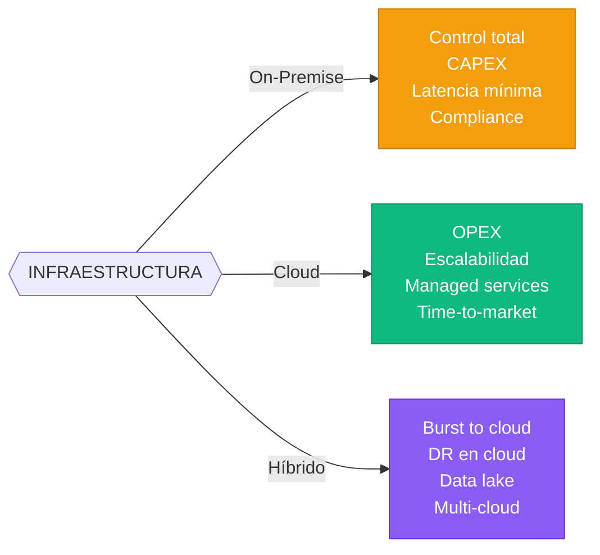

### 1.3. Tuning y Rendimiento - Resumen

**PostgreSQL**: shared_buffers (25% RAM), work_mem, effective_cache_size, autovacuum tuning
**SQL Server**: max server memory, MAXDOP, tempdb configuration, Query Store
**Oracle**: SGA_TARGET, PGA_AGGREGATE_TARGET, MEMORY_TARGET, optimizer hints
**MariaDB/MySQL**: innodb_buffer_pool_size (70-80% RAM), innodb_io_capacity

**Jerarquía de optimización**: Hardware/OS → Configuración motor → Diseño físico → Diseño lógico → Consultas

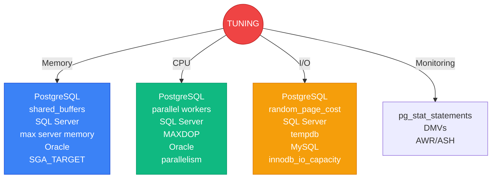

### 1.4. Herramientas de Administración - Resumen

**GUI Universales**: DBeaver (multi-database), Azure Data Studio (SQL Server), pgAdmin (PostgreSQL), SQL Developer (Oracle)
**CLI**: psql (PostgreSQL), sqlcmd (SQL Server), sqlplus (Oracle), mysql (MariaDB/MySQL), pg_dump/mysqldump (backup)
**Scripting**: Python (psycopg2, pyodbc), Bash scripts, Ansible (config management), Terraform (IaC)

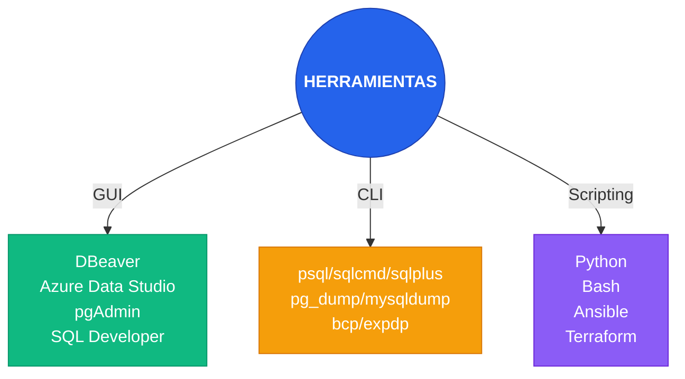

---

## 📊 2. Consultas SQL Avanzadas y Analítica de Datos

### 2.1. Subconsultas, CTE y Big Data - Resumen

**Subconsultas**: Escalares, fila, columna, tabla, correlacionadas, EXISTS/NOT EXISTS, ANY/ALL
**CTE**: Básicas, múltiples, recursivas (WITH RECURSIVE) - para jerarquías y grafos
**Big Data**: Partitioning (range, list, hash), sharding, materialized views, batch processing

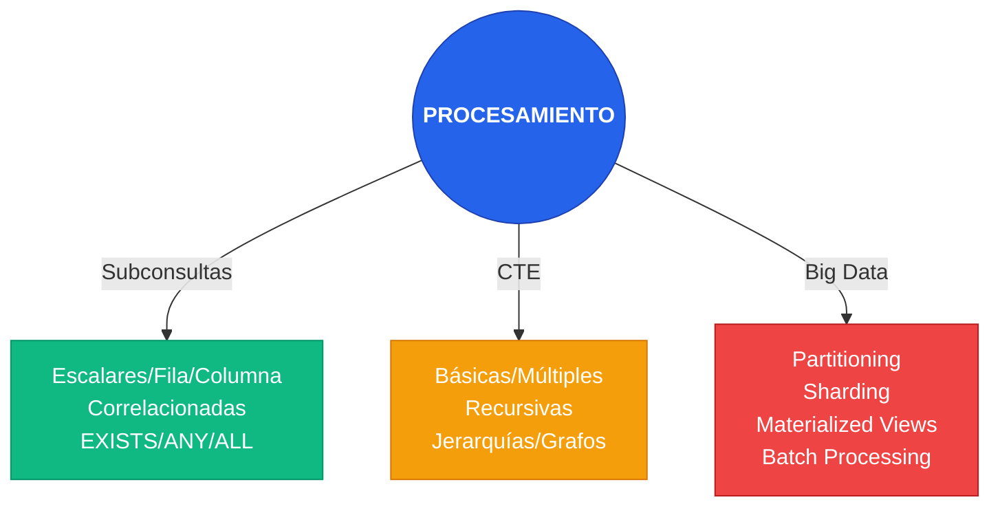

### 2.2. JOINs, Window Functions y Transformación - Resumen

**JOINs**: INNER, LEFT/RIGHT, FULL OUTER, CROSS, SELF, LATERAL/APPLY
**Window Functions**: Agregación (AVG, SUM), Ranking (ROW_NUMBER, RANK, DENSE_RANK), Offset (LAG, LEAD), Frames
**Set Operations**: UNION, UNION ALL, INTERSECT, EXCEPT/MINUS
**PIVOT/UNPIVOT**: Rotación de datos (filas ↔ columnas)

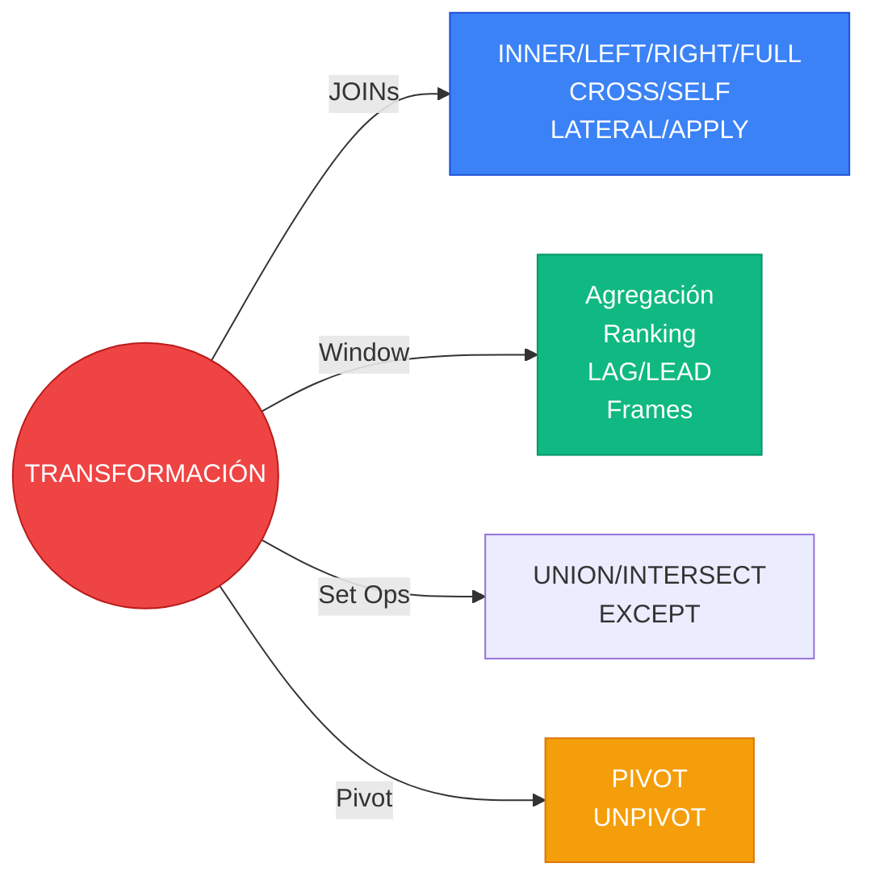

### 2.3. Analítica para BI - Resumen

**ROLLUP**: Subtotales y gran total con jerarquía
**CUBE**: Todas las combinaciones posibles (matriz multidimensional)
**GROUPING SETS**: Combinaciones específicas de agregación
**Advanced**: Percentiles (PERCENTILE_CONT), histogramas (NTILE, WIDTH_BUCKET), análisis de tendencias (YoY, moving averages), cohort analysis

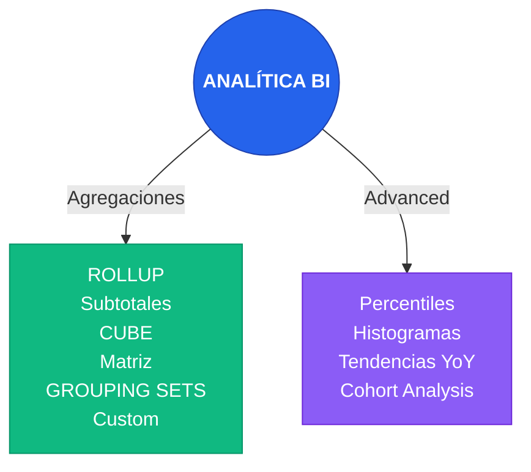

### 2.4. Optimización de Consultas - Resumen

**EXPLAIN**: PostgreSQL EXPLAIN ANALYZE, SQL Server Execution Plan, Oracle EXPLAIN PLAN
**Indexing**: B-Tree (default), Partial/Functional, Composite, Covering, GIN/GiST (PostgreSQL)
**Tuning por motor**: PostgreSQL VACUUM/ANALYZE, SQL Server Query Store, Oracle SQL Tuning Advisor
**Anti-patrones**: SELECT *, funciones en columnas indexadas, LIKE con wildcard al inicio

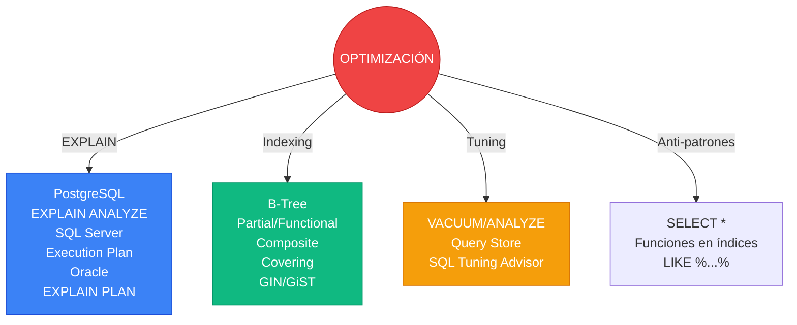

---

## ⚙️ 3. Procedimientos, Funciones y Automatización

### 3.1. Procedimientos, Funciones y Triggers - Resumen

**Stored Procedures**: PostgreSQL plpgsql, SQL Server T-SQL, Oracle PL/SQL, MariaDB/MySQL - con parámetros IN/OUT, control de flujo
**Functions**: Escalares (retornan valor), Table-Valued (retornan tabla), Inline - usables en consultas SQL
**Triggers**: BEFORE/AFTER/INSTEAD OF, por evento (INSERT/UPDATE/DELETE), auditoría automática
**Portabilidad**: Usar SQL estándar, abstraer diferencias, evitar funciones propietarias

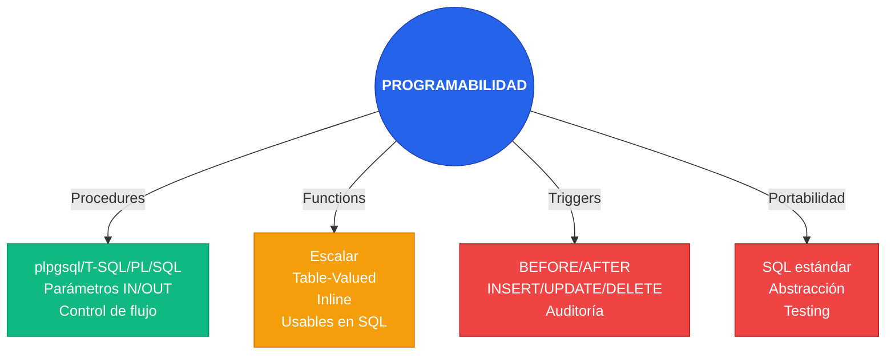

### 3.2. Orquestación y Automatización - Resumen

**Nativos**: SQL Server Agent, Oracle DBMS_SCHEDULER, PostgreSQL pg_cron, MariaDB Event Scheduler
**Externos**: Airflow (workflows), dbt (transformación datos), Prefect, Kubernetes CronJobs
**Scripts**: Python APScheduler, Bash Cron, systemd timers, PowerShell Scheduled Tasks

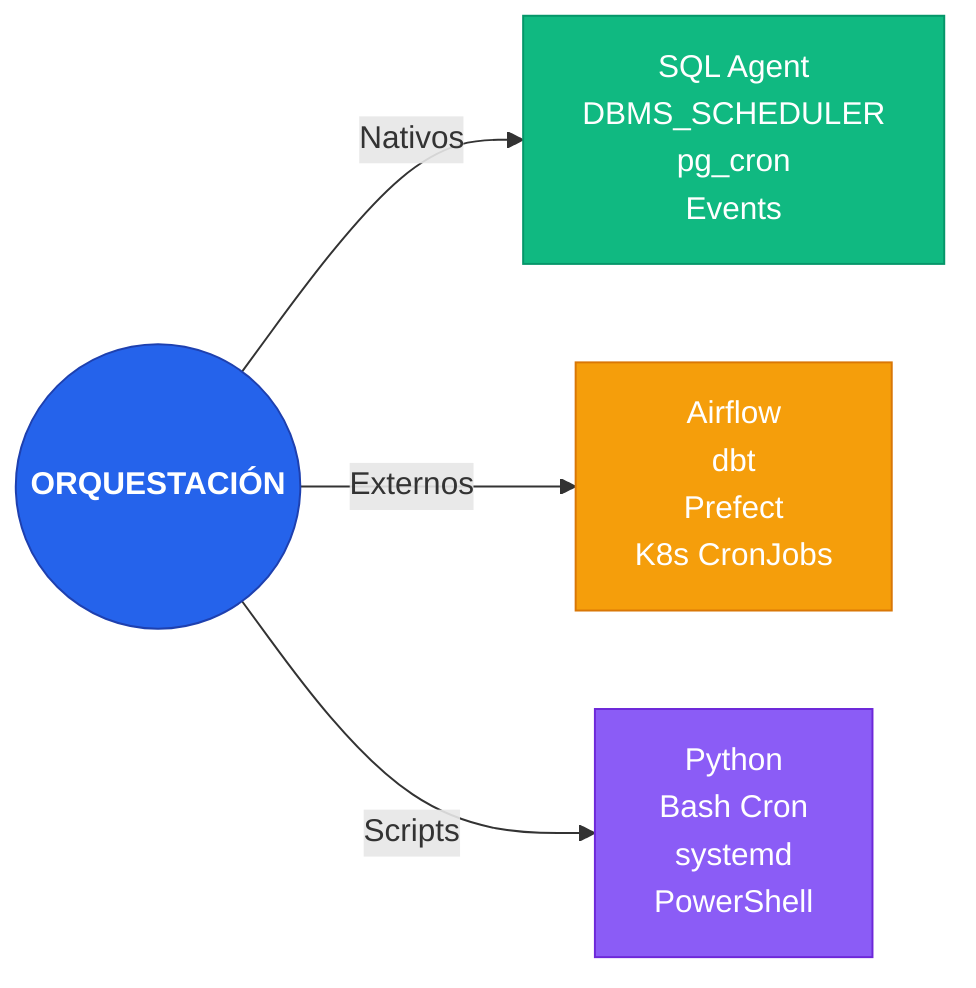

### 3.3. Auditoría y Logging - Resumen

**Auditoría**: PostgreSQL pg_audit, SQL Server Audit/CDC, Oracle FGA/Unified Auditing, triggers
**Logging**: Query logging, slow query log, error logging, extended events
**Centralización**: ELK Stack (Elasticsearch, Logstash, Kibana), Prometheus + Grafana, Splunk, CloudWatch

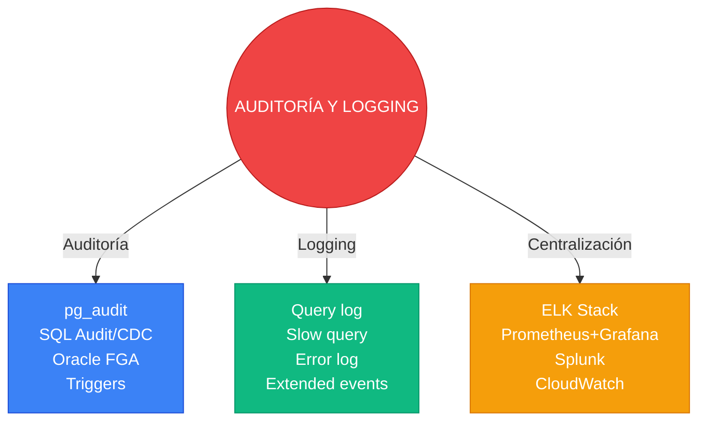

### 3.4. Buenas Prácticas - Resumen

**Diseño**: Single Responsibility, nombres descriptivos, manejo de errores robusto, documentación
**Portabilidad**: SQL estándar, abstracción de diferencias, evitar vendor lock-in, testing
**Mantenimiento**: Version Control (Git), Code Review, Monitoring, Automated Testing
**Cuándo usar lógica en BD**: Validaciones complejas, cálculos complejos, auditoría, batch processing

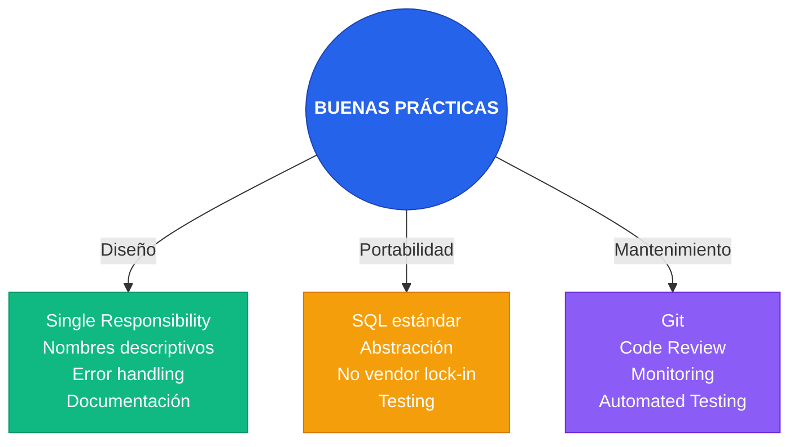

---

## 📚 Notas sobre los Diagramas

- **Colores utilizados**:
  - Azul (#2563eb): Elementos centrales principales
  - Verde (#10b981): Elementos nativos o estándar
  - Naranja (#f59e0b): Elementos externos o de transformación
  - Rojo (#ef4444): Elementos críticos o de seguridad
  - Púrpura (#8b5cf6): Elementos híbridos o de scripting

- **Tipos de diagramas**:
  - `flowchart TD`: Diagramas de flujo top-down
  - `flowchart LR`: Diagramas de flujo left-right

- **Convenciones**:
  - Los nodos con bordes gruesos indican elementos principales
  - Las flechas etiquetadas indican relaciones específicas
  - Los nodos agrupados representan categorías relacionadas
