# 🗺️ Diagramas Mermaid - Gestión Avanzada de Base de Datos II

Este archivo contiene todos los diagramas Mermaid utilizados en la documentación de la Microevaluación 2.

---

## 🏗️ 1. Administración Avanzada de SGBD

### 1.1. SGBD Modernos y Cloud - Resumen

**PostgreSQL**: MVCC, extensible, tipos avanzados, replicación física/lógica
**SQL Server**: Integración Microsoft, columnstore, Always On, PolyBase, ML Services
**Oracle**: Multitenant CDB/PDB, AMM, Exadata, compresión, GoldenGate
**MariaDB**: Storage engines pluggables, Galera cluster, window functions
**SQLite**: Serverless, ACID, single-file, zero-config

**Cloud Services**: AWS RDS/Aurora, GCP Cloud SQL, Azure Database - managed services con alta disponibilidad, backups automáticos, escalabilidad

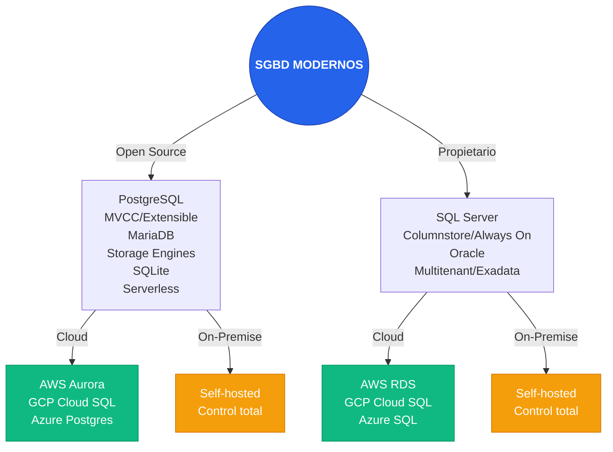

### 1.2. Infraestructura Híbrida - Resumen

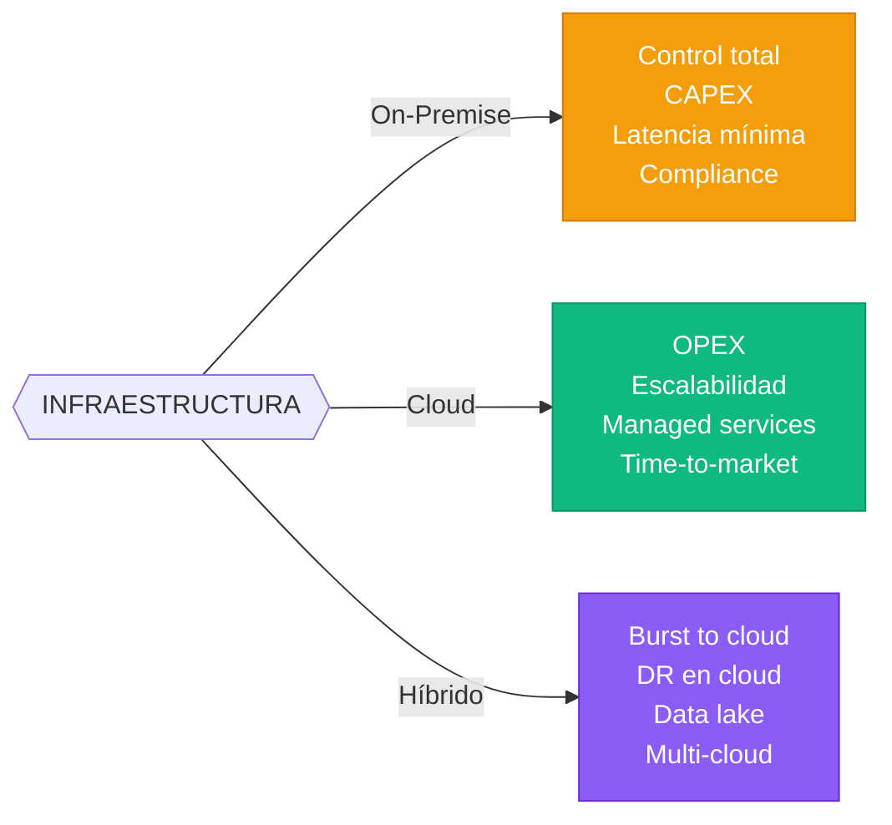

### 1.3. Tuning y Rendimiento - Resumen

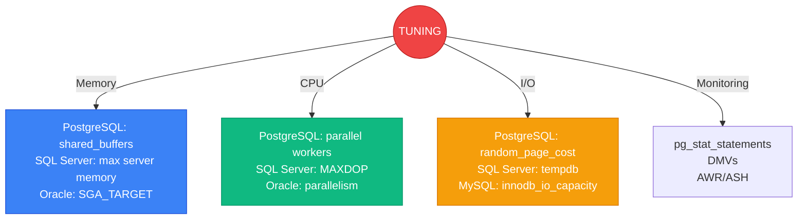

### 1.4. Herramientas de Administración - Resumen

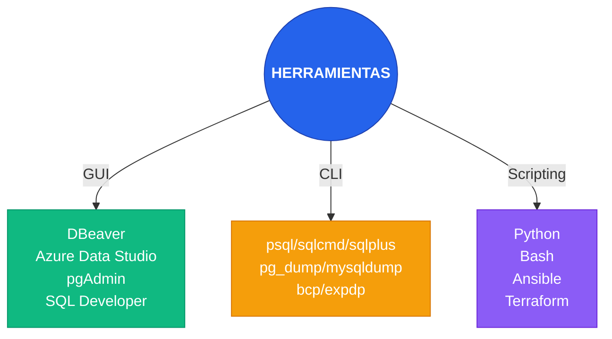

---

## 📊 2. Consultas SQL Avanzadas y Analítica de Datos

### 2.1. Subconsultas, CTE y Big Data - Resumen

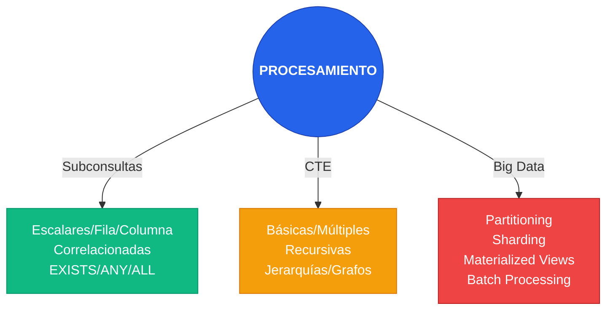

### 2.2. JOINs, Window Functions y Transformación - Resumen

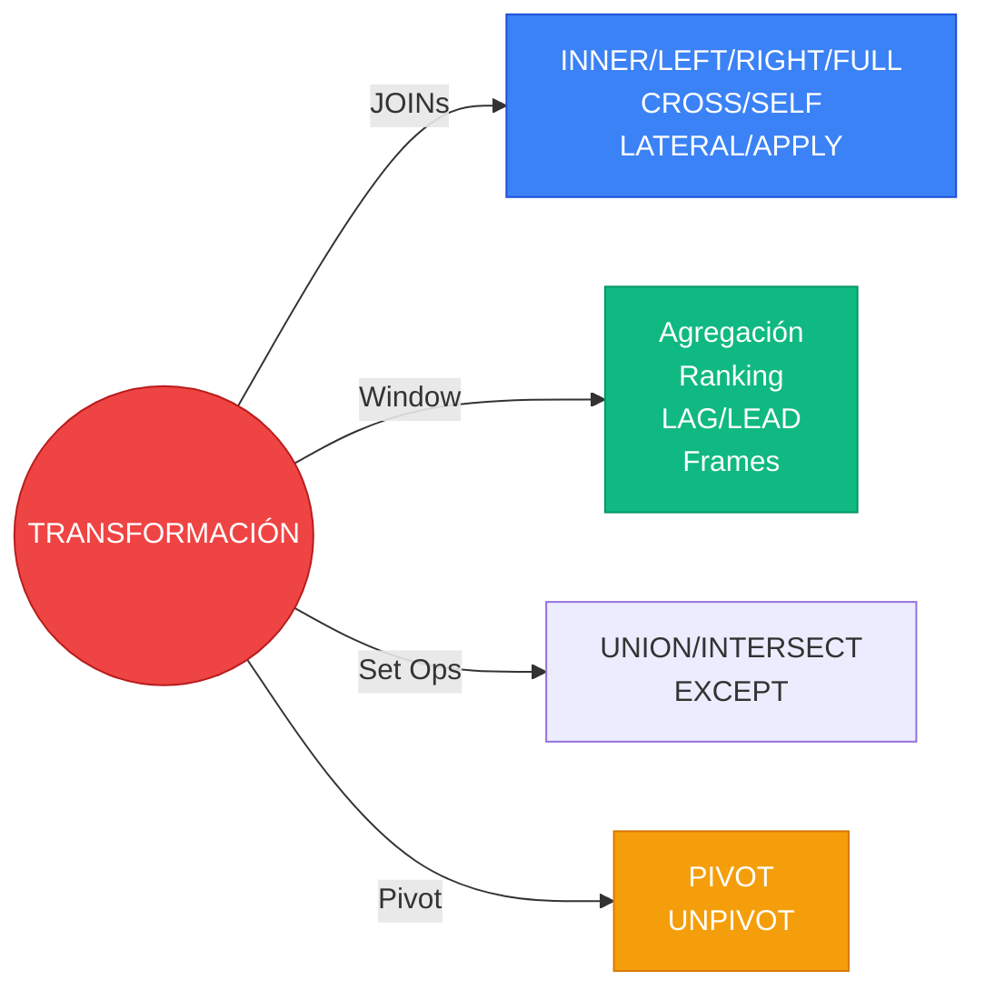

### 2.3. Analítica para BI - Resumen

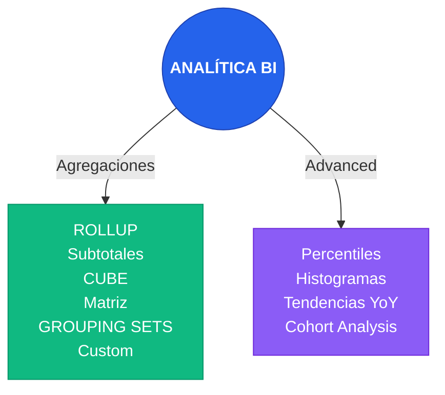

### 2.4. Optimización de Consultas - Resumen

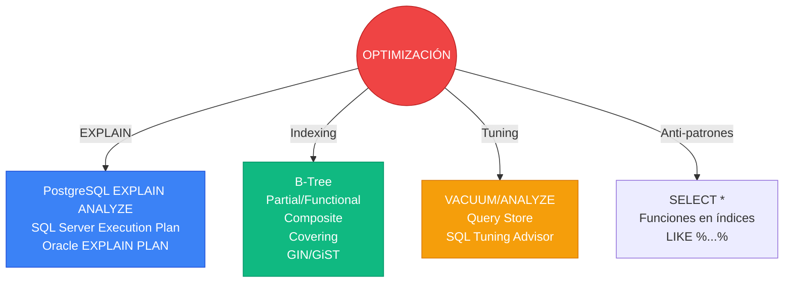

---

## ⚙️ 3. Procedimientos, Funciones y Automatización

### 3.1. Procedimientos, Funciones y Triggers - Resumen

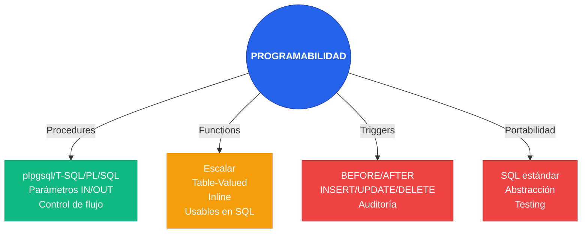

### 3.2. Orquestación y Automatización - Resumen

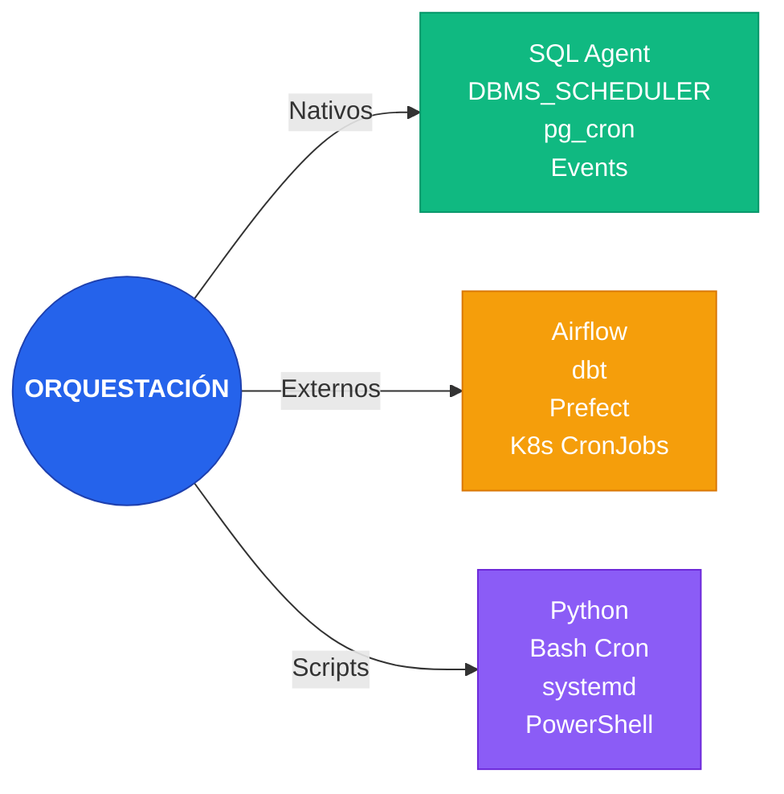

### 3.3. Auditoría y Logging - Resumen

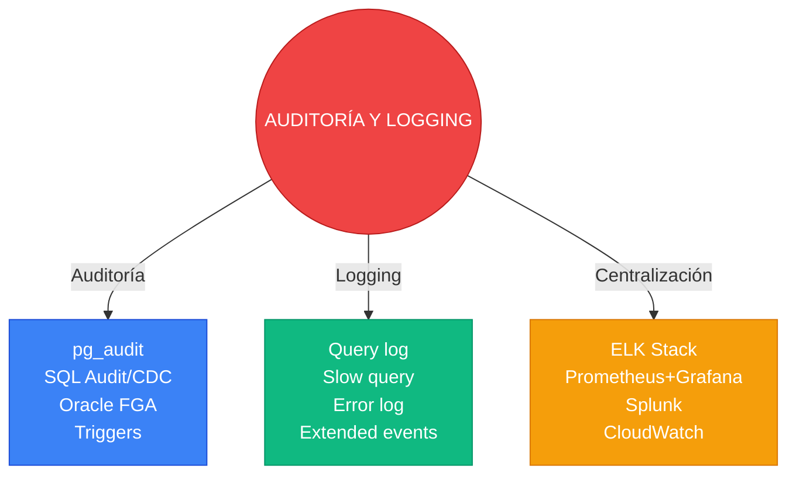

### 3.4. Buenas Prácticas - Resumen

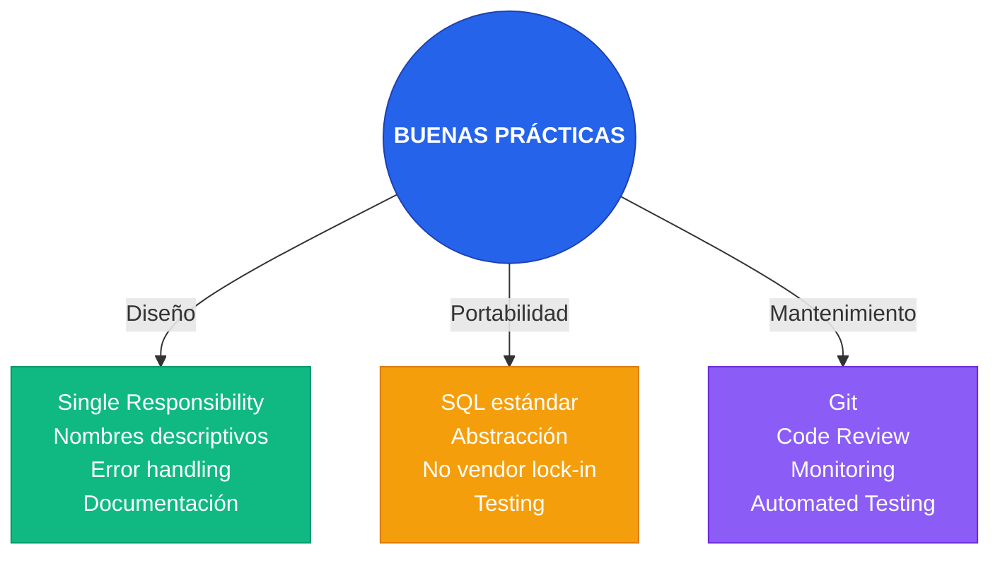
