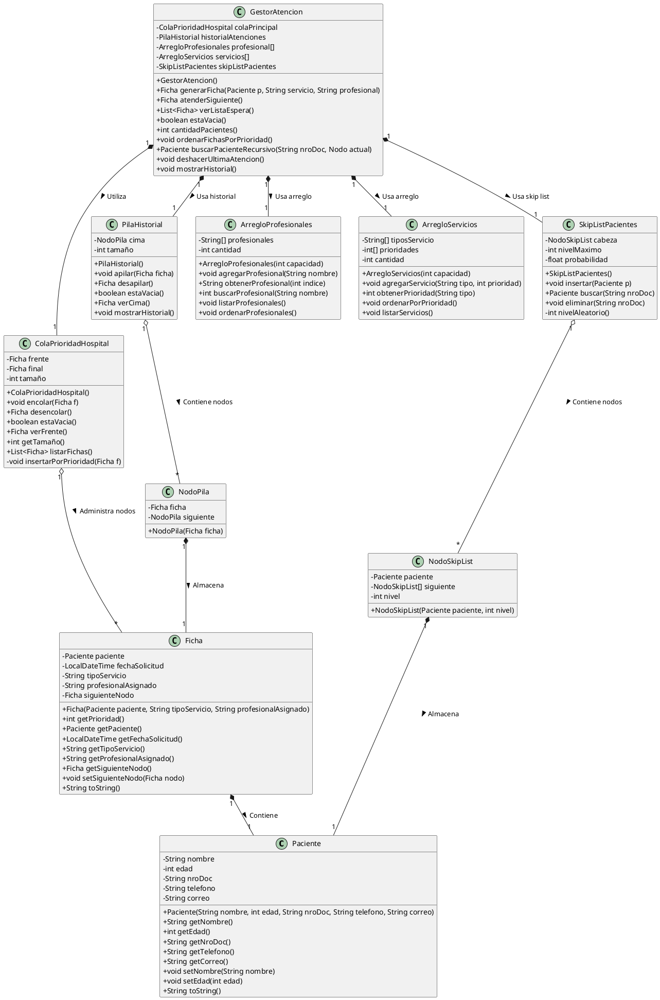
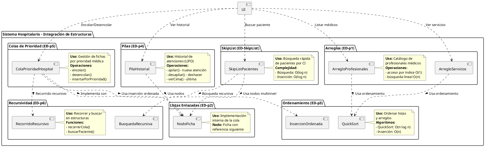
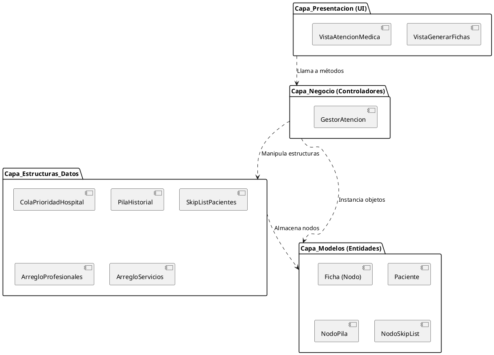
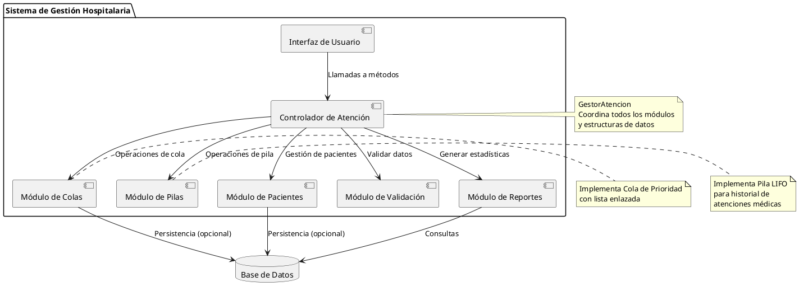

# 1. Diagramas Estructurales

**Materia:** Estructura de Datos I | **Autor:** Raul Heredia

---

## 1.1 Diagrama de Clases - Integración Completa de Estructuras

Este diagrama muestra cómo se integran las **7 estructuras de datos** del repositorio:

**Estructuras Integradas:**
- ✅ **ED-p1 (Arreglos):** `ArregloProfesionales`, `ArregloServicios`
- ✅ **ED-p2 (Listas):** Nodos de Ficha, NodoPila, NodoSkipList
- ✅ **ED-p4 (Pilas):** `PilaHistorial` para historial LIFO
- ✅ **ED-p5 (Colas):** `ColaPrioridadHospital` - **ESTRUCTURA PRINCIPAL**
- ✅ **ED-SkipList:** `SkipListPacientes` búsqueda O(log n)

---

## 1.2 Diagrama de Integración de Estructuras

Visualización de cómo las 7 estructuras se conectan en el sistema:

---

## 1.3 Diagrama de Paquetes

Arquitectura en capas del sistema:

---

## 1.4 Diagrama de Componentes

Componentes del sistema y sus interdependencias:

---

## Resumen de Diagramas Estructurales

| Diagrama | Descripción | Estructuras Incluidas |
|----------|-------------|---------------------|
| **Clases** | Modelo completo con todas las clases | 7 estructuras integradas |
| **Integración** | Visual de conexiones entre estructuras | Arquitectura unificada |
| **Paquetes** | Capas del sistema | 4 capas organizadas |
| **Componentes** | Módulos funcionales | 7 componentes principales |

**Navegación:**
- [← Volver al INICIO](../INDICE_DIAGRAMAS.md)
- [→ Siguiente: Diagramas de Comportamiento](./2_DIAGRAMAS_COMPORTAMIENTO.md)
