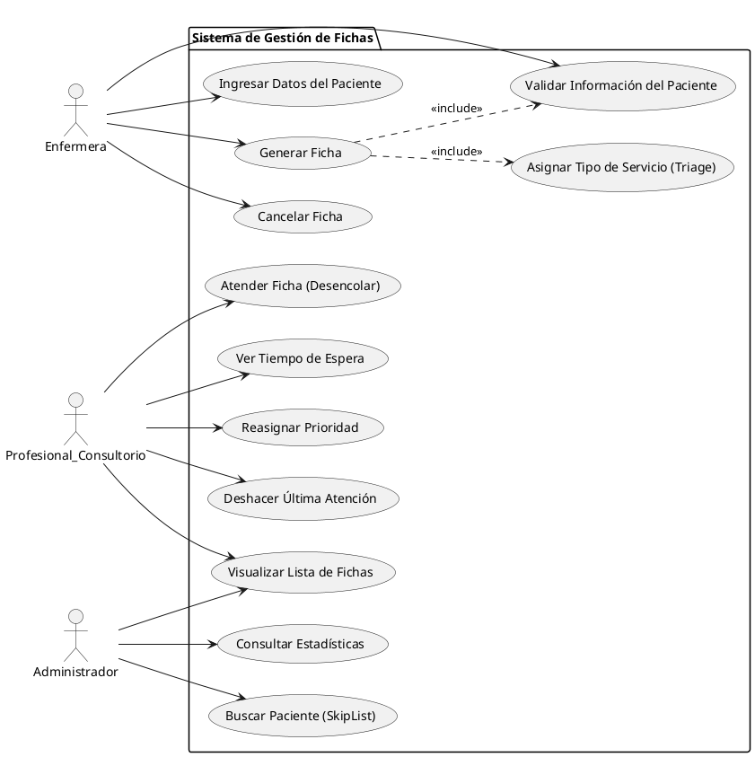
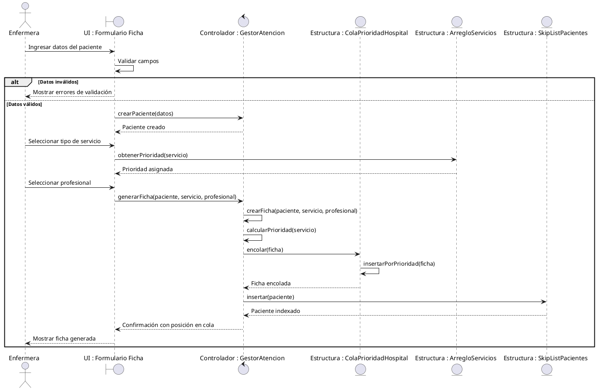
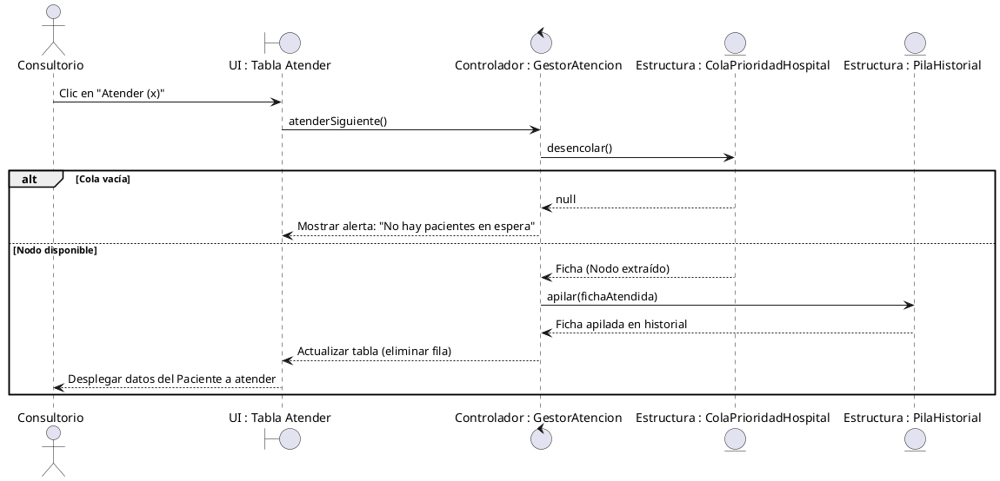

# 2. Diagramas de Comportamiento

**Materia:** Estructura de Datos I | **Autor:** Raul Heredia

---

## 2.1 Diagrama de Casos de Uso - General

Actores y casos de uso principales del sistema:

**Actores:**
- **Enfermera:** Genera fichas, ingresa datos, cancela fichas
- **Profesional Consultorio:** Atiende pacientes, reasigna prioridades, usa pila para deshacer
- **Administrador:** Consulta estadísticas, busca pacientes con SkipList

---

## 2.2 Diagrama de Uso - Generar Ficha (Detallado)

Flujo completo para la generación de una ficha:

```plantuml
@startuml
left to right direction
actor Enfermera as R
actor Sistema as S

usecase "Ingresar Datos del Paciente" as UC1
usecase "Validar Información" as UC2
usecase "Seleccionar Tipo de Servicio" as UC3
usecase "Asignar Prioridad (Triage)" as UC4
usecase "Generar Ficha" as UC5
usecase "Confirmar Generación" as UC6

R --> UC1
UC1 ..> UC2 : <<include>>
UC2 ..> UC3 : <<include>>
UC3 ..> UC4 : <<include>>
UC4 ..> UC5 : <<include>>
UC5 ..> UC6 : <<include>>
UC6 --> S : Almacenar en cola

@enduml
```

**Flujo:**
1. Ingresar datos → Validar información
2. Seleccionar servicio → Asignar prioridad automáticamente
3. Generar ficha → Confirmar al usuario
4. Almacenar en Cola de Prioridad

---

## 2.3 Diagrama de Uso - Atender Paciente (Detallado)

Proceso de atención médica:

```plantuml
@startuml
left to right direction
actor Consultorio as M
actor Sistema as S

usecase "Ver Lista de Espera" as UC1
usecase "Seleccionar Paciente" as UC2
usecase "Verificar Disponibilidad" as UC3
usecase "Atender Paciente" as UC4
usecase "Registrar Atención" as UC5
usecase "Eliminar de Cola" as UC6
usecase "Apilar en Historial" as UC7

M --> UC1
UC1 ..> UC2 : <<include>>
UC2 ..> UC3 : <<include>>
UC3 ..> UC4 : <<include>>
UC4 ..> UC5 : <<include>>
UC5 ..> UC6 : <<include>>
UC5 ..> UC7 : <<include>>
UC6 --> S : Actualizar cola
UC7 --> S : Guardar en pila LIFO

@enduml
```

**Flujo:**
1. Ver lista ordenada por prioridad
2. Seleccionar siguiente paciente (frente de cola)
3. Atender y registrar
4. Eliminar de Cola + Apilar en Historial (Pila LIFO)

---

## 2.4 Diagrama de Secuencia - Generar Ficha

Interacción entre componentes:

---

## 2.5 Diagrama de Secuencia - Atender Paciente

Flujo cuando un consultorio atiende al siguiente paciente:

**Nota:** La Pila (LIFO) permite al consultorio "deshacer" la última atención si fue un error.

---

## Resumen de Diagramas de Comportamiento

| Diagrama | Tipo | Actores | Estructuras Destacadas |
|----------|------|---------|---------------------|
| **Casos de Uso General** | Comportamiento | 3 actores | Cola principal |
| **Generar Ficha** | Caso de uso detallado | Enfermera | Cola + SkipList |
| **Atender Paciente** | Caso de uso detallado | Consultorio | Cola + Pila |
| **Secuencia Generar** | Interacción | Enfermera | Cola + Arreglo + SkipList |
| **Secuencia Atender** | Interacción | Consultorio | Cola + Pila |

**Navegación:**
- [← Anterior: Diagramas Estructurales](./1_DIAGRAMAS_ESTRUCTURALES.md)
- [→ Siguiente: Diagramas de Flujo y Estados](./3_DIAGRAMAS_FLUJO_ESTADOS.md)
