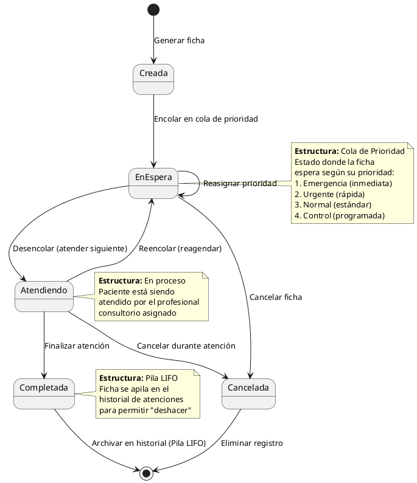
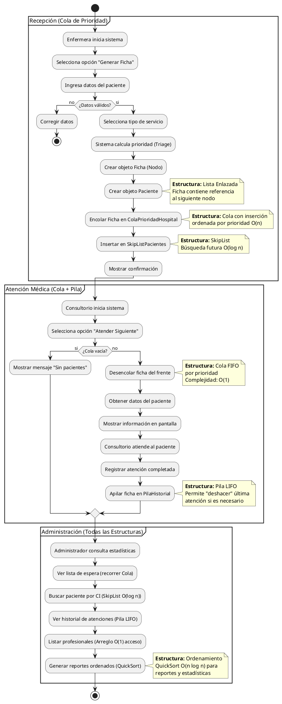
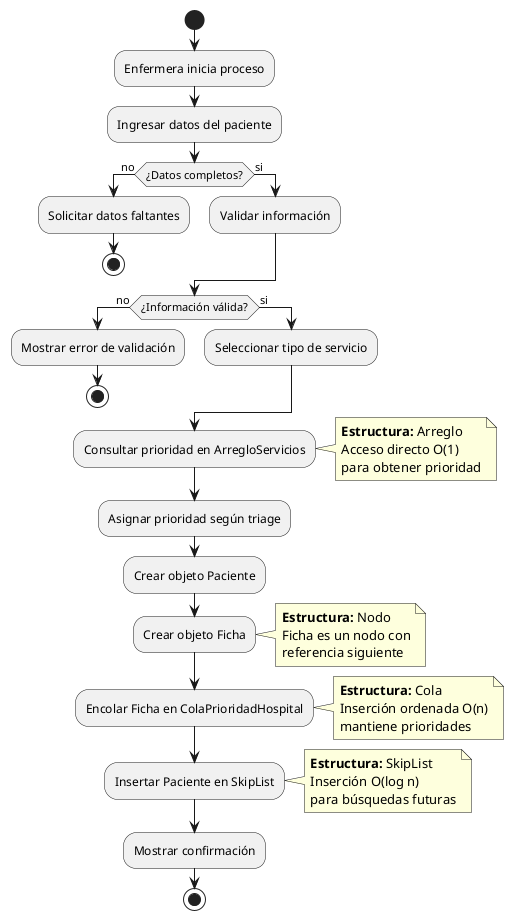
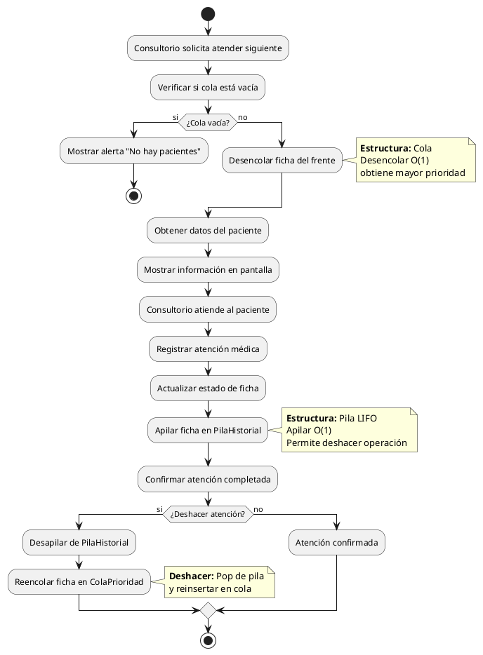
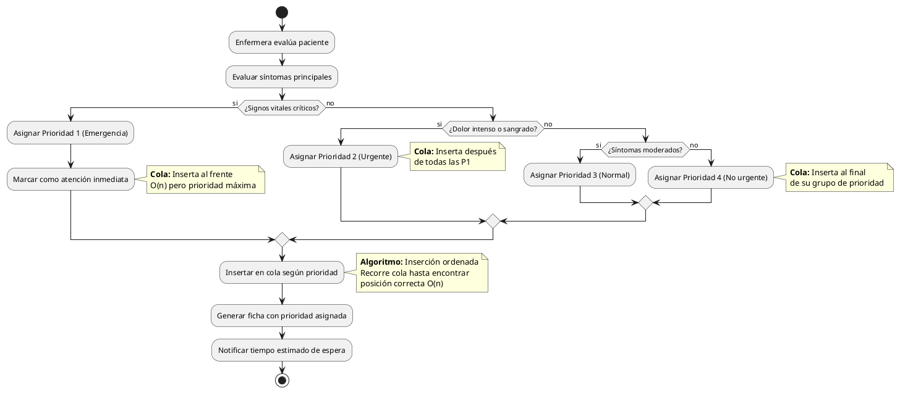

# 3. Diagramas de Flujo y Estados

**Materia:** Estructura de Datos I | **Autor:** Raul Heredia

---

## 3.1 Diagrama de Estados - Ciclo de Vida de la Ficha

Estados por los que pasa una ficha médica:

**Transiciones de Estados:**
- **Creada → EnEspera:** Inserción ordenada en cola por prioridad
- **EnEspera → Atendiendo:** Desencolar del frente (mayor prioridad)
- **Atendiendo → Completada:** Apilar en PilaHistorial (LIFO)
- **EnEspera → Cancelada:** Eliminación de la cola

---

## 3.2 Diagrama de Actividad - Sistema General

Flujo completo del sistema hospitalario:

---

## 3.3 Diagrama de Flujo - Generar Ficha (Algoritmo)

Algoritmo detallado con estructuras de datos:

---

## 3.4 Diagrama de Flujo - Atender Paciente (Algoritmo)

Proceso de desencolar y atender:

---

## 3.5 Diagrama de Flujo - Proceso de Triage (Asignación de Prioridad)

Algoritmo de clasificación médica:

---

## Resumen de Diagramas de Flujo y Estados

| Diagrama | Tipo | Estructura Principal | Complejidad |
|----------|------|---------------------|-------------|
| **Estados Ficha** | Dinámico | Cola + Pila | Ciclo de vida completo |
| **Actividad Sistema** | Procesos | Todas las estructuras | Flujo general |
| **Flujo Generar** | Algoritmo | Cola + SkipList + Arreglo | O(n) inserción |
| **Flujo Atender** | Algoritmo | Cola + Pila | O(1) operaciones |
| **Flujo Triage** | Algoritmo | Cola (inserción ordenada) | O(n) por prioridad |

**Navegación:**
- [← Anterior: Diagramas de Comportamiento](./2_DIAGRAMAS_COMPORTAMIENTO.md)
- [→ Siguiente: Documentación Técnica](./4_DOCUMENTACION_TECNICA.md)
